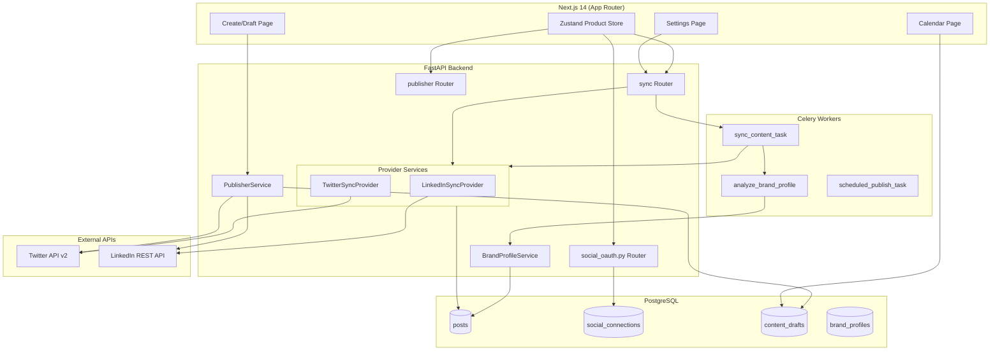
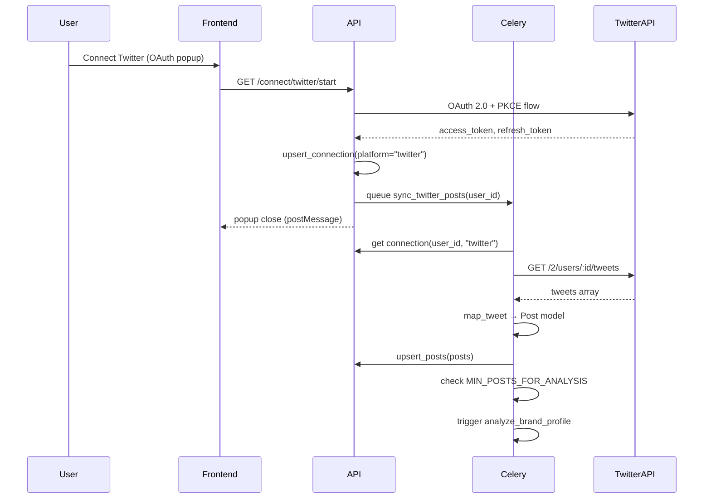
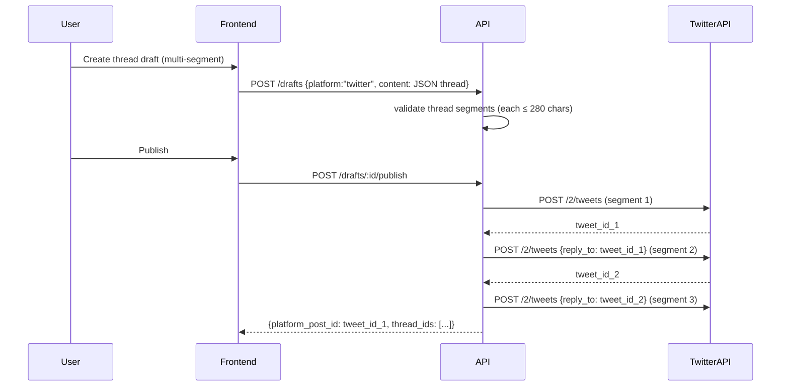

# Design: Iterra Platform Stabilization & Twitter Integration

## Overview

This design addresses six interconnected goals: stabilizing LinkedIn historical content sync, implementing Twitter/X content retrieval, enabling multi-platform persona analysis, adding Twitter thread publishing, formalizing a provider pattern for future platforms, and enforcing platform-aware content generation limits based on user subscription tiers.

The architecture extends existing patterns — the `linkedin_service.py` model of "OAuth API → fallback → mock" becomes the canonical provider template. Twitter content sync mirrors LinkedIn's service structure verbatim. The brand profile engine evolves from LinkedIn-only to platform-agnostic by querying all platforms from the `posts` table. Thread publishing extends the existing `publisher_service.py` dispatch pattern. Content generation becomes tier-aware by resolving character limits from `social_connections.connection_metadata` and passing them through `platform_rules.py` into the ContentEngine prompt.

**Key design decisions:**
- No new database tables — the existing `posts`, `social_connections`, and `content_drafts` schema handles all platforms via the `platform` column
- Thread content stored as JSON array in `content_drafts.content` (avoids a new `thread_segments` table)
- Provider pattern is a Python Protocol (structural typing), not an ABC — keeps services decoupled and testable
- Celery tasks for all sync operations — consistent with existing `queue_scrape_task` pattern
- Twitter subscription tier stored in `connection_metadata` JSON — no schema migration needed
- Character limits resolved at generation time from tier + platform, with free-tier as safe default

## Architecture



### Sync Flow (Twitter — mirrors LinkedIn)



### Thread Publishing Flow



## Components and Interfaces

### 1. ContentSyncProvider Protocol

```python
from typing import Protocol, runtime_checkable

@runtime_checkable
class ContentSyncProvider(Protocol):
    """Common interface for all platform content sync services."""
    
    platform: str  # "linkedin", "twitter", "instagram"
    
    async def sync_posts(self, db: Session, user: User) -> SyncResult:
        """Fetch and upsert posts. Returns sync metadata."""
        ...
    
    def get_status(self, db: Session, user: User) -> PlatformStatus:
        """Return connection status, scope info, readiness flags."""
        ...
    
    def map_post(self, raw: dict) -> dict | None:
        """Map platform-specific API response to Post model fields."""
        ...
```

### 2. TwitterSyncService (new file: `twitter_service.py`)

```python
class TwitterSyncService:
    """Implements ContentSyncProvider for Twitter/X API v2."""
    
    platform = "twitter"
    
    TWEETS_URL = "https://api.twitter.com/2/users/{user_id}/tweets"
    TWEET_FIELDS = "created_at,public_metrics,conversation_id,in_reply_to_user_id,referenced_tweets"
    MAX_RESULTS = 100
    
    async def sync_posts(self, db: Session, user: User) -> SyncResult:
        """
        Fetches user's recent tweets via Twitter API v2.
        - Refreshes token if needed (reuses _refresh_x_token_if_needed)
        - Fetches up to 100 tweets with pagination
        - Detects threads (conversation_id == author tweet_id)
        - Upserts into posts table
        """
        ...
    
    def get_status(self, db: Session, user: User) -> PlatformStatus:
        """Returns Twitter connection/sync status for settings page."""
        ...
    
    def map_tweet(self, tweet: dict) -> dict | None:
        """Maps Twitter v2 tweet object to Post model dict."""
        ...
    
    def detect_threads(self, tweets: list[dict]) -> dict[str, list[str]]:
        """Groups tweets by conversation_id where author replied to self."""
        ...
```

### 3. BrandProfileService Enhancement

Current state: `generate_profile()` queries only `Post.platform == "linkedin"`.

Change: Query `Post` with no platform filter for users with any connected platform:

```python
def generate_profile(db: Session, user: User) -> dict:
    # OLD: posts = db.query(Post).filter(Post.user_id == user.id, Post.platform == "linkedin").all()
    # NEW: all platforms
    posts = db.query(Post).filter(Post.user_id == user.id).all()
    ...
```

The `_format_posts_for_engine()` function adds platform annotation:

```python
def _format_posts_for_engine(posts: list[Post]) -> list[str]:
    sorted_posts = sorted(posts, key=lambda p: p.published_at or utc_now(), reverse=True)
    result = []
    for i, p in enumerate(sorted_posts, 1):
        date_str = p.published_at.strftime("%Y-%m-%d") if p.published_at else "unknown date"
        er_str = f"{p.engagement_rate:.1%}" if p.engagement_rate else "0.0%"
        platform_label = p.platform.upper()
        header = f"Post #{i} | {platform_label} | {date_str} | Engagement: {er_str}"
        result.append(f"{header}\n{p.content or ''}")
    return result
```

### 4. Thread Publishing Extension (in `publisher_service.py`)

```python
async def _publish_x_thread(db: Session, conn: SocialConnection, draft: ContentDraft) -> dict[str, Any]:
    """Publishes a multi-tweet thread sequentially, chaining reply_to."""
    segments = json.loads(draft.content)  # List of strings
    tweet_ids = []
    reply_to = None
    
    for segment in segments:
        body = {"text": segment[:280]}
        if reply_to:
            body["reply"] = {"in_reply_to_tweet_id": reply_to}
        # POST /2/tweets...
        tweet_ids.append(new_tweet_id)
        reply_to = new_tweet_id
    
    return {"platform_post_id": tweet_ids[0], "thread_ids": tweet_ids}
```

### 5. Frontend Sync Status Component

The settings page surfaces per-platform sync state with clear UX for scope limitations:

```typescript
interface PlatformSyncStatus {
  platform: string;
  connected: boolean;
  username: string | null;
  lastSyncedAt: string | null;
  syncedPosts: number;
  postingReady: boolean;
  readSyncReady: boolean;
  missingScopes: string[];
  reconnectRequired: boolean;
  syncInProgress: boolean;
  message: string | null;
}
```

### 6. API Endpoints (New/Modified)

| Endpoint | Method | Description |
|----------|--------|-------------|
| `/api/sync/twitter` | POST | Trigger manual Twitter sync |
| `/api/sync/twitter/status` | GET | Get Twitter sync status |
| `/api/sync/{platform}` | POST | Generic sync trigger (future) |
| `/api/sync/{platform}/status` | GET | Generic status endpoint |
| `/api/drafts` (existing) | POST | Extended: accepts thread content as JSON array |
| `/api/brand-profile/generate` (existing) | POST | Now pulls all platforms |

### 7. Platform Content Limits Module (new: `platform_limits.py`)

This module centralizes tier-aware character limit resolution. It replaces the hard-coded `LIMITS` dict in `content_service.py` and the static `max_chars` in `platform_rules.py` with a dynamic resolver that considers the user's subscription tier.

```python
"""Platform-aware character limit resolution.

Sits between content_service.py and iterra_ai's platform_rules.py.
Resolves the effective max_chars for a user+platform combination
by reading subscription tier from connection_metadata.
"""
from enum import StrEnum
from dataclasses import dataclass
from sqlalchemy.orm import Session

from app.models.social_connection import SocialConnection


class TwitterTier(StrEnum):
    FREE = "free"
    PREMIUM = "premium"


# Hard limits per platform+tier (characters)
PLATFORM_CHAR_LIMITS: dict[str, int | dict[str, int]] = {
    "linkedin": 3_000,
    "instagram": 2_200,
    "twitter": {
        TwitterTier.FREE: 280,
        TwitterTier.PREMIUM: 25_000,
    },
}

# Default tier when unknown or missing
DEFAULT_TWITTER_TIER = TwitterTier.FREE


@dataclass
class ContentLimit:
    """Resolved character limit for a platform+user combination."""
    platform: str
    max_chars: int
    tier: str | None  # None for platforms without tiers
    is_thread_eligible: bool  # True if content can be auto-split into a thread


def resolve_content_limit(db: Session, user_id: str, platform: str) -> ContentLimit:
    """
    Resolve the effective character limit for a user on a platform.
    
    For Twitter: reads subscription_tier from connection_metadata.
    Falls back to FREE tier if tier is unknown/missing.
    For other platforms: returns the static limit.
    """
    if platform == "twitter":
        tier = _get_twitter_tier(db, user_id)
        limit = PLATFORM_CHAR_LIMITS["twitter"][tier]
        return ContentLimit(
            platform=platform,
            max_chars=limit,
            tier=tier,
            is_thread_eligible=(tier == TwitterTier.FREE),
        )
    
    max_chars = PLATFORM_CHAR_LIMITS.get(platform, 3_000)
    if isinstance(max_chars, dict):
        max_chars = 3_000  # safety fallback
    return ContentLimit(
        platform=platform,
        max_chars=max_chars,
        tier=None,
        is_thread_eligible=False,
    )


def _get_twitter_tier(db: Session, user_id: str) -> TwitterTier:
    """Read Twitter subscription tier from connection_metadata."""
    conn = (
        db.query(SocialConnection)
        .filter(
            SocialConnection.user_id == user_id,
            SocialConnection.platform == "twitter",
            SocialConnection.is_active == True,
        )
        .first()
    )
    if not conn:
        return DEFAULT_TWITTER_TIER
    
    metadata = conn.connection_metadata or {}
    tier_value = metadata.get("subscription_tier")
    
    if tier_value == TwitterTier.PREMIUM:
        return TwitterTier.PREMIUM
    return DEFAULT_TWITTER_TIER


def update_twitter_tier(db: Session, user_id: str, tier: TwitterTier) -> None:
    """Update the stored Twitter subscription tier in connection_metadata."""
    conn = (
        db.query(SocialConnection)
        .filter(
            SocialConnection.user_id == user_id,
            SocialConnection.platform == "twitter",
            SocialConnection.is_active == True,
        )
        .first()
    )
    if not conn:
        return
    
    metadata = dict(conn.connection_metadata or {})
    metadata["subscription_tier"] = tier
    conn.connection_metadata = metadata
    db.commit()
```

### 8. Thread Auto-Splitting Algorithm (in `platform_limits.py`)

When a free-tier Twitter user's generated content exceeds 280 characters, this algorithm splits content into a thread while preserving sentence boundaries.

```python
import re

# Sentence boundary pattern: period, question mark, or exclamation followed by space or end
SENTENCE_BOUNDARY_RE = re.compile(r'(?<=[.!?])\s+')

# Thread segment numbering format (optional, configurable)
THREAD_NUMBERING = True  # e.g., "1/3", "2/3", "3/3"


@dataclass
class ThreadSplitResult:
    """Result of splitting content into a thread."""
    segments: list[str]
    segment_count: int
    original_length: int
    all_within_limit: bool


def split_into_thread(content: str, max_chars: int = 280) -> ThreadSplitResult:
    """
    Split content into thread segments respecting sentence boundaries.
    
    Algorithm:
    1. Split content into sentences
    2. Greedily pack sentences into segments up to max_chars
    3. If a single sentence exceeds max_chars, fall back to word-boundary split
    4. Optionally prepend thread numbering (e.g., "1/N")
    
    Returns ThreadSplitResult with all segments.
    """
    content = content.strip()
    if len(content) <= max_chars:
        return ThreadSplitResult(
            segments=[content],
            segment_count=1,
            original_length=len(content),
            all_within_limit=True,
        )
    
    sentences = SENTENCE_BOUNDARY_RE.split(content)
    sentences = [s.strip() for s in sentences if s.strip()]
    
    # Reserve space for numbering if enabled (e.g., "1/10 " = 5 chars max)
    numbering_reserve = 6 if THREAD_NUMBERING else 0  # "XX/XX " worst case
    effective_max = max_chars - numbering_reserve
    
    segments: list[str] = []
    current_segment = ""
    
    for sentence in sentences:
        if len(sentence) > effective_max:
            # Sentence too long — flush current segment, then word-split the long sentence
            if current_segment:
                segments.append(current_segment.strip())
                current_segment = ""
            segments.extend(_word_boundary_split(sentence, effective_max))
        elif len(current_segment) + len(sentence) + 1 <= effective_max:
            # Fits in current segment
            current_segment = f"{current_segment} {sentence}".strip()
        else:
            # Start new segment
            if current_segment:
                segments.append(current_segment.strip())
            current_segment = sentence
    
    if current_segment:
        segments.append(current_segment.strip())
    
    # Apply numbering
    if THREAD_NUMBERING and len(segments) > 1:
        total = len(segments)
        segments = [f"{i+1}/{total} {seg}" for i, seg in enumerate(segments)]
    
    all_within = all(len(s) <= max_chars for s in segments)
    
    return ThreadSplitResult(
        segments=segments,
        segment_count=len(segments),
        original_length=len(content),
        all_within_limit=all_within,
    )


def _word_boundary_split(text: str, max_chars: int) -> list[str]:
    """Split a single long sentence at word boundaries."""
    words = text.split()
    segments = []
    current = ""
    
    for word in words:
        if len(current) + len(word) + 1 <= max_chars:
            current = f"{current} {word}".strip()
        else:
            if current:
                segments.append(current)
            current = word
    
    if current:
        segments.append(current)
    
    return segments
```

### 9. ContentEngine Tier-Aware Integration

The `content_service.py` `generate()` function is updated to resolve limits dynamically and pass them to the AI engine:

```python
# In content_service.py — updated generate() function

def generate(db: Session, user: User, payload: GenerateRequest) -> dict:
    _require_brand_profile(db, user)
    ctx = context_service.assemble(db, user, platform=payload.platform)

    from iterra_ai.content.engine import ContentGenerationEngine
    from iterra_ai.content.schemas import ContentGenerationInput
    from iterra_ai.content.platform_rules import get_rules
    from app.services.platform_limits import resolve_content_limit, split_into_thread

    # Resolve tier-aware character limit
    content_limit = resolve_content_limit(db, user.id, payload.platform)
    
    # Override platform_rules max_chars with the resolved limit
    rules = dict(get_rules(payload.platform))  # copy to avoid mutating module-level dict
    rules["max_chars"] = content_limit.max_chars

    engine_input = ContentGenerationInput(
        platform=payload.platform,
        prompt=payload.prompt,
        hook=payload.suggestion.hook if payload.suggestion else None,
        system_prompt=ctx.system_prompt,
        platform_rules=rules,  # Now includes tier-aware max_chars
    )
    
    engine = ContentGenerationEngine()
    output = engine.generate(engine_input)
    
    # ... persona fit scoring (unchanged) ...

    # Validate output length against platform limit
    within_limit = output.char_count <= content_limit.max_chars
    
    # Auto-split into thread if free-tier Twitter and over limit
    thread_segments = None
    if not within_limit and content_limit.is_thread_eligible:
        split_result = split_into_thread(output.content, content_limit.max_chars)
        thread_segments = split_result.segments
    
    # Store draft — as thread JSON if split, or plain text otherwise
    draft_content = (
        json.dumps(thread_segments) if thread_segments 
        else output.content
    )
    
    draft = ContentDraft(
        user_id=user.id,
        platform=payload.platform,
        content=draft_content,
        prompt_used=payload.prompt,
        # ...
    )
    # ...
    
    return {
        "draft_id": draft.id,
        "content": draft_content,
        "word_count": output.word_count,
        "within_platform_limit": within_limit,
        "thread_segments": thread_segments,  # None if not split
        "content_limit": {
            "platform": content_limit.platform,
            "max_chars": content_limit.max_chars,
            "tier": content_limit.tier,
        },
        # ...
    }
```

### 10. Publisher Service Tier-Aware Update

The existing `_publish_x()` truncation (`[:280]`) becomes tier-aware:

```python
# In publisher_service.py — updated _publish_x()

async def _publish_x(db: Session, conn: SocialConnection, draft: ContentDraft) -> dict[str, Any]:
    from app.services.platform_limits import resolve_content_limit, is_thread
    
    content_limit = resolve_content_limit(db, conn.user_id, "twitter")
    
    # Check if this is a thread (JSON array)
    if is_thread(draft.content):
        return await _publish_x_thread(db, conn, draft, content_limit.max_chars)
    
    # Single tweet — enforce tier-aware limit
    required = set(X_POSTING_SCOPES)
    if draft.media:
        required |= X_MEDIA_SCOPES
    _require_scopes(conn, required, "X")
    await _refresh_x_token_if_needed(db, conn)
    
    body: dict[str, Any] = {"text": (draft.content or "")[:content_limit.max_chars]}
    # ... rest of publish logic
```

## Data Models

### Existing Models (No Schema Changes)

**posts table** — already has `platform` column; Twitter tweets fit the same schema:
- `platform = "twitter"`
- `content_type` = "text" | "thread" | "image" | "video"
- `platform_post_id` = tweet ID
- `raw_api_response` = full Twitter API v2 response

**social_connections table** — already platform-agnostic:
- `platform = "twitter"` with PKCE tokens stored
- `scopes` = `["tweet.read", "tweet.write", "users.read", "media.write", "offline.access"]`
- `connection_metadata` = `{"name": "...", "profile_image": "...", "subscription_tier": "free"|"premium"}`

**Twitter subscription tier storage** (FR-8.4):
The `connection_metadata` JSON column on the Twitter `social_connections` row stores the user's subscription tier. This avoids schema migrations and keeps tier info co-located with the connection it applies to.

```json
{
  "name": "John Doe",
  "profile_image": "https://pbs.twimg.com/...",
  "subscription_tier": "free"
}
```

- When tier is missing or `null`: system defaults to `"free"` (280-char limit)
- When tier is `"premium"`: system applies 25,000-char limit
- Updated via settings page or auto-detected if Twitter API exposes tier info in the future

**content_drafts table** — thread support via existing columns:
- `platform = "twitter"`
- `content` = JSON string: `["Segment 1 text", "Segment 2 text", ...]` for threads, or plain string for single tweets
- `content_type` column (if added) or detected at publish time by checking if content parses as JSON array

### New Data Structures (in-code, no migrations)

```python
# SyncResult — returned by all providers
@dataclass
class SyncResult:
    synced_posts: int
    total_posts: int
    last_synced_at: datetime
    message: str
    ready_for_analysis: bool
    sync_path: str  # "oauth_api", "cookie_auth", "mock", "unavailable"

# PlatformStatus — returned by get_status()
@dataclass
class PlatformStatus:
    connected: bool
    platform_username: str | None
    last_synced_at: datetime | None
    synced_posts: int
    scopes: list[str]
    posting_ready: bool
    read_sync_ready: bool
    missing_posting_scopes: list[str]
    missing_read_scopes: list[str]
    reconnect_required: bool
    message: str | None

# ThreadSegment — used during thread publishing
@dataclass
class ThreadSegment:
    text: str  # max 280 chars
    media_ids: list[str] = field(default_factory=list)
```

### Thread Content Storage Convention

For `content_drafts.content` when `platform = "twitter"`:
- **Single tweet**: plain string (e.g., `"Hello world"`)
- **Thread**: JSON array of strings (e.g., `'["First tweet", "Second tweet", "Third tweet"]'`)

Detection logic:
```python
def is_thread(content: str) -> bool:
    try:
        parsed = json.loads(content)
        return isinstance(parsed, list) and len(parsed) > 1
    except (json.JSONDecodeError, TypeError):
        return False
```


## Correctness Properties

*A property is a characteristic or behavior that should hold true across all valid executions of a system — essentially, a formal statement about what the system should do. Properties serve as the bridge between human-readable specifications and machine-verifiable correctness guarantees.*

### Property 1: LinkedIn post mapping preserves required fields

*For any* valid LinkedIn UGC Post API response containing non-empty commentary text, `map_ugc_post` SHALL produce a dict containing: a non-empty `content` field, a valid `platform_post_id`, a `published_at` datetime, numeric `likes`/`comments`/`impressions` fields, and `platform` equal to `"linkedin"`.

**Validates: Requirements 1.1**

### Property 2: Tweet mapping preserves required fields

*For any* valid Twitter API v2 tweet object with non-empty text, `map_tweet` SHALL produce a dict containing: `content` equal to the tweet text, `platform_post_id` equal to the tweet id, a valid `published_at` datetime, numeric engagement metrics (`likes`, `shares`, `comments`), `content_type` correctly identifying threads vs single tweets, and `platform` equal to `"twitter"`.

**Validates: Requirements 2.1, 2.2**

### Property 3: Post upsert is idempotent

*For any* list of post dicts with unique `platform_post_id` values, calling `_upsert_posts` twice with the same data SHALL result in the same database state as calling it once — specifically, the total post count remains unchanged after the second call, and engagement metrics reflect the latest values.

**Validates: Requirements 2.4**

### Property 4: Multi-platform posts included in brand profile input

*For any* user with posts across multiple platforms (linkedin, twitter), the formatted posts list passed to BrandProfileEngine SHALL contain posts from ALL platforms the user has synced, with each post annotated with its platform label.

**Validates: Requirements 3.1**

### Property 5: Minimum post threshold gates analysis

*For any* user, brand profile generation SHALL trigger if and only if the total post count across all connected platforms is greater than or equal to 5. If the count is below 5, `ready_for_analysis` SHALL be `False`.

**Validates: Requirements 3.3**

### Property 6: Thread publishing chains replies correctly

*For any* valid thread (a list of N string segments where each segment is ≤ 280 characters and N ≥ 2), publishing SHALL produce N tweets where tweet[i] (for i > 0) has `reply.in_reply_to_tweet_id` set to the id of tweet[i-1], and the returned `platform_post_id` equals the id of tweet[0].

**Validates: Requirements 4.2**

### Property 7: Calendar includes all platform drafts

*For any* set of scheduled content drafts across platforms (linkedin, twitter), the calendar endpoint SHALL return all drafts regardless of platform, and each calendar event SHALL include the platform identifier.

**Validates: Requirements 4.3**

### Property 8: Repurposed Twitter content respects character limit

*For any* LinkedIn post content of any length, the repurposed Twitter version SHALL have total character count ≤ 280 characters (for single tweets) or each segment ≤ 280 characters (for threads).

**Validates: Requirements 6.1**

### Property 9: Platform-aware character limit enforcement

*For any* content string and any valid platform+tier combination (LinkedIn/3000, Twitter-Free/280, Twitter-Premium/25000), the `format_content` function SHALL produce output whose character count is less than or equal to the resolved `max_chars` for that platform+tier. When the tier is unknown or missing for Twitter, the system SHALL use the free-tier limit of 280 characters.

**Validates: Requirements 8.1, 8.2, 8.3, 8.8**

### Property 10: Thread splitting preserves content within limits at sentence boundaries

*For any* text content exceeding 280 characters that contains at least one sentence boundary (period, question mark, or exclamation mark followed by whitespace), `split_into_thread` SHALL produce segments where: (a) every segment has character count ≤ 280, (b) no segment splits mid-sentence when a sentence-boundary split is possible, and (c) the concatenation of all segment texts (minus thread numbering) preserves all words from the original content.

**Validates: Requirements 8.5, 8.6**

### Property 11: Content length validation flag correctness

*For any* generated content and resolved platform character limit, the `within_platform_limit` response field SHALL be `True` if and only if the content's character count is less than or equal to the platform's `max_chars` value.

**Validates: Requirements 8.7**

## Error Handling

### Sync Errors

| Error Condition | Behavior | User Message |
|----------------|----------|--------------|
| Twitter token expired | Attempt refresh via `/2/oauth2/token`. If refresh fails, mark sync as failed. | "Twitter session expired. Please reconnect." |
| Twitter API 429 (rate limit) | Retry with exponential backoff (max 3 attempts). Log rate limit headers. | "Twitter rate limit reached. Sync will retry automatically." |
| Twitter API 5xx | Retry up to 3 times with 250ms/500ms/750ms delays. | "Twitter is temporarily unavailable. Try again later." |
| LinkedIn r_member_social missing | Return `sync_path: "unavailable"` with explanatory message. Do NOT disconnect. | "LinkedIn read permission requires separate developer app approval. Posting still works." |
| Malformed tweet response | Skip tweet, log warning, continue processing remaining tweets. | (silent — logged server-side) |
| Thread publish partial failure | Store IDs of successfully published tweets. Mark draft as "failed" with partial data. | "Thread partially published (N of M tweets). Please check your Twitter account." |
| Celery task timeout (30s) | Task marked as FAILURE. Connection remains active. | "Sync timed out. Try again — your connection is still active." |

### Token Refresh Strategy

```python
# Shared across LinkedIn and Twitter
async def refresh_token_if_needed(db: Session, conn: SocialConnection) -> bool:
    """
    Returns True if token was refreshed successfully.
    Returns False if token is still valid (no refresh needed).
    Raises TokenExpiredError if refresh fails.
    """
    if not conn.token_expires_at:
        return False
    if conn.token_expires_at > utcnow() + timedelta(minutes=5):
        return False
    # Platform-specific refresh logic...
```

### Graceful Degradation

- If Twitter sync fails, previously stored tweets remain untouched (no data loss)
- If brand profile generation fails with new multi-platform data, the existing profile stays active
- If thread publishing fails mid-thread, the first N successful tweets remain live (they're already published)
- Publishing failures set `content_drafts.status = "failed"` and store error in `publish_error` column

### Content Limit Errors

| Error Condition | Behavior | User Message |
|----------------|----------|--------------|
| Generated content exceeds limit after AI generation | Apply `format_content` truncation at sentence boundary; flag `within_platform_limit: false` in response | "Content exceeds the {limit}-character limit for {platform}. It has been trimmed." |
| Thread split produces segment > 280 chars (long word/URL) | Fall back to word-boundary split for that segment | (automatic — no user-visible error) |
| Twitter tier cannot be resolved (no connection) | Default to free-tier 280-char limit | (silent default — logged server-side) |
| User updates tier but generation already in progress | Next generation uses updated tier; current draft keeps original limit | "Your tier has been updated. New posts will use the updated limit." |
| Thread auto-split fails (content is a single long word/URL) | Store as single segment truncated at max_chars | "Content was too long to split into sentences. It has been trimmed to fit." |

## Testing Strategy

### Unit Tests (Example-Based)

- **Scope computation**: `missing_scopes()` with various scope combinations (FR-1.2)
- **Token expiry detection**: Token refresh decision boundary at 5 minutes (FR-4.4)
- **Thread detection**: `is_thread()` with single tweets, valid threads, malformed JSON (FR-4.2)
- **Status endpoint payloads**: Verify response shape for each connection state (FR-5.1)
- **Provider Protocol conformance**: `isinstance(TwitterSyncService(), ContentSyncProvider)` (FR-7.1)
- **Tier resolution defaults**: `resolve_content_limit` returns 280 when connection_metadata has no tier (FR-8.8)
- **Tier update persistence**: `update_twitter_tier` writes to connection_metadata correctly (FR-8.9)
- **Thread numbering format**: Verify "1/N" prefix on split segments (FR-8.5)

### Property-Based Tests

Property-based testing applies well to this feature because the core logic involves:
- Data mapping (API responses → Post model) — pure functions with large input space
- Upsert idempotence — behavioral property over arbitrary data sets
- Thread validation/publishing — correctness across many segment configurations
- Threshold logic — quantified over all possible post counts
- Character limit enforcement — pure functions with infinite input space (any string)
- Thread splitting — algorithm correctness across all possible content strings

**Library**: `hypothesis` (Python) with `hypothesis[pytest]` integration

**Configuration**:
- Minimum 100 examples per property
- Deadline of 1000ms per example (generous for DB-backed tests)
- Suppress `HealthCheck.too_slow` for tests using database fixtures

**Tag format**: `# Feature: iterra-platform-stabilization-and-twitter, Property {N}: {title}`

Each correctness property maps to one property-based test:

| Property | Test File | Generator Strategy |
|----------|-----------|-------------------|
| P1: LinkedIn post mapping | `test_linkedin_mapping_props.py` | Random UGC post dicts with optional fields |
| P2: Tweet mapping | `test_twitter_mapping_props.py` | Random Twitter v2 tweet objects |
| P3: Upsert idempotence | `test_upsert_props.py` | Random lists of post dicts with repeated IDs |
| P4: Multi-platform inclusion | `test_brand_profile_props.py` | Random posts across 2-3 platforms |
| P5: Minimum threshold | `test_brand_profile_props.py` | Random post counts (0-20) across platforms |
| P6: Thread chaining | `test_thread_publish_props.py` | Random threads (2-25 segments, varied content) |
| P7: Calendar all platforms | `test_calendar_props.py` | Random scheduled drafts across platforms |
| P8: Repurpose char limit | `test_repurpose_props.py` | Random LinkedIn posts (50-5000 chars) |
| P9: Platform-aware limit enforcement | `test_content_limits_props.py` | Random strings (1-50000 chars) × all platform+tier combos |
| P10: Thread splitting correctness | `test_thread_split_props.py` | Random multi-sentence strings (281-10000 chars) with varied sentence lengths |
| P11: Validation flag correctness | `test_content_limits_props.py` | Random content strings × random positive limit values |

### Integration Tests

- Twitter OAuth callback → Celery task enqueued (FR-2.3)
- End-to-end sync: mock Twitter API → posts in DB → brand profile triggered (FR-2.1 + FR-3.1)
- Thread publish with mock Twitter API: verify sequential POST calls with correct reply_to (FR-4.2)
- LinkedIn reconnect after scope change: verify token refresh and scope update (FR-1.1)
- Tier persistence: set subscription_tier in connection_metadata, verify it persists across sessions (FR-8.4)
- Tier upgrade flow: update tier from free → premium, generate content, verify 25,000-char limit applies (FR-8.9)
- Content generation with tier-aware limits: mock AI engine output, verify draft stored with correct limit applied (FR-8.7)

### Manual Testing Checklist

- OAuth popup flow for Twitter (connect/disconnect)
- Settings page shows correct status for partially-scoped LinkedIn connection
- Calendar visually differentiates Twitter vs LinkedIn posts
- Thread creation UX: segment splitting, character count per segment
- Error states: expired token banner, failed sync recovery
- Twitter tier selection in settings: free vs premium toggle persists and affects generation
- Content generation shows real-time character count against tier-aware limit
- Auto-thread-split preview: when free-tier content exceeds 280 chars, UI shows proposed thread segments
- Tier change mid-session: switching tier immediately affects next content generation
