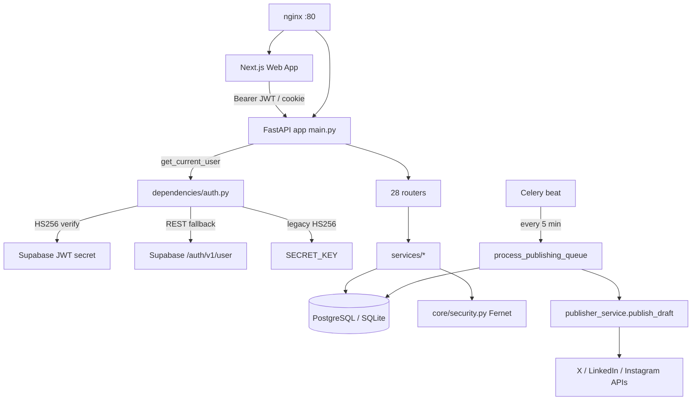
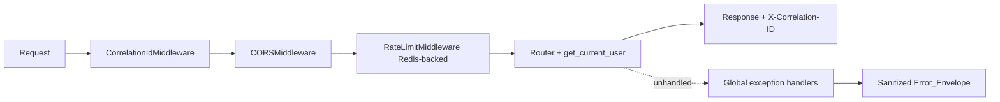
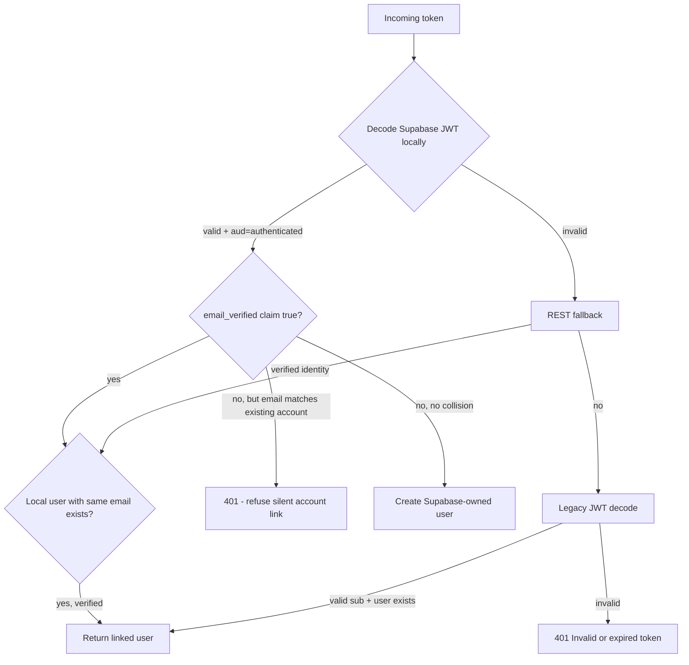
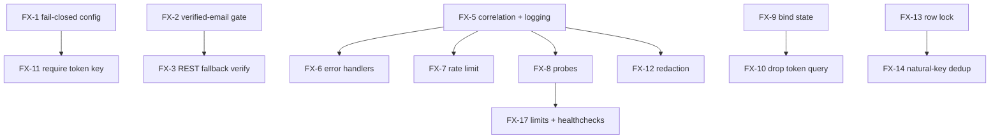

# Design Document

## Overview

This design turns the production-readiness and security-hardening requirements into a concrete, code-grounded plan for the Iterra (Ittera) platform. It is built from a line-by-line read of the actual repository — `apps/api` (FastAPI), `workers/celery`, `packages/ai-engine`, `apps/web`, `supabase/`, and `infra/` — and it produces the three deliverables the requirements demand:

1. **Audit Report** — verified findings with severity, exact file/location, impact, and area classification, marked verified-in-code vs. unverified.
2. **Fix Plan** — each finding mapped to a remediation, prioritized by severity, with explicit ordering/dependencies.
3. **Go-Live Checklist** — an ordered, verifiable list of deployment prerequisites.

The initiative deliberately extends, rather than duplicates, three existing specs. Where a concern is already hardened there, this design references it:

- **`iterra-platform-stabilization-and-twitter`** — general stabilization and the Twitter/X publish path. The publish-queue immutability, bounded retries, and `process_publishing_queue` registration originate here.
- **`x-integration-hardening`** — X/Twitter publish hardening: media limits, secret-safe publish logs, X token encryption-at-rest, reconnect-required surfacing.
- **`self-learning-content-loop`** — publish → analyze → synthesize → inject loop, including the draft→post bridge and learning-loop idempotency.

The scope of *this* spec is to take the same guarantees and apply them **platform-wide**: every router (not just publish) gets ownership checks and a sanitized error envelope; encryption-at-rest is validated for all OAuth platforms (not just X); idempotency is generalized; and the runtime/infra layer (rate limiting, CORS, TLS, probes, correlation IDs, resource limits) is brought up to a deployable standard.

### Design Principles

- **Verify before asserting.** Every finding in the Audit Report cites a real file and line-level behavior observed in the repository. Findings that could not be confirmed are explicitly labeled *Unverified*.
- **Least change, highest leverage.** Several capabilities already exist but are dormant (e.g. `RateLimitMiddleware` and `AuthMiddleware` are defined but never registered in `main.py`). Remediation prefers wiring and hardening existing code over rewrites.
- **Fail closed at startup.** Security-critical misconfiguration (default `SECRET_KEY`, missing `TOKEN_ENCRYPTION_KEY`, empty CORS allowlist in production) should stop the process from serving traffic rather than degrade silently.
- **No secret or raw upstream payload ever reaches a log or a client response.**

## Architecture

### Current System (as observed)



### Cross-Cutting Middleware Stack (target)

The central architectural change is to introduce an ordered ASGI middleware stack in `apps/api/main.py`. Today `main.py` registers only `CORSMiddleware`. The target order (outermost first) is:



1. **CorrelationIdMiddleware** (new) — assigns/propagates `X-Correlation-ID`, binds it to a `contextvar` so loggers and exception handlers can read it, and echoes it on every response. (R11.1, R11.4, R7.4)
2. **CORSMiddleware** (existing) — origins always from `settings.ALLOWED_ORIGINS` allowlist; methods/headers explicit in production. Add a startup guard for empty allowlist in production. (R6)
3. **RateLimitMiddleware** (exists, must be registered + reworked to a shared store) — per-client window limit, stricter on `/api/v1/auth/*`, emits `429` + `Retry-After`. (R5)
4. **Global exception handlers** (new) — `add_exception_handler` for unhandled `Exception` and for `RequestValidationError`, returning the standard `Error_Envelope`. (R7.1, R7.2, R7.3)

### Authentication Resolution (target)

The current `get_current_user` resolves identity by trying Supabase-local → Supabase-REST → legacy, and on the Supabase path looks a user up **by email** and returns it with no verification of the `email_verified` claim. The redesign inserts a verification gate:



The key rule (R1.1): an account is linked across issuers **only if** the Supabase token's email is verified. Email collision with an unverified Supabase email is rejected with `401`, never silently merged.

### Background Publishing (target)

`process_publishing_queue` currently uses `db.refresh(draft)` and a status re-check to avoid double-publishing. This is a read-after-read, not a lock. The redesign:

- Selects due drafts and acquires a **row-level lock** (`SELECT ... FOR UPDATE SKIP LOCKED` on Postgres; the existing `_lock_draft` helper in `content_service.py` already does `with_for_update()` for non-SQLite) before transitioning to `publishing`. (R8.1)
- Adds a **natural-key idempotency guard**: before calling the platform API, check whether a `published` post already exists for `(user_id, platform, platform_post_id)` or the draft already carries a `platform_post_id`, so a retry after partial success does not republish. (R8.5)

## Components and Interfaces

### New / changed components

| Component | File (new or changed) | Responsibility | Requirements |
|---|---|---|---|
| `CorrelationIdMiddleware` | `apps/api/app/middleware/correlation.py` (new) | Generate/propagate correlation id; expose via contextvar; set response header | R11.1, R11.4, R7.4 |
| `RateLimitMiddleware` (rework) | `apps/api/app/middleware/rate_limit.py` | Redis-backed sliding window; per-route tiers; `Retry-After` | R5.1–R5.5 |
| Global error handlers | `apps/api/main.py` + `app/core/errors.py` (new) | Map unhandled + validation errors to `Error_Envelope` | R7.1–R7.4 |
| Startup validators | `apps/api/config.py` (extend) | Fail closed on default secrets / empty CORS in prod | R3.1, R3.5, R6.3 |
| Auth verification gate | `apps/api/app/dependencies/auth.py` | Enforce `email_verified` + `aud` before account link | R1.1, R1.3, R1.4 |
| Connect-state binding | `apps/api/app/routers/social_oauth.py` | Bind OAuth state to browser session; single-use; drop `token` query fallback | R4.1, R4.2 |
| Publish lock + idempotency | `workers/celery/tasks/publisher.py` | Row-level lock + natural-key dedup | R8.1, R8.5 |
| Structured logging config | `apps/api/app/core/logging.py` (new) | JSON formatter with correlation id, severity, timestamp; secret redaction | R11.1, R4.4, R7.2 |
| Readiness/Liveness probes | `apps/api/main.py` (extend) | `/health/live` (process), `/health/ready` (DB + broker) | R11.2, R11.3 |
| Nginx TLS + headers | `infra/nginx/nginx.conf` | 443 + HTTP→HTTPS redirect, HSTS + security headers | R12.1, R12.2 |
| Compose resource limits + healthchecks | `docker-compose.yml` / k8s manifests | CPU/memory limits + healthchecks for api/worker/web | R12.3, R12.4 |
| Test harness hardening | `apps/api/tests/conftest.py` | Block outbound network; per-test timeout; per-test DB isolation | R13.1–R13.3 |

### Error_Envelope interface

```json
{
  "error": {
    "code": "internal_error | validation_error | not_found | unauthorized | forbidden | rate_limited",
    "message": "Human-readable, category-level message with no internal detail",
    "correlation_id": "8f3c...",
    "details": [ { "field": "scheduled_for", "issue": "must be in the future" } ]
  }
}
```

- `details` is populated only for `422` validation errors (field-level, no values echoed for secret-like fields).
- Stack traces, exception messages from upstream APIs, and internal identifiers never appear. (R7.1)
- `correlation_id` is always present and matches the `X-Correlation-ID` response header. (R7.4)

### Readiness vs. liveness

- `GET /health/live` → `200` whenever the process is up; no dependency checks. (R11.2)
- `GET /health/ready` → `200` only if a trivial DB `SELECT 1` and a broker ping both succeed; otherwise `503` with which dependency failed (category only). (R11.3)
- Existing `GET /health` is retained as an alias for liveness for backward compatibility with `nginx` and `test_auth.py`.

## Data Models

This initiative is largely behavioral and does not introduce new domain tables. It relies on existing models (`apps/api/app/models/`) and adds small, additive fields where idempotency or auditing requires them.

### Existing models referenced

- `User` (`users`) — `id`, `email` (unique), `hashed_password`. Auth resolution and the email-collision rule operate on `email`.
- `SocialConnection` (`social_connections`) — `access_token`, `refresh_token` (encrypted at rest via `core/security.py`), `token_expires_at`, `scopes`, `connection_metadata`, `is_active`. OAuth hardening and token-refresh logic operate here.
- `ContentDraft` (`content_drafts`) — `status`, `scheduled_for`, `platform_post_id`, `published_at`, `publish_error`, `review_status`, `auto_post_enabled_snapshot`. Publishing idempotency and immutability operate here.
- `Post` (`posts`) — `platform`, `platform_post_id`. Natural key for publish dedup is `(user_id, platform, platform_post_id)`.

### Additive fields (only if required by remediation)

| Model | Field | Type | Purpose | Requirement |
|---|---|---|---|---|
| `ContentDraft` | `publish_idempotency_key` | `VARCHAR` nullable, unique per draft | Stable key set before platform call to detect partial-success retries | R8.5 |
| `SocialConnection` | `requires_reconnect` | `BOOLEAN` default false | Set when a token cannot be refreshed/decrypted | R4.3 |

Each additive field ships in a new Alembic revision **with both `upgrade` and `downgrade`** (R10.1), continuing the pattern of revisions `004`–`008` and `010` (all reversible) and explicitly *not* repeating the irreversible no-op downgrade of `009_encrypt_social_tokens` unless data semantics force it.

## Acceptance Criteria Testing Prework

A property is a characteristic or behavior that should hold true across all valid executions of a system — a formal statement about what the system should do. Properties bridge human-readable specifications and machine-verifiable correctness guarantees.

The prework analysis classifying every acceptance criterion follows.

## Correctness Properties

A property is a characteristic or behavior that should hold true across all valid executions of a system — essentially, a formal statement about what the system should do. Properties serve as the bridge between human-readable specifications and machine-verifiable correctness guarantees.

The property-based approach applies to the **pure-logic and decision** portions of this initiative — authentication resolution, token encryption, datetime normalization, ownership scoping, rate-limit thresholds, idempotency, and error-envelope shape. It does **not** apply to the infrastructure (nginx/compose/k8s), CORS/secret startup branches, migration reversibility enumeration, or the three documentation deliverables; those are covered by snapshot/config checks, example tests, integration tests, and review (see Testing Strategy).

### Property 1: Verified-email account linking

*For any* Supabase token whose email matches an existing local account, the Auth_Resolver SHALL return that linked account only when the token's email is marked verified, and SHALL respond with HTTP 401 (creating no new account) when the email is unverified.

**Validates: Requirements 1.1**

### Property 2: Invalid identity is always rejected without account creation

*For any* token that is expired, malformed, has an invalid signature, carries an audience other than `authenticated` on the local Supabase path, or cannot be resolved by any configured method, the Auth_Resolver SHALL respond with HTTP 401 and SHALL NOT create a new user record.

**Validates: Requirements 1.2, 1.3, 1.4, 1.5**

### Property 3: Every non-public route requires authentication

*For any* mounted route that is not in the documented public allowlist (`/health`, liveness, readiness, waitlist join/stats, auth register/login/logout, OAuth callbacks), an unauthenticated request SHALL receive HTTP 401 (or 403) and never a successful resource response.

**Validates: Requirements 2.1**

### Property 4: User-owned resources are owner-scoped

*For any* two distinct users and a resource owned by one of them, a request from the other user targeting that resource by identifier SHALL receive HTTP 404.

**Validates: Requirements 2.2**

### Property 5: Admin authorization matches the admin allowlist

*For any* authenticated user, an admin-only route SHALL authorize the request if and only if the user's email is present in `ADMIN_EMAILS`, responding with HTTP 403 otherwise.

**Validates: Requirements 2.3**

### Property 6: Token encryption round-trips and never stores plaintext

*For any* token string, encrypting then decrypting SHALL return the original value, a value encrypted under the legacy `SECRET_KEY`-derived key SHALL still decrypt after a dedicated `TOKEN_ENCRYPTION_KEY` is configured, and the persisted column value SHALL never equal the plaintext.

**Validates: Requirements 3.2, 3.3**

### Property 7: OAuth connect-state is single-use and bound

*For any* OAuth callback, the OAuth_Connector SHALL accept the request only when the connect-state is fresh, unexpired, bound to the initiating session, and for the matching platform, and SHALL reject a state that is missing, expired, reused, or unbound; a single-use connect token SHALL NOT authenticate a second time.

**Validates: Requirements 4.1, 4.2**

### Property 8: Credential refresh-or-reconnect decision

*For any* stored OAuth credential, when it is expired the API SHALL refresh it if a refresh token is available and otherwise SHALL mark the connection as requiring reconnection.

**Validates: Requirements 4.3**

### Property 9: No secret or raw upstream payload escapes to logs or responses

*For any* OAuth or external-platform error carrying token values or raw response bodies, neither the emitted log records nor the response returned to the browser SHALL contain access tokens, refresh tokens, or raw external payloads; the response SHALL contain only a category-level message.

**Validates: Requirements 4.4, 4.5, 7.2**

### Property 10: Rate limiting enforces per-tier thresholds with Retry-After

*For any* client and route tier, requests within the configured window beyond that tier's limit SHALL receive HTTP 429 with a positive `Retry-After`, and the authentication-route tier's limit SHALL be stricter (lower) than the general tier's limit.

**Validates: Requirements 5.1, 5.2, 5.4, 5.5**

### Property 11: Unhandled exceptions yield a sanitized, correlated envelope

*For any* unhandled exception raised during request processing, the API SHALL return HTTP 500 with the standard Error_Envelope that contains a correlation id matching the response header and contains no stack trace or internal identifier.

**Validates: Requirements 7.1, 7.4**

### Property 12: Invalid input yields HTTP 422

*For any* request whose body, path parameter, or query parameter violates its typed schema, the API SHALL respond with HTTP 422.

**Validates: Requirements 7.3**

### Property 13: Exactly-once publishing under concurrency

*For any* due draft, concurrent runs of the Publishing_Queue SHALL result in at most one run transitioning the draft to a publishing/published state, because the draft is selected under a row-level lock before transition.

**Validates: Requirements 8.1**

### Property 14: Published/publishing drafts are immutable

*For any* draft in a publishing or published state, attempts to change its content, media, or schedule SHALL be rejected, while drafts in other states remain editable.

**Validates: Requirements 8.2**

### Property 15: Failed publish terminates in a failed state with a category error

*For any* publish attempt that raises, the Worker SHALL transition the draft to the failed state with a category-level error and SHALL NOT retry the draft indefinitely.

**Validates: Requirements 8.3**

### Property 16: Publish is idempotent by natural key

*For any* draft that already has a successful published post (identified by the natural key `(user_id, platform, platform_post_id)` or an existing `platform_post_id`), re-running the publish operation SHALL NOT create a duplicate published post.

**Validates: Requirements 8.5**

### Property 17: Relative date windows succeed for every calendar date

*For any* calendar date, including the first seven days of a month, computing a relative date window using duration-based arithmetic SHALL succeed without raising and SHALL span the requested duration.

**Validates: Requirements 9.1**

### Property 18: Datetime normalization yields comparable aware UTC values

*For any* datetime (naive or aware) and any pair of datetimes, normalization SHALL produce timezone-aware UTC values, and comparing or subtracting two normalized values SHALL never raise an offset-naive/offset-aware error.

**Validates: Requirements 9.2, 9.3**

### Property 19: Every request carries a propagated correlation id

*For any* request, with or without an inbound correlation-id header, the response SHALL include a correlation id, and an inbound id SHALL be propagated unchanged; each request-scoped structured log entry SHALL include that correlation id, a severity, and a timestamp.

**Validates: Requirements 11.1, 11.4**

## Error Handling

### Standardized envelope and handlers

`apps/api/main.py` currently registers no exception handlers, so unhandled errors fall through to Starlette's default `500 Internal Server Error` (which is safe but unstructured and uncorrelated). The design adds, in `app/core/errors.py`:

- `@app.exception_handler(Exception)` → logs `correlation_id`, exception class, and a stack trace **to the server log only**, returns the `Error_Envelope` with `code="internal_error"`, HTTP 500, and no internals in the body.
- `@app.exception_handler(RequestValidationError)` → returns `code="validation_error"`, HTTP 422, with field-level `details` (field names and category issues only; never the offending value for secret-like fields).
- `@app.exception_handler(HTTPException)` → wraps existing `401/403/404/429` responses in the same envelope so clients see one consistent shape, preserving status codes.

### Secret-safe logging

A `SecretRedactingFormatter` (in `app/core/logging.py`) and the existing `AuditLogger._sanitize_details` pattern (which already redacts `password`, `token`, `access_token`, `refresh_token`, `api_key`, `secret`, `credential`, `auth`) are applied to all log handlers. External-platform clients (`linkedin_client.py`, `publisher_service.py`, `twitter_service.py`) already log category-level errors; this design generalizes the same discipline to the OAuth router, which today embeds `f"Supabase auth API returned: {payload}"` into a popup error reason — that path is changed to a category message.

### Failure isolation in background jobs

The publisher already isolates the learning-loop bridge (`_bridge_and_enqueue_learning_loop` swallows and logs all exceptions so a bridge failure cannot fail a publish). The design preserves this and adds the same discipline to token refresh: a refresh failure marks `requires_reconnect` and surfaces a category error rather than crashing the queue run.

### Degraded-dependency behavior

- DB unreachable → readiness returns `503`; liveness still `200`.
- Broker unreachable → readiness `503`; enqueue paths already retry with `_enqueue_with_retry` and log on exhaustion.
- Connect-token / PKCE-verifier store unreachable → OAuth start/callback returns a category error popup (already implemented via `ConnectTokenStoreError` / `VerifierStoreError`).

## Testing Strategy

### Dual approach

- **Property-based tests** verify the universal properties above across generated inputs.
- **Example/unit tests** cover specific config branches, single endpoints, and edge cases.
- **Integration tests** cover external/infra wiring (shared-store rate limiting, migration downgrade, readiness against mocked deps, LLM cost tracking).
- **Snapshot/config checks** cover IaC (nginx, compose, k8s, Dockerfiles).

### Generated-input testing

The backend already uses **Hypothesis** (see `apps/api/.hypothesis/` and existing `test_*_properties.py` files), so property tests use Hypothesis; no PBT framework is built from scratch.

- Each property test runs **a minimum of 100 iterations**.
- Each property test is tagged with a comment referencing its design property in the form:
  `# Feature: production-readiness-security-hardening, Property {number}: {property_text}`
- Each correctness property (Properties 1–19) is implemented by a **single** property-based test.

Mapping of properties to suggested test modules:

| Property | Test module (new) |
|---|---|
| 1, 2 | `tests/test_auth_identity_properties.py` |
| 3, 4, 5 | `tests/test_authorization_properties.py` |
| 6 | `tests/test_token_encryption_properties.py` |
| 7, 8, 9 | `tests/test_oauth_hardening_properties.py` |
| 10 | `tests/test_rate_limit_properties.py` |
| 11, 12, 19 | `tests/test_error_envelope_properties.py` |
| 13, 14, 15, 16 | `tests/test_publishing_idempotency_properties.py` |
| 17, 18 | `tests/test_datetime_properties.py` |

### Example, integration, smoke, and config tests

- **Examples** — startup failure on default `SECRET_KEY`/empty `TOKEN_ENCRYPTION_KEY`/empty CORS in production (R3.1, R3.5, R6.1–R6.3); liveness `200` with DB down, readiness `200/503` (R11.2, R11.3); network-blocked outbound call raises (R13.1); per-test DB isolation (R13.3).
- **Integration** — shared-store rate limiting across two limiter instances on one fake Redis (R5.3); upgrade-head-then-downgrade on a disposable DB for recent revisions (R10.4); LLM `CostTracker` records usage per engine call (R11.5).
- **Smoke/config** — every `BEAT_SCHEDULE` task is in `celery_app.tasks` (R8.4); nginx has a 443 server, HTTP→HTTPS redirect, and HSTS/security headers (R12.1, R12.2); compose/k8s define CPU/memory limits and healthchecks for api/worker/web (R12.3, R12.4); Dockerfiles set `USER appuser` (R12.5, already true); static credential scan of tracked files and `docker-compose.yml` (R3.4, R12.6); per-test timeout configured (R13.2); transient artifacts gitignored (R13.4).

### Test harness hardening (R13)

`conftest.py` today uses a single shared in-memory SQLite (`StaticPool`) for the whole session with manual per-test cleanup, runs Celery eagerly with an in-memory broker (good — no broker dependency), but has **no outbound-network guard, no per-test timeout, and no per-test rollback isolation**. The design adds:

- An autouse `block_network` fixture that patches `socket.socket`/`httpx` transport to raise on real connections.
- `pytest-timeout` with a conservative per-test default.
- A per-test transaction/savepoint that rolls back after each test so committed rows do not leak between tests, replacing reliance on manual cleanup.

---

# Deliverable 1: Audit Report

Severity scale: **Critical** (exploitable now / data exposure), **High** (security or correctness gap likely to bite in production), **Medium** (hardening/operational gap), **Low** (hygiene). All findings below are **Verified in code** unless marked *Unverified*. The "Area" column uses the requirement areas. "Existing spec" notes where work overlaps an existing spec.

| ID | Severity | Area | File / Location | Finding | Impact | Verified | Existing spec |
|----|----------|------|-----------------|---------|--------|----------|---------------|
| F-01 | Critical | Authentication | `apps/api/app/dependencies/auth.py` `_get_or_create_user_from_supabase` | User is looked up **by email** and returned with no check of the Supabase `email_verified` claim. | An attacker who registers a Supabase account with an unverified email equal to a legacy account's email inherits that account. | Yes | extends this spec (R1) |
| F-02 | High | Authentication | `apps/api/app/dependencies/auth.py` `_fetch_supabase_user` | REST fallback accepts the Supabase user response without re-checking audience/verified status; errors are swallowed (`except Exception: return None`). | Weakens identity guarantees when local JWT verify is bypassed. | Yes | — |
| F-03 | High | Rate limiting | `apps/api/main.py` (no `add_middleware` for rate limiting); `app/middleware/rate_limit.py` | `RateLimitMiddleware` exists but is **never registered**; it is also in-memory only, single-tier, and emits no `Retry-After`. | No active rate limiting in production; auth endpoints brute-forceable; limits would not hold across replicas. | Yes | — |
| F-04 | High | Authorization | `apps/api/app/middleware/auth.py` (`AuthMiddleware` is a no-op and unregistered) | Global auth is entirely per-route via `get_current_user`. A newly added router that forgets the dependency is silently public. | Risk of unprotected routes; needs an enumerated public allowlist + test. | Yes | — |
| F-05 | High | Error handling | `apps/api/main.py` (no exception handlers) | No global exception/validation handlers; no standardized `Error_Envelope`; no correlation id in errors. | Inconsistent error shapes; no client-to-log correlation; risk of detail leakage as routes grow. | Yes | — |
| F-06 | High | Observability | `apps/api/main.py` only `/health` | No readiness probe (DB/broker), no correlation-id middleware, no structured logging config. | Cannot gate orchestration on real readiness; hard to diagnose in production. | Yes | — |
| F-07 | High | OAuth | `apps/api/app/routers/social_oauth.py` `_make_connect_state` / `_decode_connect_state`, `linkedin_callback`, `instagram_callback` | Connect-state is a signed JWT with a 10-min `exp` but is **not bound to the browser session and not single-use** for LinkedIn/Instagram (only the Twitter PKCE verifier is single-use). | OAuth state replay/CSRF window for LinkedIn/Instagram connects. | Yes | `x-integration-hardening` (X path) |
| F-08 | Medium | OAuth | `apps/api/app/routers/social_oauth.py` `_resolve_start_user` still accepts `?token=` raw JWT; `_get_user_id_from_token` returns `f"...{payload}"` into popup error | Bearer JWT accepted in URL query (deprecated fallback) and fallback error embeds upstream payload in the browser message. | Token in URL/logs; minor upstream detail leak. R4.2/R4.5. | Yes | — |
| F-09 | High | Background jobs | `workers/celery/tasks/publisher.py` `process_publishing_queue` | Due drafts are selected then `db.refresh(draft)`'d — a re-read, **not a row-level lock**. No natural-key dedup before the platform call. | Concurrent beat runs could double-publish; a retry after partial success could create a duplicate post. R8.1/R8.5. | Yes | `iterra-platform-stabilization-and-twitter`, `self-learning-content-loop` |
| F-10 | Medium | Secrets | `apps/api/config.py` (`TOKEN_ENCRYPTION_KEY` default `""`); `app/core/security.py` `_multifernet` | Token encryption silently falls back to a `SECRET_KEY`-derived key when `TOKEN_ENCRYPTION_KEY` is unset; **no production validation** requires the dedicated key. | A single leaked `SECRET_KEY` compromises both JWT signing and token-at-rest. R3.2/R3.5. | Yes | `x-integration-hardening` |
| F-11 | Medium | Data integrity | `apps/api/app/routers/predictions.py` (`datetime.utcnow()`), `app/services/storage_service.py` (`google_datetime.utcnow()`), `app/services/reporting_service.py` (`datetime.now()`) | Naive/machine-local datetimes used where aware UTC values are compared/stored. | Offset-naive/aware subtraction errors and timezone-dependent behavior. R9.2/R9.4. | Yes | — |
| F-12 | Medium | Infrastructure | `infra/nginx/nginx.conf` | Listens on `:80` only; **no TLS, no HTTP→HTTPS redirect, no HSTS or security headers**. | Plaintext traffic; missing transport hardening. R12.1/R12.2. | Yes | — |
| F-13 | Medium | Infrastructure | `docker-compose.yml` | No CPU/memory limits; healthchecks only for `db`/`redis`, **not** api/worker/web; Postgres creds `iterra/iterra` inline. | No resource bounds; orchestration can't gate on app health; local creds pattern must not reach prod. R12.3/R12.4/R12.6. | Yes | — |
| F-14 | Medium | Testing | `apps/api/tests/conftest.py` | No outbound-network guard, no per-test timeout, single shared in-memory DB with manual cleanup (no per-test rollback isolation). | Tests can reach external services, hang, or leak state across order. R13.1–R13.3. | Yes | — |
| F-15 | Low | Testing | repo root / `apps/api` (`.coverage`, `.hypothesis/`, `iterra.db` present) | Transient test artifacts tracked/committed. | Repo noise; potential stale local DB. R13.4. | Yes | — |
| F-16 | Low | Migrations | `apps/api/app/db/migrations/versions/009_encrypt_social_tokens.py` | `downgrade()` is an intentional **no-op** (documented irreversible). | Cannot roll back past 009 without manual data handling; must be recorded. R10.1/R10.2. | Yes | `x-integration-hardening` |
| F-17 | Low | CORS | `apps/api/main.py` / `config.py` | Origins are a non-wildcard allowlist (good) and methods/headers are explicit in production (good), but there is **no startup guard** failing on an empty allowlist in production. | Silent misconfiguration could serve with no usable origins. R6.3. | Yes | — |
| F-18 | Medium | Authorization | `apps/api/app/routers/*` (28 routers in `main.py`) | No single source of truth documenting each route's scope (public/user/admin); ownership relies on per-service `filter(... user_id ...)` (present in `content_service.py`, `social_service.py`, etc.). | Coverage gaps are hard to detect; needs the route-scope table + Property 3 test. R2.4. | Yes | — |
| F-19 | Low | Observability | `packages/ai-engine/iterra_ai/core/cost_tracker.py` (`CostTracker`) *Unverified at call sites* | Cost tracking exists but per-call attribution to a request/correlation id was not confirmed across all engine call sites. | Cost may not be attributable per request. R11.5. | Unverified | `self-learning-content-loop` |

### Positive findings (already hardened — do not re-do)

- **Non-root containers**: `infra/docker/Dockerfile.api` and `Dockerfile.worker` both create and switch to `appuser` (R12.5 satisfied).
- **Production `SECRET_KEY` guard**: `config.py` `secret_key_must_be_changed` validator raises in production for the insecure default (R3.1 satisfied).
- **Token encryption-at-rest with rotation**: `core/security.py` `MultiFernet` decrypts legacy `SECRET_KEY`-derived ciphertext after rotating to `TOKEN_ENCRYPTION_KEY`; OAuth upsert encrypts tokens before persisting (R3.3 satisfied; key separation pending — F-10).
- **Beat task registration**: `workers/celery/app.py` `include=[...]` registers all beat-referenced tasks, including previously-unregistered `compute_analytics`/`smart_scheduler` (R8.4 satisfied).
- **Draft immutability + bounded retries**: publishing-state transitions and the bounded HTTP retry/`failed` terminal state originate in `iterra-platform-stabilization-and-twitter` (R8.2/R8.3 largely satisfied; lock/dedup pending — F-09).
- **Datetime helpers**: `db/datetime_helpers.py` provides `utc_now()`/`ensure_aware()` and most analytics services use duration arithmetic with aware UTC (R9.1 largely satisfied; stragglers in F-11).

### Example user flows that expose the failure modes

These flows were used to derive and stress the findings above.

**Flow A — Email collision (exposes F-01).** A legitimate user signed up long ago via the legacy `/auth/register` flow with `dana@acme.com`. An attacker creates a Supabase account using `dana@acme.com` but never clicks the verification email. The attacker's Supabase JWT decodes locally (signature valid, `aud=authenticated`), and `_get_or_create_user_from_supabase` looks up by email, finds Dana's row, and returns it. The attacker is now authenticated as Dana. **Expected after remediation:** because `email_verified` is false and the email collides with an existing account, the resolver returns `401` and links nothing (Property 1).

**Flow B — OAuth connect round-trip (exposes F-07, F-08).** A user clicks "Connect LinkedIn." The frontend should call `POST /connect/session` to mint a single-use `ct`, then open `/connect/linkedin/start?ct=...`. Today a client can instead pass `?token=<raw JWT>` (F-08), and the returned `state` (a 10-min JWT) is not bound to the browser session — a captured authorization URL can be replayed within the window (F-07). **Expected after remediation:** start accepts only a single-use `ct`; the callback accepts state only when it is fresh, bound, and unused; replay is rejected (Property 7).

**Flow C — Scheduled publish retried after partial success (exposes F-09).** A draft is due at 12:00. The beat fires `process_publishing_queue`; `publish_draft` posts to X successfully, but the worker crashes before `db.commit()` sets `published`. Five minutes later the next beat run selects the same still-`scheduled` draft and publishes again — a duplicate tweet. Separately, two overlapping beat runs can both pass the `db.refresh` status re-check. **Expected after remediation:** the draft is selected under a row-level lock so only one run transitions it (Property 13), and a natural-key/`platform_post_id` guard detects the prior success and skips re-posting (Property 16).

**Flow D — Unhandled error in production (exposes F-05, F-06).** A service raises an unexpected `KeyError` while building an analytics summary. Today the client receives Starlette's default `500` with no correlation id, and the server log line cannot be tied to the client's report. **Expected after remediation:** the client gets the `Error_Envelope` (HTTP 500, category message, `correlation_id`) and the server log carries the same id, exception class, and stack trace — with no secrets (Properties 11, 19, 9).

**Flow E — First-of-month analytics window (exposes F-11).** On the 3rd of the month a user opens analytics. Any code that computed a window by replacing the day or month component (rather than subtracting a `timedelta`) would raise on invalid day-of-month; naive `datetime.utcnow()` in `predictions.py` compared to aware stored values raises offset-naive/aware errors. **Expected after remediation:** windows use duration arithmetic and all comparisons normalize via `ensure_aware` (Properties 17, 18).

---

# Deliverable 2: Fix Plan

Priority is derived from severity: **P0** = Critical, **P1** = High, **P2** = Medium, **P3** = Low. Remediations are grouped into ordered phases; later phases depend on earlier ones where noted. Where a remediation overlaps an existing spec, it references that spec instead of duplicating the work.

### Phase 0 — Fail-closed configuration (foundation; no runtime dependencies)

| Fix | Addresses | Priority | Remediation | Depends on |
|-----|-----------|----------|-------------|------------|
| FX-1 | F-10, F-17 | P2 | Extend `config.py` validators: in staging/production require non-default `SECRET_KEY` **and** non-empty `TOKEN_ENCRYPTION_KEY`, and require a non-empty `ALLOWED_ORIGINS`. Fail startup otherwise (R3.5, R6.3). | — |

### Phase 1 — Authentication & authorization correctness (highest risk)

| Fix | Addresses | Priority | Remediation | Depends on |
|-----|-----------|----------|-------------|------------|
| FX-2 | F-01 | P0 | In `_get_or_create_user_from_supabase`, gate account linking on `email_verified`; on unverified email that collides with an existing account, raise `401` and create nothing (R1.1, R1.4). | — |
| FX-3 | F-02 | P1 | In `_fetch_supabase_user`, enforce verified identity and bounded timeout; on any non-verified/non-2xx result return `None` → `401` (R1.5). | FX-2 |
| FX-4 | F-04, F-18 | P1 | Define an explicit public-route allowlist; add the Property 3 test enumerating `app.routes`; publish the per-router scope table (R2.1, R2.4). | — |

### Phase 2 — Cross-cutting middleware (correlation → CORS guard → rate limit → errors)

| Fix | Addresses | Priority | Remediation | Depends on |
|-----|-----------|----------|-------------|------------|
| FX-5 | F-06 | P1 | Add `CorrelationIdMiddleware` + JSON structured logging with secret redaction (R11.1, R11.4). | — |
| FX-6 | F-05 | P1 | Add global exception + validation handlers returning `Error_Envelope` with the correlation id; wrap `HTTPException` (R7.1–R7.4). | FX-5 |
| FX-7 | F-03 | P1 | Register `RateLimitMiddleware`; rework to a Redis-backed sliding window, per-tier limits (stricter for `/api/v1/auth/*`), `429` + `Retry-After` (R5.1–R5.5). | FX-5 |
| FX-8 | F-06 | P1 | Add `/health/live` and `/health/ready` (DB + broker) probes; keep `/health` as liveness alias (R11.2, R11.3). | FX-5 |

### Phase 3 — OAuth & secrets hardening

| Fix | Addresses | Priority | Remediation | Depends on |
|-----|-----------|----------|-------------|------------|
| FX-9 | F-07 | P1 | Bind connect-state to the initiating session and make it single-use for all platforms (extend the X PKCE pattern in `x-integration-hardening` to LinkedIn/Instagram) (R4.1). | — |
| FX-10 | F-08 | P2 | Remove the `?token=` raw-JWT fallback in `_resolve_start_user`; replace upstream-payload error strings with category messages (R4.2, R4.5). | FX-9 |
| FX-11 | F-10 | P2 | Require `TOKEN_ENCRYPTION_KEY` in prod (via FX-1); document/record any env still on the fallback key (R3.2). | FX-1 |
| FX-12 | F-02/F-07 logs | P2 | Apply secret-redaction to OAuth and external-platform error logs platform-wide; reference `x-integration-hardening` secret-safe logging for X (R4.4, R7.2). | FX-5 |

### Phase 4 — Background-job exactly-once

| Fix | Addresses | Priority | Remediation | Depends on |
|-----|-----------|----------|-------------|------------|
| FX-13 | F-09 | P1 | Select due drafts under a row-level lock (`SELECT ... FOR UPDATE SKIP LOCKED`, reusing the `_lock_draft` pattern) before transitioning to `publishing` (R8.1). | — |
| FX-14 | F-09 | P1 | Add a natural-key idempotency guard (`publish_idempotency_key` / `platform_post_id` check) before the platform call; reference `iterra-platform-stabilization-and-twitter` + `self-learning-content-loop` for the publish path (R8.5). | FX-13 |

### Phase 5 — Data integrity

| Fix | Addresses | Priority | Remediation | Depends on |
|-----|-----------|----------|-------------|------------|
| FX-15 | F-11 | P2 | Replace naive/machine-local datetimes (`predictions.py`, `storage_service.py`, `reporting_service.py`) with `utc_now()`/`ensure_aware`; ensure all windows use `timedelta` (R9.1–R9.3). | — |

### Phase 6 — Infrastructure & deployment

| Fix | Addresses | Priority | Remediation | Depends on |
|-----|-----------|----------|-------------|------------|
| FX-16 | F-12 | P2 | Add a 443 server, HTTP→HTTPS redirect, HSTS + security headers to `infra/nginx/nginx.conf` (R12.1, R12.2). | — |
| FX-17 | F-13 | P2 | Add CPU/memory limits and healthchecks for api/worker/web in compose/k8s; source secrets from env-specific stores (R12.3, R12.4, R12.6). | FX-8 |
| FX-18 | F-16 | P3 | Record revision 009 as irreversible in the audit; ensure new additive migrations are reversible (R10.1, R10.2). | — |

### Phase 7 — Test-suite reliability & hygiene

| Fix | Addresses | Priority | Remediation | Depends on |
|-----|-----------|----------|-------------|------------|
| FX-19 | F-14 | P2 | Add outbound-network block fixture, `pytest-timeout`, and per-test transaction rollback isolation to `conftest.py` (R13.1–R13.3). | — |
| FX-20 | F-15 | P3 | Gitignore and untrack `.coverage`, `.hypothesis/`, `iterra.db` (R13.4). | — |
| FX-21 | F-19 | P3 | Verify/instrument `CostTracker` per-call attribution at all engine call sites (R11.5); reference `self-learning-content-loop`. | FX-5 |

### Remediation dependency overview



---

# Deliverable 3: Go-Live Checklist

Items are presented in execution order. Each item is marked **[Required]** or **[Optional]** for the initial production release and cites the requirement(s) it verifies. "Verify" describes the concrete check.

### Stage 1 — Environment configuration & secrets (do first)

1. **[Required]** Set `ENVIRONMENT=production`. *Verify:* app reads production branches (CORS methods/headers explicit). (R6.2)
2. **[Required]** Set a strong `SECRET_KEY` (32-byte hex). *Verify:* startup does not raise the default-secret error; rotating it does not invalidate stored tokens (MultiFernet). (R3.1)
3. **[Required]** Set a dedicated `TOKEN_ENCRYPTION_KEY`. *Verify:* startup fails if unset in production (FX-1); a sample token round-trips. (R3.2, R3.5)
4. **[Required]** Set `ALLOWED_ORIGINS` to the real frontend origin(s), never `*`. *Verify:* startup fails on empty allowlist; credentialed cross-origin works only from listed origins. (R6.1, R6.3)
5. **[Required]** Provide DB URL, broker URL, and all API keys via the environment's secret store; confirm none are committed. *Verify:* static credential scan of tracked files and `docker-compose.yml` is clean; the local `iterra/iterra` Postgres creds are not used in prod. (R3.4, R12.6)
6. **[Required]** Configure Supabase (`SUPABASE_JWT_SECRET`, `SUPABASE_URL`, `SUPABASE_ANON_KEY`). *Verify:* a verified Supabase login resolves; an unverified-email collision is rejected with 401. (R1.1, R1.3)

### Stage 2 — Database & migrations

7. **[Required]** Run `alembic upgrade head` against the production DB. *Verify:* schema current; app boots.
8. **[Required]** Test the downgrade path of recent migrations on a disposable copy. *Verify:* `upgrade head` then `downgrade -1` succeeds for reversible revisions; revision **009** is acknowledged as irreversible (no-op downgrade) and its rollback consequence accepted. (R10.1, R10.2, R10.4)

### Stage 3 — Application hardening verification

9. **[Required]** Confirm every non-public route requires auth. *Verify:* Property 3 test (route enumeration) passes; the route-scope table is published. (R2.1, R2.4)
10. **[Required]** Confirm ownership scoping. *Verify:* Property 4 test passes; cross-user access returns 404. (R2.2)
11. **[Required]** Confirm admin gating. *Verify:* `ADMIN_EMAILS` set; non-admin gets 403. (R2.3)
12. **[Required]** Confirm rate limiting is active and shared-store. *Verify:* exceeding the general/auth tiers returns 429 + `Retry-After`; limits hold across two API replicas. (R5.1–R5.5)
13. **[Required]** Confirm the global error envelope. *Verify:* a forced error returns the sanitized envelope with a correlation id and no stack trace; 422 on bad input. (R7.1–R7.4)
14. **[Required]** Confirm OAuth hardening. *Verify:* connect uses single-use `ct`; replayed/expired/unbound state rejected; no token appears in any URL or log; browser errors are category-level. (R4.1, R4.2, R4.4, R4.5)
15. **[Required]** Confirm token refresh/reconnect. *Verify:* an expired credential with a refresh token refreshes; without one, the connection is marked reconnect-required (see `docs/live_readiness_checklist.md` reconnect flow). (R4.3)

### Stage 4 — Background jobs

16. **[Required]** Confirm `process_publishing_queue` and all beat tasks are registered. *Verify:* `celery -A workers.celery.app inspect registered` lists every `BEAT_SCHEDULE` task. (R8.4)
17. **[Required]** Confirm exactly-once publishing. *Verify:* two identical due drafts publish at most once each under concurrent runs; a retry after partial success creates no duplicate. (R8.1, R8.5)
18. **[Required]** Confirm draft immutability and bounded failure. *Verify:* edits to publishing/published drafts are blocked; a forced failure ends in `failed` with a category error and no infinite retry. (R8.2, R8.3)

### Stage 5 — Observability

19. **[Required]** Confirm structured logging with correlation ids. *Verify:* request logs are JSON with `correlation_id`, severity, timestamp; secrets redacted. (R11.1, R11.4)
20. **[Required]** Wire orchestration probes. *Verify:* `/health/live` is 200 while up; `/health/ready` is 503 when DB or broker is down. (R11.2, R11.3)
21. **[Optional]** Confirm LLM cost attribution. *Verify:* `CostTracker` records token usage per engine call. (R11.5)

### Stage 6 — Infrastructure & TLS

22. **[Required]** Terminate TLS at nginx and redirect HTTP→HTTPS. *Verify:* `http://` redirects to `https://`; valid certificate served. (R12.1)
23. **[Required]** Emit security headers incl. HSTS. *Verify:* response headers include `Strict-Transport-Security` and the standard security set. (R12.2)
24. **[Required]** Define CPU/memory limits and healthchecks for api/worker/web. *Verify:* compose/k8s manifests show limits and healthchecks; orchestrator gates readiness on them. (R12.3, R12.4)
25. **[Required]** Confirm containers run as non-root. *Verify:* api/worker images run as `appuser` (already configured). (R12.5)

### Stage 7 — Test-suite & release gating

26. **[Required]** CI runs the full backend suite offline and deterministically. *Verify:* outbound network blocked; per-test timeout enforced; suite passes regardless of order. (R13.1–R13.3)
27. **[Required]** All Property 1–19 tests pass at ≥100 iterations each. *Verify:* property suite green.
28. **[Optional]** Transient artifacts excluded from VCS. *Verify:* `.coverage`, `.hypothesis/`, `iterra.db` gitignored and untracked. (R13.4)
29. **[Required]** Rollback plan rehearsed. *Verify:* a previous image can be redeployed and migrations downgraded one step (excluding 009) without data loss.

---

## Open Questions / Assumptions

- **Rate-limit backing store** assumes Redis (already present for Celery) is the shared store for multi-replica limits (R5.3). If a different store is preferred, FX-7 changes accordingly.
- **Connect-state session binding** (FX-9) assumes a short-lived server-side store (the existing PKCE/connect-token stores) can hold a per-session nonce; if popups run without first-party cookies, a double-submit nonce passed back via `postMessage` is the fallback.
- **F-19 (LLM cost attribution)** is the only *Unverified* finding; confirming it requires reading every engine call site in `packages/ai-engine` and the services that invoke them.
- New additive fields (`publish_idempotency_key`, `requires_reconnect`) are proposed; if the existing `platform_post_id` + connection metadata already suffice, the migration can be skipped to minimize schema churn.
