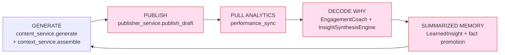
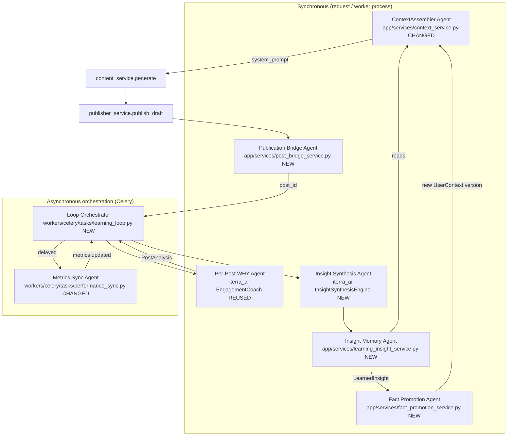

# Design Document: Self-Learning Content Loop

## Overview

The self-learning content loop is the agentic feedback cycle that makes Iterra's content
get measurably better over time. The system **(1) posts content**, **(2) pulls its own
analytics after posting**, **(3) decodes _why_ a post succeeded or failed**, **(4) stores
those learnings in a compact, summarized form**, and **(5) applies those learnings when
writing the next post**.

Today the platform has every ingredient but the wiring is broken in five places: publishing
writes only to `ContentDraft` (never creates a `Post`), AI analysis is manual-only, there is
no summarized "what we learned" memory, the context assembler never reads the analysis it
imports, and learned facts are never promoted into `UserContext`. This design closes those
gaps by adding a thin **agent layer on top of the existing engines and Celery orchestration** —
not a parallel framework. Each agent is a single-responsibility unit that either reuses an
existing `iterra_ai` `BaseEngine` (synchronous, typed, cost-tracked LLM call) or an existing
Celery task pattern (asynchronous hand-off via `.delay()` / chains).

This spec sits **on top of** two adjacent specs and deliberately does not duplicate them:

- `.kiro/specs/x-integration-hardening` — hardens X OAuth, token refresh, publishing, and sync.
- `.kiro/specs/iterra-platform-stabilization-and-twitter` — platform stabilization + Twitter sync.

Those specs own *connecting, publishing to, and pulling raw metrics from* LinkedIn and X. This
spec consumes their output: it assumes a `Post` can be published and its raw metrics fetched,
and it builds the **learning** that turns those metrics into better future content.

All work follows the repo conventions: contracts/schemas before code, no business logic in
routers, the AI engine is always called as the `iterra_ai` package (never over HTTP), every
prompt is a versioned constant under `iterra_ai/prompts/`, every model change ships with an
Alembic migration that has both `upgrade()` and `downgrade()`, engine I/O is typed Pydantic
(no raw `str`/`dict`), and every LLM call is cost-tracked through `BaseEngine._call_llm`.

---

## Part A — High-Level Design

### A.1 The Five-Stage Loop and the Gaps It Closes



| # | Gap (today) | Closed by (this design) |
|---|-------------|--------------------------|
| 1 | `publish_draft` writes only to `ContentDraft`; no `Post` is created | **Publication Bridge Agent** creates/links a `Post` on publish |
| 2 | AI analysis runs only via manual `POST /analytics/analyze/{post_id}` | **Loop Orchestrator** chains metric-sync → auto-analysis |
| 3 | No summarized "why posts win/lose" memory | New **`LearnedInsight`** table written by the **Insight Synthesis Agent** |
| 4 | `context_service` imports `PostAnalysis` but never queries it | **Context injection change**: Layer 3 reads `PostAnalysis` + `LearnedInsight` |
| 5 | `change_source='fact_promotion'` exists but is never executed | **Fact Promotion Agent** writes learned facts into `UserContext` |
| 6 | `weekly_reports.send_weekly_reports` is a TODO stub | Reimplemented on top of the **Insight Synthesis Agent** |
| 7 | `performance_sync` is LinkedIn-only, hardcodes `impressions=0` | **Metrics Sync Agent** made platform-agnostic via a `MetricsProvider` protocol |
| 8 | prediction/competitive engines are off-loop | Optional **Signal Enrichment** feeds them into the synthesis input |

## Architecture

### A.2 Agent Architecture

The loop is realized as **seven agents**. "Agent" here means a unit with one responsibility,
typed inputs/outputs, and an explicit hand-off mechanism. LLM-bearing agents are `iterra_ai`
engines; orchestration/IO agents are API services or Celery tasks.



#### Agent responsibilities, I/O, reuse, and hand-off

| Agent | Single responsibility | Input → Output | Reuses / New | Hand-off |
|-------|----------------------|----------------|--------------|----------|
| **ContextAssembler Agent** | Build the 3-layer system prompt; inject learnings into Layer 3 | `(db, user, platform)` → `AssembledContext` | **CHANGED** `context_service` | Synchronous call from `content_service.generate` |
| **Publication Bridge Agent** | Create/link a `Post` for an Iterra-published `ContentDraft` | `(db, user, draft, publish_result)` → `Post` | **NEW** `post_bridge_service` | Synchronous call from publish flow; then enqueues Orchestrator via `.delay()` |
| **Metrics Sync Agent** | Pull raw metrics for a post from its platform (LinkedIn **or** X) | `post` → updated `Post` (likes/comments/shares/impressions/ER) | **CHANGED** `performance_sync` + **NEW** `MetricsProvider` protocol | Celery task; chains into auto-analysis |
| **Per-Post WHY Agent** | Score one post (hook/tone/structure/CTA) and explain why | `CoachInput` → `CoachOutput` | **REUSED** `EngagementCoach` | Synchronous engine call inside `analytics_service.analyze_post` |
| **Insight Synthesis Agent** | Synthesize many posts + analyses into a compact "why we win/lose" summary + candidate facts | `InsightSynthesisInput` → `InsightSynthesisOutput` | **NEW** `InsightSynthesisEngine` | Synchronous engine call inside Insight Memory Agent |
| **Insight Memory Agent** | Persist/version the summarized insight per user+platform | `(db, user, platform, output)` → `LearnedInsight` | **NEW** `learning_insight_service` | Synchronous; hands candidate facts to Fact Promotion |
| **Fact Promotion Agent** | Write high-confidence learned facts into `UserContext.platform_facts` as a new version | `(db, user, platform, candidate_facts)` → `UserContext` | **NEW** `fact_promotion_service` | Synchronous; result read by ContextAssembler next cycle |
| **Loop Orchestrator** | Sequence publish→sync→analyze→summarize→promote; enforce idempotency and timing | post_id / user_id | **NEW** `learning_loop` Celery tasks | Celery chains + `.delay()`; beat-scheduled cadence task |

**Why this split.** `EngagementCoach` already decodes *per-post* WHY well (hook/tone/structure
+ `detailed_feedback`). What is missing is **cross-post synthesis** ("questions outperform your
statements by 2x on LinkedIn", "long-form wins on weekday mornings") and a **durable place to
keep it**. The Insight Synthesis Agent owns synthesis; the Insight Memory Agent owns durability;
the Fact Promotion Agent owns turning a learning into an approved, prompt-visible fact. Keeping
these separate preserves single responsibility and lets each degrade independently.

### A.3 End-to-End Data Flow (closed loop)

```mermaid
sequenceDiagram
    participant U as User / Scheduler
    participant CS as content_service
    participant CTX as context_service (Agent)
    participant PUB as publisher_service
    participant BR as post_bridge_service (Agent)
    participant ORCH as learning_loop (Orchestrator)
    participant SYNC as performance_sync (Agent)
    participant AN as analytics_service + EngagementCoach
    participant MEM as learning_insight_service (Agent)
    participant SYN as InsightSynthesisEngine (Agent)
    participant PROMO as fact_promotion_service (Agent)
    participant DB as Postgres

    U->>CS: generate(platform, prompt)
    CS->>CTX: assemble(db, user, platform)
    CTX->>DB: read UserContext + BrandProfile + Post + PostAnalysis + LearnedInsight
    CTX-->>CS: system_prompt (now carries learnings)
    CS->>DB: write ContentDraft
    U->>PUB: publish_draft(draft)
    PUB->>DB: set draft.platform_post_id, published_at
    PUB->>BR: bridge_draft_to_post(draft, result)
    BR->>DB: upsert Post (source='iterra_published', draft.post_id=Post.id)
    BR->>ORCH: on_post_published.delay(post_id)
    Note over ORCH: idempotent; schedules delayed pulls (t+1h, t+24h, t+72h)
    ORCH->>SYNC: sync_single_post(post_id)
    SYNC->>DB: update Post metrics via MetricsProvider (LinkedIn|X)
    ORCH->>AN: analyze_post(post_id) [auto, was manual]
    AN->>DB: write/refresh PostAnalysis
    ORCH->>MEM: synthesize_user_insights(user, platform)
    MEM->>SYN: InsightSynthesisEngine.generate(InsightSynthesisInput)
    SYN-->>MEM: summary + why_wins/why_losses + candidate_facts
    MEM->>DB: upsert LearnedInsight (versioned)
    MEM->>PROMO: promote_facts(user, platform, candidate_facts)
    PROMO->>DB: insert new UserContext version (change_source='fact_promotion')
    Note over PROMO,CTX: next generate() reads the promoted facts → loop closed
```

## Components and Interfaces

_High-level component contracts; full low-level signatures are in Part B._

#### ContextAssembler Agent (CHANGED `app/services/context_service.py`)

- **Purpose**: produce the 3-layer system prompt. The change makes **Layer 3** read the AI
  WHY-analysis (`PostAnalysis`) and the summarized `LearnedInsight`, not just raw recent
  engagement.
- **Interface** (unchanged signature, richer output):
  ```python
  def assemble(db: Session, user: User, platform: str = "linkedin") -> AssembledContext: ...
  ```
- **Responsibilities**: read `LearnedInsight` for `(user, platform)`; fold its `summary`,
  `why_wins`, and `recommendations` into the `ReportContext`; degrade gracefully to current
  behavior when no insight exists.

#### Publication Bridge Agent (NEW `app/services/post_bridge_service.py`)

- **Purpose**: the missing link that gives the loop something to learn from.
- **Interface**:
  ```python
  def bridge_draft_to_post(db: Session, user: User, draft: ContentDraft,
                           publish_result: dict) -> Post: ...
  ```
- **Responsibilities**: when a draft is published, create a `Post` (or link an existing one by
  `platform_post_id`) carrying `content`, `platform`, `platform_post_id`, `published_at`,
  `source='iterra_published'`, and set `draft.post_id`. Idempotent on `(platform, platform_post_id)`.

#### Metrics Sync Agent (CHANGED `performance_sync.py` + NEW `MetricsProvider`)

- **Purpose**: pull raw metrics for any platform and normalize engagement-rate math.
- **Interface**:
  ```python
  class MetricsProvider(Protocol):
      platform: str
      async def fetch(self, conn: SocialConnection, post: Post) -> PostMetrics | None: ...
  ```
- **Responsibilities**: route to `LinkedInMetricsProvider` / `TwitterMetricsProvider`; fix
  impressions handling (use real impressions when the platform supplies them, fall back to a
  follower/reach proxy or leave `None` rather than hardcoding `0`); compute `engagement_rate`
  with a platform-correct denominator.

#### Per-Post WHY Agent (REUSED `iterra_ai.coach.EngagementCoach`)

- Already produces `hook_score`, `tone_match_score`, `structure_score`, `cta_effectiveness`,
  `top_strength`, `top_improvement`, `detailed_feedback`, `predicted_engagement`,
  `rewrite_suggestion`. No engine change; only its **invocation** moves from manual-only to
  auto-chained by the Orchestrator.

#### Insight Synthesis Agent (NEW `iterra_ai/insight/`)

- **Purpose**: the "decode WHY across posts" brain. Turns a batch of `(Post, PostAnalysis)`
  records into a compact, durable narrative + structured recommendations + candidate facts.
- See Part B for full schemas, prompt, and algorithm.

#### Insight Memory Agent (NEW `app/services/learning_insight_service.py`)

- **Purpose**: own the `LearnedInsight` row lifecycle (read latest, upsert new version,
  decide when re-synthesis is warranted).

#### Fact Promotion Agent (NEW `app/services/fact_promotion_service.py`)

- **Purpose**: execute the long-dormant `fact_promotion` path — write approved learned facts
  (best post times, best formats, avoid-list) into a **new** `UserContext` version.

#### Loop Orchestrator (NEW `workers/celery/tasks/learning_loop.py`)

- **Purpose**: sequence the asynchronous stages with correct timing and idempotency, and run
  the periodic per-user insight cadence (superseding the weekly-report stub's role).

## Error Handling

### A.5 Error Handling & Graceful Degradation

| Failure | Behavior |
|---------|----------|
| Bridge cannot create `Post` (e.g., missing `platform_post_id`) | Log + emit `AnalyticsEvent('post_bridge_failed')`; publish still succeeds; loop simply has nothing to learn from this post |
| Platform metrics fetch fails / rate-limited | Existing retry/backoff in `performance_sync`; post keeps prior metrics; orchestrator reschedules next pull window |
| `EngagementCoach` LLM fails | Existing heuristic fallback in `EngagementCoach._heuristic_analyze` |
| `InsightSynthesisEngine` LLM fails | Heuristic fallback built from `analytics_service.get_content_insights` (already computes hook/length/time patterns without an LLM); **prior `LearnedInsight` is retained**, never wiped |
| Fact promotion produces a low-confidence fact | Not promoted; only facts ≥ confidence threshold are written; previous `UserContext` stays active |
| Any stage raises mid-chain | Chain stops at that stage; partial progress persists; next cadence run resumes from current DB state (stages are idempotent) |

### A.6 Security, Cost, and Idempotency (high level)

- **Cost tracking**: `InsightSynthesisEngine` extends `BaseEngine`, so every call is logged by
  `CostTracker` exactly like `EngagementCoach`. Synthesis runs **per user+platform on a cadence**,
  not per request, capping spend. Per-post auto-analysis reuses the existing coach call already
  budgeted by the manual endpoint.
- **No new external surface**: all LLM access stays in-package; no new network egress of user
  content beyond the existing Anthropic/AIML path.
- **Idempotency** is enforced through `AnalyticsEvent` markers and natural keys (see B.6).

---

## Part B — Low-Level Design

## Data Models

### B.1 Data Models (new + changed) and Migrations

Every model change ships as one Alembic migration with `upgrade()` **and** `downgrade()`.
SQLAlchemy models follow the existing style (`String` UUID PKs, `utc_now` defaults).

#### B.1.1 NEW model: `LearnedInsight` — the summarized memory (Gap 3)

`app/models/learned_insight.py`

```python
import uuid
from sqlalchemy import (Column, DateTime, Float, ForeignKey, Integer, JSON,
                        String, Text, UniqueConstraint)
from sqlalchemy.orm import relationship
from app.db.base import Base
from app.db.datetime_helpers import utc_now


class LearnedInsight(Base):
    """
    Compact, summarized 'what we learned / why posts win or lose' memory for one
    user on one platform. Upserted in place and version-bumped on each synthesis,
    mirroring the BrandProfile single-active-row pattern (not append-only).
    Read by context_service Layer 3 to inject learnings into the next prompt.
    """
    __tablename__ = "learned_insights"

    id = Column(String, primary_key=True, default=lambda: str(uuid.uuid4()))
    user_id = Column(String, ForeignKey("users.id", ondelete="CASCADE"),
                     nullable=False, index=True)
    platform = Column(String, nullable=False, index=True)

    # Human-readable synthesis (1 short paragraph) injected into the prompt.
    summary = Column(Text, nullable=False, default="")

    # Structured, prompt-ready learnings. Each is a list[str] of crisp findings.
    why_wins = Column(JSON, nullable=False, default=list)      # what makes posts succeed
    why_losses = Column(JSON, nullable=False, default=list)    # what makes posts underperform
    recommendations = Column(JSON, nullable=False, default=list)  # do-next guidance for generation

    # Candidate facts proposed for promotion into UserContext.platform_facts.
    # Shape: [{"key": "best_post_times", "value": ["08:00"], "confidence": 0.81,
    #          "evidence": "5 of top 6 posts published 07:00-09:00"}]
    candidate_facts = Column(JSON, nullable=False, default=list)

    # Provenance / confidence
    confidence = Column(Float, nullable=False, default=0.0)   # 0..1 overall trust
    based_on_posts = Column(Integer, nullable=False, default=0)
    based_on_analyses = Column(Integer, nullable=False, default=0)
    period_days = Column(Integer, nullable=False, default=30)
    model = Column(String, nullable=True)                     # engine model or "heuristic"
    is_mock = Column(Integer, nullable=False, default=0)      # 0/1 flag for fallback output

    version = Column(Integer, nullable=False, default=1)
    generated_at = Column(DateTime, default=utc_now)
    updated_at = Column(DateTime, default=utc_now, onupdate=utc_now)

    user = relationship("User", back_populates="learned_insights")

    __table_args__ = (
        UniqueConstraint("user_id", "platform", name="uq_learned_insight_user_platform"),
    )
```

`User` gains `learned_insights = relationship("LearnedInsight", back_populates="user", cascade="all, delete-orphan")`.

#### B.1.2 CHANGED model: `ContentDraft` — draft↔post link (Gap 1)

Add a nullable FK so a published draft points at the `Post` the loop learns from:

```python
# app/models/content_draft.py  (added column)
post_id = Column(String, ForeignKey("posts.id", ondelete="SET NULL"),
                 nullable=True, index=True)
post = relationship("Post", foreign_keys=[post_id])
```

#### B.1.3 CHANGED model: `Post` — provenance (Gaps 1 & 7)

```python
# app/models/post.py  (added column)
# 'imported' (scraper/importer) | 'iterra_published' (created by the bridge)
source = Column(String, nullable=False, default="imported", index=True)
```

`impressions` stays `Integer NOT NULL default 0` for backward compatibility, but the Metrics
Sync Agent stops writing a hardcoded `0`: when a platform does not report impressions it leaves
the existing value untouched and uses the platform-specific ER rule in B.4.

#### B.1.4 Alembic migration note

One revision, e.g. `xxxx_self_learning_loop.py`:

```python
def upgrade():
    op.create_table(
        "learned_insights",
        sa.Column("id", sa.String(), primary_key=True),
        sa.Column("user_id", sa.String(), sa.ForeignKey("users.id", ondelete="CASCADE"),
                  nullable=False),
        sa.Column("platform", sa.String(), nullable=False),
        sa.Column("summary", sa.Text(), nullable=False, server_default=""),
        sa.Column("why_wins", sa.JSON(), nullable=False),
        sa.Column("why_losses", sa.JSON(), nullable=False),
        sa.Column("recommendations", sa.JSON(), nullable=False),
        sa.Column("candidate_facts", sa.JSON(), nullable=False),
        sa.Column("confidence", sa.Float(), nullable=False, server_default="0"),
        sa.Column("based_on_posts", sa.Integer(), nullable=False, server_default="0"),
        sa.Column("based_on_analyses", sa.Integer(), nullable=False, server_default="0"),
        sa.Column("period_days", sa.Integer(), nullable=False, server_default="30"),
        sa.Column("model", sa.String(), nullable=True),
        sa.Column("is_mock", sa.Integer(), nullable=False, server_default="0"),
        sa.Column("version", sa.Integer(), nullable=False, server_default="1"),
        sa.Column("generated_at", sa.DateTime(), nullable=True),
        sa.Column("updated_at", sa.DateTime(), nullable=True),
    )
    op.create_index("ix_learned_insights_user_id", "learned_insights", ["user_id"])
    op.create_index("ix_learned_insights_platform", "learned_insights", ["platform"])
    op.create_unique_constraint("uq_learned_insight_user_platform",
                                "learned_insights", ["user_id", "platform"])
    op.add_column("content_drafts",
                  sa.Column("post_id", sa.String(), nullable=True))
    op.create_foreign_key("fk_content_drafts_post_id", "content_drafts", "posts",
                          ["post_id"], ["id"], ondelete="SET NULL")
    op.create_index("ix_content_drafts_post_id", "content_drafts", ["post_id"])
    op.add_column("posts",
                  sa.Column("source", sa.String(), nullable=False,
                            server_default="imported"))
    op.create_index("ix_posts_source", "posts", ["source"])

def downgrade():
    op.drop_index("ix_posts_source", table_name="posts")
    op.drop_column("posts", "source")
    op.drop_index("ix_content_drafts_post_id", table_name="content_drafts")
    op.drop_constraint("fk_content_drafts_post_id", "content_drafts", type_="foreignkey")
    op.drop_column("content_drafts", "post_id")
    op.drop_constraint("uq_learned_insight_user_platform", "learned_insights", type_="unique")
    op.drop_index("ix_learned_insights_platform", table_name="learned_insights")
    op.drop_index("ix_learned_insights_user_id", table_name="learned_insights")
    op.drop_table("learned_insights")
```

No new `AnalyticsEvent` columns are required — its existing `event_type` + `metrics` JSON
absorb the new loop events used for idempotency/audit (see B.6).

### B.2 NEW Engine: `InsightSynthesisEngine` (iterra_ai)

Lives under `packages/ai-engine/iterra_ai/insight/` with the standard layout
(`engine.py`, `schemas.py`) and a versioned prompt module `iterra_ai/prompts/insight.py`.
Registered in `iterra_ai/__init__.py` exports.

#### B.2.1 Schemas — `iterra_ai/insight/schemas.py`

```python
from pydantic import BaseModel, Field


class PostPerformanceRecord(BaseModel):
    """One analyzed post fed into synthesis. Pre-joined Post + PostAnalysis."""
    content: str
    platform: str
    published_hour: int | None = None          # 0-23 UTC, for timing patterns
    likes: int = 0
    comments: int = 0
    shares: int = 0
    impressions: int | None = None
    engagement_rate: float = 0.0
    hook_score: int | None = None              # from PostAnalysis
    tone_match_score: int | None = None
    structure_score: int | None = None
    cta_effectiveness: str | None = None
    top_strength: str | None = None
    top_improvement: str | None = None


class InsightSynthesisInput(BaseModel):
    platform: str
    period_days: int = 30
    avg_engagement_rate: float | None = None
    records: list[PostPerformanceRecord]
    # Optional off-loop signals (Gap 8); engine treats them as soft context.
    predicted_signals: dict | None = None      # from PredictorEngine
    competitive_signals: dict | None = None     # from competitive engine
    # Prior memory so synthesis is incremental, not amnesiac.
    prior_summary: str | None = None


class CandidateFact(BaseModel):
    key: str = Field(..., description="e.g. best_post_times | best_formats | avoid")
    value: list[str]
    confidence: float = Field(..., ge=0.0, le=1.0)
    evidence: str


class InsightSynthesisOutput(BaseModel):
    summary: str                                # 1 short paragraph
    why_wins: list[str] = Field(default_factory=list)
    why_losses: list[str] = Field(default_factory=list)
    recommendations: list[str] = Field(default_factory=list)
    candidate_facts: list[CandidateFact] = Field(default_factory=list)
    confidence: float = Field(0.0, ge=0.0, le=1.0)
    model: str = ""
    is_mock: bool = False
```

#### B.2.2 Engine — `iterra_ai/insight/engine.py`

```python
class InsightSynthesisEngine(BaseEngine[InsightSynthesisInput, InsightSynthesisOutput]):
    """
    Cross-post 'why' synthesizer. Reads many analyzed posts and distills a compact,
    durable memory + candidate facts. Mirrors EngagementCoach's structure:
    typed I/O, cost-tracked _call_llm, JSON parsing with fallback strategies,
    and a deterministic heuristic fallback when the LLM is unavailable.
    """
    DEFAULT_MODEL = "gpt-4o-mini"
    MAX_TOKENS = 1500
    TEMPERATURE = 0.3

    def generate(self, input: InsightSynthesisInput) -> InsightSynthesisOutput:
        if not self._client and not os.getenv("AIML_API_KEY"):
            return self._heuristic_synthesize(input)          # graceful degradation
        try:
            system, user = format_insight_prompt(input)        # from prompts/insight.py
            raw = self._call_llm(system=system, user=user,     # cost-tracked
                                 max_tokens=self.MAX_TOKENS,
                                 temperature=self.TEMPERATURE)
            data = self._parse_json(raw)                        # reuse coach-style parsing
            return self._build_output(data, input)
        except Exception:
            logger.exception("InsightSynthesisEngine failed; using heuristic fallback")
            return self._heuristic_synthesize(input)

    def _heuristic_synthesize(self, input) -> InsightSynthesisOutput:
        # Deterministic patterns from records: rank by engagement_rate, compare
        # top third vs bottom third on hook/length/CTA/publish_hour. This mirrors
        # analytics_service.get_content_insights so the loop still learns w/o an LLM.
        ...
```

The heuristic fallback intentionally reuses the same pattern math already proven in
`analytics_service.get_content_insights` (`_analyze_hook_patterns`, `_analyze_length_patterns`,
`_analyze_time_patterns`, `_analyze_quality_engagement_correlation`), so a missing API key
degrades quality, never correctness.

#### B.2.3 Versioned prompt — `iterra_ai/prompts/insight.py`

Follows the `coach.py` convention exactly: module-level versioned constants plus a
`format_insight_prompt(input) -> tuple[str, str]` helper.

```python
INSIGHT_SYNTHESIS_SYSTEM_V1 = """You are a content performance analyst. You receive a
creator's recent posts with engagement metrics and per-post AI scores. Identify the
PATTERNS that separate winners from losers for THIS creator on THIS platform.
Be specific and evidence-based. Output ONLY JSON matching the schema:
{
  "summary": str,                 // one tight paragraph
  "why_wins": [str],              // patterns that drive success
  "why_losses": [str],           // patterns that drag performance
  "recommendations": [str],       // concrete guidance for the NEXT post
  "candidate_facts": [            // only facts you are confident enough to promote
     {"key": "best_post_times|best_formats|avoid", "value": [str],
      "confidence": float, "evidence": str}],
  "confidence": float             // overall 0..1
}
Never invent facts not supported by the records. Prefer fewer, higher-confidence facts."""

INSIGHT_SYNTHESIS_USER_V1 = """Platform: {platform}
Period: last {period_days} days | Avg engagement rate: {avg_er}
{prior_block}
POSTS (ranked by engagement):
{records_block}
{signals_block}
Respond with JSON per the system instructions."""
```

### B.3 NEW / CHANGED Services (FastAPI side, no business logic in routers)

#### B.3.1 NEW `app/services/post_bridge_service.py` (Gap 1)

```python
def bridge_draft_to_post(db: Session, user: User, draft: ContentDraft,
                         publish_result: dict) -> Post | None:
    """
    Create or link the Post that represents an Iterra-published draft so the loop
    has something to analyze. Idempotent on (platform, platform_post_id) and on
    draft.post_id. Returns the Post, or None if the draft has no platform_post_id.
    """
    platform_post_id = publish_result.get("platform_post_id") or draft.platform_post_id
    if not platform_post_id:
        _emit_event(db, user.id, "post_bridge_failed",
                    metrics={"draft_id": draft.id, "reason": "no_platform_post_id"})
        return None

    if draft.post_id:                                   # already bridged
        return db.query(Post).filter(Post.id == draft.post_id).first()

    existing = (db.query(Post)
                  .filter(Post.platform == draft.platform,
                          Post.platform_post_id == platform_post_id)
                  .first())
    if existing:                                        # scraper got there first
        draft.post_id = existing.id
        existing.source = "iterra_published"
        db.commit()
        return existing

    post = Post(
        user_id=user.id,
        workspace_id=draft.workspace_id,
        platform=draft.platform,
        platform_post_id=platform_post_id,
        content=_draft_plaintext(draft),                # joins thread JSON into text
        content_type="thread" if _is_thread(draft.content) else "post",
        published_at=draft.published_at or utc_now(),
        source="iterra_published",
        topics=[],
    )
    db.add(post)
    db.flush()
    draft.post_id = post.id
    db.commit()
    _emit_event(db, user.id, "post_bridged",
                post_id=post.id, metrics={"draft_id": draft.id})
    return post
```

**Call sites** (both publish paths):
- `content_service.publish_now()` — after the draft is marked published, call
  `bridge_draft_to_post(...)` then `learning_loop.on_post_published.delay(post.id)`.
- `workers/celery/tasks/publisher.process_publishing_queue` — same two calls after a queued
  publish succeeds.

#### B.3.2 NEW `app/services/learning_insight_service.py` (Insight Memory Agent, Gap 3)

```python
def get_active_insight(db: Session, user: User, platform: str) -> LearnedInsight | None:
    return (db.query(LearnedInsight)
              .filter(LearnedInsight.user_id == user.id,
                      LearnedInsight.platform == platform)
              .first())

def synthesize_user_insights(db: Session, user: User, platform: str,
                             period_days: int = 30) -> LearnedInsight | None:
    """
    Build InsightSynthesisInput from the last `period_days` of (Post, PostAnalysis),
    run InsightSynthesisEngine, and upsert the LearnedInsight row (version += 1).
    Skips work when there is nothing new to learn (see B.6 idempotency).
    """
    records = _build_records(db, user, platform, period_days)   # joins Post + PostAnalysis
    if len(records) < MIN_POSTS_FOR_SYNTHESIS:                  # e.g. 3
        return None
    prior = get_active_insight(db, user, platform)
    output = InsightSynthesisEngine().generate(InsightSynthesisInput(
        platform=platform, period_days=period_days,
        avg_engagement_rate=_avg_er(records), records=records,
        prior_summary=prior.summary if prior else None,
        predicted_signals=_maybe_predictions(db, user, platform),    # Gap 8 (optional)
        competitive_signals=_maybe_competitive(db, user, platform),  # Gap 8 (optional)
    ))
    return _upsert_insight(db, user, platform, output, records)
```

`_upsert_insight` writes/updates the single `(user, platform)` row, bumps `version`, stores
`model`/`is_mock`, and emits `AnalyticsEvent('insight_synthesized')`. After upserting it calls
the Fact Promotion Agent with `output.candidate_facts`.

#### B.3.3 NEW `app/services/fact_promotion_service.py` (Gap 5)

```python
PROMOTION_CONFIDENCE_THRESHOLD = 0.7

def promote_facts(db: Session, user: User, platform: str,
                  candidate_facts: list[dict]) -> UserContext | None:
    """
    Execute the dormant 'fact_promotion' path: write high-confidence learned facts
    into a NEW UserContext version (append-only), then flip is_active.
    Only facts with confidence >= threshold are written. No-op if none qualify
    or if the resulting platform_facts equal the active version (idempotent).
    """
    promotable = [f for f in candidate_facts
                  if f.get("confidence", 0) >= PROMOTION_CONFIDENCE_THRESHOLD]
    if not promotable:
        return None

    active = context_service.get_active_user_context(db, user)
    new_facts = _merge_platform_facts(active.platform_facts if active else {},
                                      platform, promotable)
    if active and new_facts == active.platform_facts:           # nothing changed
        return None

    if active:
        active.is_active = False
    new_ctx = UserContext(
        user_id=user.id,
        brand_name=active.brand_name if active else None,
        bio=active.bio if active else None,
        target_audience=active.target_audience if active else None,
        content_mission=active.content_mission if active else None,
        platform_facts=new_facts,
        version=(active.version + 1) if active else 1,
        change_source="fact_promotion",
        change_summary=_describe(promotable, platform),
        is_active=True,
    )
    db.add(new_ctx)
    db.commit()
    _emit_event(db, user.id, "fact_promoted",
                metrics={"platform": platform,
                         "facts": [f["key"] for f in promotable]})
    return new_ctx
```

`_merge_platform_facts` writes into the same JSON shape `context_service` already reads
(`PlatformFactEntry`: `best_post_times`, `best_formats`, `avoid`, `confirmed_at`), so no
context-schema migration is needed.

#### B.3.4 CHANGED `app/services/context_service.py` — inject learnings (Gap 4)

The single most important change. `_get_report_context` currently reads only raw recent `Post`
engagement and **never** touches `PostAnalysis` (imported but unused) or any summarized memory.
Two precise edits:

```python
# Layer 3 now also reads PostAnalysis aggregates + the LearnedInsight memory.
def _get_report_context(db, user, platform) -> ReportContext:
    posts = _recent_posts(db, user, platform, days=30)        # existing query
    insight = learning_insight_service.get_active_insight(db, user, platform)  # NEW

    # Existing: top topics / avg ER / best hook from raw posts ...
    # NEW: aggregate AI WHY-analysis across analyzed posts in the window.
    analysis_rows = _recent_analyses(db, user, platform, days=30)  # joins PostAnalysis
    avg_hook = _avg(a.hook_score for a in analysis_rows)
    common_improvement = _most_common(a.coach_feedback.get("top_improvement")
                                      for a in analysis_rows)

    return ReportContext(
        top_performing_topics=...,
        avg_engagement_rate=...,
        best_hook_last_cycle=...,
        posts_analysed=len(posts),
        period_days=30,
        # NEW prompt-ready learnings (added fields on ReportContext schema):
        learned_summary=insight.summary if insight else None,
        why_wins=insight.why_wins if insight else [],
        recommendations=insight.recommendations if insight else [],
        avg_hook_score=avg_hook,
        recurring_improvement=common_improvement,
    )
```

```python
# _build_system_prompt gains a 'What We've Learned' block in Layer 3:
if report.learned_summary:
    parts.append("## What We've Learned (apply this)")
    parts.append(f"- Summary: {report.learned_summary}")
    if report.why_wins:
        parts.append(f"- What wins for you: {'; '.join(report.why_wins[:4])}")
    if report.recommendations:
        parts.append(f"- Do next: {'; '.join(report.recommendations[:4])}")
    if report.recurring_improvement:
        parts.append(f"- Recurring fix to avoid repeating: {report.recurring_improvement}")
```

`app/schemas/context.py` `ReportContext` gains the new optional fields
(`learned_summary`, `why_wins`, `recommendations`, `avg_hook_score`, `recurring_improvement`),
all defaulting empty so behavior is unchanged until a `LearnedInsight` exists.

#### B.3.5 CHANGED `app/services/analytics_service.py` — keep `analyze_post` idempotent

`analyze_post` already short-circuits when a fresh (<30d) `PostAnalysis` exists. The Orchestrator
calls it directly; the only addition is emitting `AnalyticsEvent('auto_analysis_complete')` so
the synthesis step can detect "new analyses since last run" (B.6).

### B.4 Metrics Sync Agent — platform-agnostic (Gap 7)

`workers/celery/tasks/performance_sync.py` is refactored so the per-post fetch goes through a
provider keyed by `post.platform`. The orchestration, batching, retry, and dead-letter logic
are unchanged.

```python
class PostMetrics(BaseModel):
    likes: int = 0
    comments: int = 0
    shares: int = 0
    impressions: int | None = None      # None = platform did not report it

class MetricsProvider(Protocol):
    platform: str
    async def fetch(self, conn: SocialConnection, post: Post) -> PostMetrics | None: ...

class LinkedInMetricsProvider:           # wraps existing LinkedInClient.get_social_actions
    platform = "linkedin"
    async def fetch(self, conn, post):
        raw = await LinkedInClient(conn.access_token).get_social_actions(post.platform_post_id)
        # impressions usually absent -> return None (do NOT hardcode 0)
        ...

class TwitterMetricsProvider:            # uses X v2 public_metrics (see x-integration-hardening)
    platform = "twitter"
    async def fetch(self, conn, post):
        # GET /2/tweets/:id?tweet.fields=public_metrics,non_public_metrics
        # like_count, reply_count, retweet_count+quote_count, impression_count
        ...

PROVIDERS = {p.platform: p for p in (LinkedInMetricsProvider(), TwitterMetricsProvider())}
```

Engagement-rate rule (replaces the LinkedIn-only `impressions=0` path):

```python
def compute_engagement_rate(m: PostMetrics, followers: int | None) -> float:
    interactions = (m.likes or 0) + (m.comments or 0) + (m.shares or 0)
    denom = m.impressions if (m.impressions and m.impressions > 0) else followers
    return round(interactions / denom, 4) if denom else 0.0
```

`_sync_single_post` writes `impressions` only when the provider returns a non-`None` value,
otherwise it preserves the prior value. `sync_single_post` (the per-post task documented as
"for immediate updates after publishing" but never called) is now invoked by the Orchestrator.

### B.5 Loop Orchestrator — Celery tasks + chaining (Gap 2, ties it together)

`workers/celery/tasks/learning_loop.py` (registered in `workers/celery/app.py` `include`).

```python
@celery_app.task(name="workers.celery.tasks.learning_loop.on_post_published", bind=True)
def on_post_published(self, post_id: str) -> dict:
    """
    Entry point fired by the bridge right after publish. Metrics need time to
    accumulate, so schedule delayed pull+analyze passes rather than running now.
    Idempotent: re-delivery just re-schedules the same windows.
    """
    for delay in (PULL_DELAYS):              # e.g. 1h, 24h, 72h
        pull_and_analyze_post.apply_async(kwargs={"post_id": post_id}, countdown=delay)
    return {"post_id": post_id, "scheduled_pulls": len(PULL_DELAYS)}


@celery_app.task(name="workers.celery.tasks.learning_loop.pull_and_analyze_post",
                 bind=True, max_retries=3, default_retry_delay=300)
def pull_and_analyze_post(self, post_id: str) -> dict:
    """
    Chain: sync metrics (Metrics Sync Agent) -> auto-analyze (EngagementCoach).
    Then enqueue synthesis for the owning user+platform (debounced in B.6).
    """
    db = _session()
    post = db.query(Post).filter(Post.id == post_id).first()
    if not post:
        return {"error": "post_not_found", "post_id": post_id}
    # 1) pull metrics (reuses refactored single-post sync)
    sync_single_post(post_id)                         # platform-agnostic now
    # 2) auto-analysis (was manual-only) — idempotent via fresh-analysis guard
    user = db.query(User).filter(User.id == post.user_id).first()
    analytics_service.analyze_post(db, user, post_id)
    # 3) debounced synthesis for this user+platform
    synthesize_user_insights.apply_async(
        kwargs={"user_id": post.user_id, "platform": post.platform}, countdown=60)
    return {"post_id": post_id, "status": "analyzed"}


@celery_app.task(name="workers.celery.tasks.learning_loop.synthesize_user_insights",
                 bind=True, max_retries=2, default_retry_delay=120)
def synthesize_user_insights(self, user_id: str, platform: str) -> dict:
    """Insight Memory Agent + Fact Promotion Agent (synchronous engine calls)."""
    db = _session()
    user = db.query(User).filter(User.id == user_id).first()
    if not user or not _has_new_analyses_since_last_synthesis(db, user, platform):
        return {"skipped": True}                       # idempotency guard (B.6)
    insight = learning_insight_service.synthesize_user_insights(db, user, platform)
    if insight:
        fact_promotion_service.promote_facts(db, user, platform, insight.candidate_facts)
    return {"user_id": user_id, "platform": platform,
            "version": insight.version if insight else None}


@celery_app.task(name="workers.celery.tasks.learning_loop.run_insight_cycle_all_users",
                 bind=True)
def run_insight_cycle_all_users(self) -> dict:
    """Beat-scheduled cadence: fan out synthesis for every active user+platform.
       This is the steady-state heartbeat in case event-driven runs were missed."""
    ...
```

#### Beat schedule additions (`workers/celery/beat_schedule.py`)

```python
_learning_loop_tasks = {
    "insight-cycle-daily": {
        "task": "workers.celery.tasks.learning_loop.run_insight_cycle_all_users",
        "schedule": crontab(hour=5, minute=0),   # after 2am sync, 1am analytics snapshot
    },
} if _enable_learning_loop else {}
BEAT_SCHEDULE = {**BEAT_SCHEDULE, **_learning_loop_tasks}
```

Gated by `ENABLE_LEARNING_LOOP` (default off in dev, on in prod), matching the existing
env-flag pattern (`ENABLE_ANALYTICS_TASKS`, etc.).

#### Weekly report (Gap 6) — reimplement on the same engine

`workers/celery/tasks/weekly_reports.send_weekly_reports` stops being a TODO: for each active
user it reads the active `LearnedInsight` per platform (synthesizing first if stale) and emails
a digest via `app/services/email.py`. It reuses the Insight Memory Agent output — no second
synthesis path — so the weekly email and the prompt injection are always consistent.

### B.6 Idempotency, Cost, and Per-Platform Differences

**Idempotency (don't double-anything).**

| Stage | Natural key / guard |
|-------|--------------------|
| Bridge | `draft.post_id` set → reuse; else unique `(platform, platform_post_id)` lookup before insert |
| Auto-analysis | existing "fresh `PostAnalysis` < 30d" short-circuit in `analyze_post`; `PostAnalysis.post_id` is `unique` |
| Synthesis | `synthesize_user_insights` runs only if `count(AnalyticsEvent['auto_analysis_complete'] since LearnedInsight.updated_at) > 0`; the 60s `countdown` debounces bursts (a batch of publishes collapses into one synthesis) |
| Fact promotion | only writes a new `UserContext` if merged `platform_facts` differ from the active version |

**Cost control.** Per-post LLM cost is the existing `EngagementCoach` call (already budgeted by
the manual endpoint), now triggered automatically but guarded by the fresh-analysis check.
Synthesis is **one** `InsightSynthesisEngine` call per user+platform per cadence (debounced),
logged by `CostTracker` like every other engine. No per-request synthesis. Heuristic fallback
costs zero tokens.

**Per-platform differences.**

| Concern | LinkedIn | X (Twitter) |
|---------|----------|-------------|
| Metrics source | `get_social_actions` (likes/comments/shares; impressions usually absent) | v2 `public_metrics` (+`non_public_metrics.impression_count` when authorized) |
| Impressions | often `None` → ER falls back to follower/reach proxy | `impression_count` when available |
| Content shape | single post | single tweet **or** thread (JSON array) — bridge flattens to plaintext for analysis, preserves thread in the draft |
| Synthesis scope | one `LearnedInsight` row | a **separate** `LearnedInsight` row (per `(user, platform)`) so learnings never bleed across platforms |

## Correctness Properties

These are the invariants the implementation must uphold (candidates for property-based tests
in the tasks phase). Each is expressed as a Python assertion over the loop's behavior.

### Property 1: Bridge creates exactly one Post per published draft (idempotent)

**Validates: Requirements 1.1, 1.2**

```python
assert publish_twice(draft).count_posts(platform, platform_post_id) == 1
assert bridge(draft, result).id == bridge(draft, result).id   # second call is a no-op
```

#### Property 2: A published draft is always linked to a learnable Post

**Validates: Requirements 1.4**

When a `platform_post_id` exists, the draft must end up linked to a `Post`.

```python
assert (draft.status == "published" and draft.platform_post_id) \
       implies (draft.post_id is not None)
```

#### Property 3: Auto-analysis never double-charges

**Validates: Requirements 2.2**

A fresh (<30d) analysis short-circuits and performs zero LLM calls.

```python
a1 = analyze_post(db, user, post_id); a2 = analyze_post(db, user, post_id)
assert a1["post_id"] == a2["post_id"] and llm_calls_during(a2) == 0
```

#### Property 4: Synthesis is monotonic and non-destructive

**Validates: Requirements 3.1, 3.3**

A successful run bumps `version`; a failed run retains prior memory.

```python
before = get_active_insight(db, user, platform)
after = synthesize_user_insights(db, user, platform)
assert after is None or after.version == (before.version + 1 if before else 1)
assert llm_failure_during_synthesis() implies get_active_insight(...) == before
```

#### Property 5: Only confident facts are promoted, versioned + append-only

**Validates: Requirements 5.1, 5.2, 5.5**

```python
ctx = promote_facts(db, user, platform, candidate_facts)
assert all(f.confidence >= 0.7 for f in promoted_facts(ctx))
assert ctx is None or (ctx.is_active and ctx.change_source == "fact_promotion"
                       and ctx.version == prev_active_version + 1)
```

#### Property 6: Learnings reach the next prompt

**Validates: Requirements 4.1, 4.2**

If a `LearnedInsight` exists, its summary appears in the assembled system prompt.

```python
ctx = context_service.assemble(db, user, platform)
assert (get_active_insight(db, user, platform) is None) or \
       (insight.summary in ctx.system_prompt)
```

#### Property 7: Platform isolation

**Validates: Requirements 3.4**

Synthesizing one platform never mutates another platform's memory.

```python
m_x = get_active_insight(db, user, "twitter")
synthesize_user_insights(db, user, "linkedin")
assert get_active_insight(db, user, "twitter") == m_x
```

#### Property 8: Engagement rate is well-defined on any denominator

**Validates: Requirements 7.1, 7.5**

```python
assert 0.0 <= compute_engagement_rate(metrics, followers) <= 1.0  # or platform-capped
assert compute_engagement_rate(PostMetrics(), followers=None) == 0.0
```

## Testing Strategy

### B.8 Testing Strategy

- **Unit**: bridge idempotency, `compute_engagement_rate` denominators, fact-merge logic,
  `_has_new_analyses_since_last_synthesis` debounce, ReportContext prompt assembly with/without
  a `LearnedInsight`.
- **Engine**: `InsightSynthesisEngine` with a mocked client (assert JSON parsing + heuristic
  fallback path), mirroring `tests/test_coach.py`.
- **Property-based** (library: `hypothesis`, matching the Python stack): encode P1–P8 above —
  especially P3 (no double-charge), P4 (monotonic, non-destructive synthesis), and P5
  (confidence-gated, versioned promotion).
- **Integration**: a fake publish → bridge → `sync_single_post` (stubbed provider) →
  `analyze_post` (stubbed coach) → synthesis → promotion → re-assemble, asserting the learned
  summary appears in the regenerated system prompt (full loop closure).

### B.9 Dependencies

- No new runtime dependencies. Reuses Anthropic/AIML client via `BaseEngine`, Celery + Redis
  for orchestration, SQLAlchemy + Alembic for persistence, and `hypothesis` (already used in
  the AI-engine test suite) for property tests.
- Depends on the adjacent specs for reliable publish + raw-metric retrieval:
  `x-integration-hardening` (X OAuth/refresh/publish/sync) and
  `iterra-platform-stabilization-and-twitter` (platform stabilization + Twitter sync). This
  spec does not modify their OAuth/connect/publish internals; it consumes their results.
