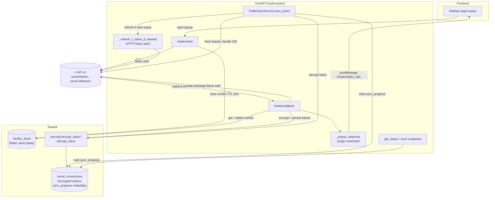

# Design Document

## Overview

This design hardens the existing X (Twitter) integration in the Iterra API service. It is a correctness, durability, and security pass over code paths that already exist — `app/routers/social_oauth.py`, `app/services/publisher_service.py`, and `app/services/twitter_service.py` — plus two shared social-OAuth fixes (`_popup_response` origin restriction and token-at-rest encryption in `app/core/security.py`).

The driving event is a billing migration to the official X API on a pay-as-you-go plan. This is a billing change only: the OAuth 2.0 + PKCE flow, the API endpoints, and the environment variables (`TWITTER_CLIENT_ID`, `TWITTER_CLIENT_SECRET`, `TWITTER_REDIRECT_URI`) are unchanged. No new environment variables are introduced.

The diagnosis surfaced seven concrete loose ends, two of them critical:

1. **Inconsistent client authentication (CRITICAL).** `_refresh_x_token_if_needed` authenticates to the token endpoint with HTTP Basic auth (`auth=(client_id, client_secret)`), but `twitter_callback` sends `client_id` in the form body with no Basic auth. When a client secret is configured, X treats the app as a confidential client and rejects the public-client-style code exchange — connect and refresh disagree.
2. **In-memory PKCE store (CRITICAL).** The verifier lives in a module-level `_pkce_store: dict[str, str]`. In a multi-worker deployment, the worker that handles `/twitter/callback` may not be the one that handled `/twitter/start`, so the verifier is missing and connect fails intermittently.
3. **Twitter sync-progress is shallow.** `twitter_service._update_sync_status` writes a flat `sync_status` key, not the structured `sync_progress` record that `linkedin_service` writes and that `get_status()` reads. Twitter status never surfaces `sync_error` or `sync_started_at`.
4. **OAuth popup posts to `"*"`.** `_popup_response` calls `window.opener.postMessage(payload, "*")`, leaking connection results and usernames to any opener origin.
5. **Tokens stored in plaintext.** `access_token` and `refresh_token` are written to `social_connections` unencrypted, despite `encrypt_value`/`decrypt_value` already existing.
6. **Silent rate-limit handling.** `_fetch_tweets` breaks out of its loop on HTTP 429 and returns whatever it has, with no signal — a rate-limited sync looks like a normal (possibly empty) success.
7. **Configuration drift risk.** The migration must stay on the three existing settings with no new secrets.

### Goals

- Make the connect and refresh flows authenticate identically as a confidential client.
- Persist the PKCE verifier in Redis so connect survives across workers.
- Bring Twitter sync-progress to parity with the LinkedIn `sync_progress` layout.
- Restrict the OAuth popup to the configured frontend origin.
- Encrypt tokens at rest with a migration for existing rows.
- Surface rate-limit interruptions as a distinct, non-silent outcome while retaining fetched tweets.

### Non-Goals

- LinkedIn read-scope strategy (explicitly out of scope).
- App-only `TWITTER_BEARER_TOKEN` / reading non-connected public accounts.
- Introducing any new environment variable or changing the OAuth endpoints.

## Architecture

The change set spans the request/response path for connect, the background sync path, and the persistence layer. The shared pieces (popup origin, token encryption) sit on code paths used by every platform.



### Component interaction summary

- **Connect (`/twitter/start` → `/twitter/callback`)** stores and retrieves the verifier in Redis instead of a process dict, and exchanges the code with HTTP Basic auth so it matches refresh.
- **Token persistence** routes through encryption helpers on every write and decryption on every read, with a fallback that flags a connection for reconnect when a stored value cannot be decrypted.
- **Sync (`TwitterSyncService`)** writes the structured `sync_progress` record (mirroring LinkedIn) and treats HTTP 429 as a distinct outcome that retains already-fetched tweets.
- **Status (`/sync/all`, `/sync/{platform}/status`, `/platforms`)** already reads `sync_status`/`sync_error`/`sync_started_at` from `PlatformStatus`; the fix is making `TwitterSyncService.get_status` populate them.

## Components and Interfaces

### 1. Confidential-client authentication (Requirement 1)

A single helper centralizes the client-authentication decision so connect and refresh cannot drift again.

```python
# app/routers/social_oauth.py (or a shared x_oauth helper module)

def _x_token_auth() -> tuple[str, str] | None:
    """Return HTTP Basic credentials when a client secret is configured.

    When TWITTER_CLIENT_SECRET is set, the X app is a confidential client and
    every token-endpoint request authenticates via HTTP Basic (client_id:client_secret).
    Returns None only when no secret is configured (public-client fallback).
    """
    if settings.TWITTER_CLIENT_SECRET:
        return (settings.TWITTER_CLIENT_ID, settings.TWITTER_CLIENT_SECRET)
    return None
```

- `twitter_callback` passes `auth=_x_token_auth()` to the `client.post(TWITTER_TOKEN_URL, ...)` code exchange and removes `client_id` from the form body when Basic auth is used (the client is identified by the Basic header).
- `_refresh_x_token_if_needed` already builds the same `auth` tuple; it is refactored to call `_x_token_auth()` so both paths share one source of truth.
- HTTP Basic is the only client-authentication method used for both flows (AC 1.4).
- On any token-endpoint error during connect, `twitter_callback` returns `_popup_response("twitter", "error", ...)` and does **not** call `_upsert_connection`, so no partial tokens are persisted (AC 1.7).

### 2. Durable PKCE verifier persistence (Requirement 2)

The module-level `_pkce_store` dict is replaced with a Redis-backed `Verifier_Store`. Redis is already configured (`settings.REDIS_URL`) and used by Celery.

```python
# app/services/pkce_store.py (new)

import redis
from app.config import settings

_VERIFIER_TTL_SECONDS = 600  # 10 minutes
_KEY = "pkce:verifier:{state}"

class VerifierStoreError(Exception):
    """Raised when the verifier store cannot be reached (distinct from missing)."""

_client: redis.Redis | None = None

def _redis() -> redis.Redis:
    global _client
    if _client is None:
        _client = redis.Redis.from_url(settings.REDIS_URL, decode_responses=True)
    return _client

def put_verifier(state: str, verifier: str) -> None:
    try:
        _redis().set(_KEY.format(state=state), verifier, ex=_VERIFIER_TTL_SECONDS)
    except redis.RedisError as exc:
        raise VerifierStoreError(str(exc)) from exc

def take_verifier(state: str) -> str | None:
    """Atomically fetch and delete the verifier. Returns None if absent/expired."""
    try:
        key = _KEY.format(state=state)
        pipe = _redis().pipeline()
        pipe.get(key)
        pipe.delete(key)
        value, _ = pipe.execute()
        return value
    except redis.RedisError as exc:
        raise VerifierStoreError(str(exc)) from exc
```

Callback handling distinguishes the two failure modes the requirements call out:

```python
# twitter_callback
try:
    verifier = take_verifier(state)
except VerifierStoreError:
    return _popup_response("twitter", "error",
        error="Could not reach the verifier store. Please try connecting again.")  # AC 2.7
if not verifier:
    return _popup_response("twitter", "error",
        error="PKCE verifier is missing or expired. Please start the connection again.")  # AC 2.6
```

- `/twitter/start` calls `put_verifier(state, verifier)` with a 10-minute TTL (AC 2.1, 2.2).
- `/twitter/callback` calls `take_verifier(state)`, which retrieves and deletes atomically (AC 2.3, 2.4).
- Because the store is shared Redis rather than per-process memory, any worker can complete the flow (AC 2.5).
- A missing/expired verifier and a store/network error produce **distinct** messages (AC 2.6 vs 2.7).

### 3. Twitter sync-progress parity (Requirements 3, 6)

`TwitterSyncService` adopts the same structured progress helpers LinkedIn uses, keyed under `connection_metadata["sync_progress"]`. The shallow `_update_sync_status` is replaced.

```python
# app/services/twitter_service.py

SYNC_STATUS_INITIATED = "initiated"
SYNC_STATUS_IN_PROGRESS = "in_progress"
SYNC_STATUS_COMPLETED = "completed"
SYNC_STATUS_FAILED = "failed"
SYNC_STATUS_RATE_LIMITED = "rate_limited"  # distinct, non-silent outcome (Req 6)

def _update_sync_progress(db, connection, status, *, error=None,
                          posts_fetched=None, reconnect_required=False) -> None:
    """Write structured sync progress, mirroring linkedin_service layout (AC 3.6).

    On failure to persist, the previously recorded progress is left unchanged (AC 3.4):
    the function commits a single metadata mutation; if commit raises, the caller
    rolls back and the prior committed value remains.
    """
    ...

def _get_sync_progress(connection) -> dict: ...
```

`get_status` is updated to read the structured record and populate the three fields on `PlatformStatus`:

```python
def get_status(self, db, user) -> PlatformStatus:
    ...
    progress = _get_sync_progress(connection)
    return PlatformStatus(
        ...,
        sync_status=progress.get("sync_status"),
        sync_error=progress.get("sync_error"),
        sync_started_at=_parse_iso(progress.get("sync_started_at")),
    )
```

Because `/sync/all`, `/sync/{platform}/status`, and `/platforms` already copy `sync_status`/`sync_error`/`sync_started_at` from `PlatformStatus` into their responses, populating them in `get_status` is sufficient for AC 3.5 and 3.7.

#### Rate-limit handling (Requirement 6)

`_fetch_tweets` is changed to signal a rate-limit interruption rather than silently breaking, while still returning the tweets gathered so far:

```python
class RateLimitInterruption(Exception):
    def __init__(self, partial_tweets: list[dict]):
        self.partial_tweets = partial_tweets

# inside the pagination loop, on response.status_code == 429:
if response.status_code == 429:
    raise RateLimitInterruption(all_tweets[:MAX_RESULTS])
```

`sync_posts` catches it, upserts the retained tweets, records the rate-limited progress, and returns a non-silent `SyncResult`:

```python
try:
    tweets = await self._fetch_tweets(token, twitter_user_id)
except RateLimitInterruption as rl:
    synced = _upsert_posts(db, user, [m for t in rl.partial_tweets
                                      if (m := self.map_post(t))])           # AC 6.1, 6.3
    _update_sync_progress(db, connection, SYNC_STATUS_RATE_LIMITED,
        error="X rate limit reached during sync. Partial results saved; "
              "try again later.")                                            # AC 6.2
    return SyncResult(synced_posts=synced, ..., sync_path="oauth_api",
        message="X rate limit reached. Synced the tweets fetched before the limit.")  # AC 6.5
```

`get_status` then surfaces the rate-limit message through `PlatformStatus.sync_error` (AC 6.4).

### 4. OAuth popup origin restriction (Requirement 4)

`_popup_response` is changed to target the configured frontend origin instead of `"*"`. This is shared by X, LinkedIn, and Instagram, so the fix applies to all three (AC 4.3).

```python
from urllib.parse import urlparse

def _frontend_origin() -> str:
    """Scheme://host[:port] derived from settings.FRONTEND_URL."""
    p = urlparse(settings.FRONTEND_URL)
    return f"{p.scheme}://{p.netloc}"

def _popup_response(platform, status_str, username="", error=""):
    target_origin = _frontend_origin()
    payload = json.dumps({...})
    html = f"""... window.opener.postMessage({payload}, {json.dumps(target_origin)}); ..."""
    return HTMLResponse(content=html)
```

- The target origin is the `Frontend_Origin` (AC 4.1).
- The wildcard `"*"` is never used in any environment; the origin must be configured per environment via `FRONTEND_URL` (AC 4.2). `FRONTEND_URL` already defaults to `http://localhost:3000` for local development.

### 5. Token encryption at rest (Requirement 5)

Token reads/writes route through `encrypt_value`/`decrypt_value`. To keep encryption from leaking into every call site, encryption is centralized at the persistence boundary.

Design choice: add accessor helpers and use them in `_upsert_connection`, the refresh flow, and at the point of use (publish / sync). The stored column value is always ciphertext; plaintext only exists in memory at the moment of use.

```python
# app/core/security.py — add a decrypt that signals undecryptable values
class TokenDecryptionError(Exception): ...

def decrypt_token(encrypted: str) -> str:
    """Decrypt a stored token. Raises TokenDecryptionError if it cannot be decrypted."""
    plaintext = decrypt_value(encrypted)   # returns "" on failure today
    if plaintext == "" and encrypted != "":
        raise TokenDecryptionError("stored token could not be decrypted")
    return plaintext
```

```python
# write path (_upsert_connection and _refresh_x_token_if_needed)
conn.access_token = encrypt_value(access_token)
conn.refresh_token = encrypt_value(refresh_token) if refresh_token else None   # AC 5.1, 5.2

# read path (sync / publish / refresh), before using a token in an API call
try:
    access_token = decrypt_token(conn.access_token)                            # AC 5.3
except TokenDecryptionError:
    _mark_reconnect_required(db, conn)   # treat as needing reconnection        # AC 5.6
    raise
```

- Encrypt `access_token` always, and `refresh_token` only when present (AC 5.1, 5.2).
- Decrypt before use in any API call (AC 5.3).
- Round-trip: writing then reading back yields the original plaintext (AC 5.4).
- A value that cannot be decrypted flags the connection for reconnection rather than being used (AC 5.6).

#### Migration (AC 5.5)

An Alembic data migration encrypts existing plaintext rows. To make it safe and idempotent, each value is probed: if `decrypt_value(value)` succeeds it is already encrypted and is skipped; otherwise the plaintext is encrypted in place.

```python
# alembic revision: encrypt_existing_social_tokens
def upgrade():
    conn = op.get_bind()
    rows = conn.execute(sa.text(
        "SELECT id, access_token, refresh_token FROM social_connections")).fetchall()
    for row in rows:
        updates = {}
        if _looks_like_plaintext(row.access_token):
            updates["access_token"] = encrypt_value(row.access_token)
        if row.refresh_token and _looks_like_plaintext(row.refresh_token):
            updates["refresh_token"] = encrypt_value(row.refresh_token)
        if updates:
            conn.execute(sa.text("UPDATE social_connections SET ... WHERE id=:id"),
                         {**updates, "id": row.id})
```

`_looks_like_plaintext(v)` returns `True` when `decrypt_value(v)` returns `""` for a non-empty `v` (Fernet tokens decrypt cleanly; raw plaintext does not), making the migration re-runnable without double-encrypting.

### 6. Configuration boundary (Requirement 7)

No code introduces a new setting. All X credentials are sourced from `settings.TWITTER_CLIENT_ID`, `settings.TWITTER_CLIENT_SECRET`, and `settings.TWITTER_REDIRECT_URI` (AC 7.1, 7.2). The Redis verifier store reuses the existing `settings.REDIS_URL`, which is not X-specific and predates this spec. `TWITTER_BEARER_TOKEN` remains unused and out of scope (AC 7.3). This is enforced by review and by a configuration test asserting no new X settings appear in `Settings`.

## Data Models

No schema columns are added. Two JSON-shaped conventions are formalized inside the existing `social_connections.connection_metadata` column, and token columns change representation (ciphertext, not plaintext) without changing type.

### `connection_metadata.sync_progress` (shared layout with LinkedIn)

```json
{
  "sync_progress": {
    "sync_status": "initiated | in_progress | completed | failed | rate_limited",
    "sync_started_at": "2025-01-01T00:00:00+00:00",
    "sync_completed_at": "2025-01-01T00:00:05+00:00 | null",
    "sync_error": "string | null",
    "sync_posts_fetched": 0,
    "reconnect_required": false
  }
}
```

### `PlatformStatus` (existing dataclass, fields now populated for Twitter)

| Field | Source | Notes |
|---|---|---|
| `sync_status` | `sync_progress.sync_status` | drives `sync_in_progress` in `/platforms` |
| `sync_error` | `sync_progress.sync_error` | carries rate-limit and failure messages |
| `sync_started_at` | `sync_progress.sync_started_at` | parsed from ISO string |

### Token columns (`social_connections`)

| Column | Before | After |
|---|---|---|
| `access_token` | plaintext (`String`) | Fernet ciphertext (`String`, same type) |
| `refresh_token` | plaintext / null | Fernet ciphertext / null |

### Verifier store entry (Redis)

| Key | Value | TTL |
|---|---|---|
| `pkce:verifier:{state}` | PKCE `code_verifier` | 600s (10 min) |

## Correctness Properties

*A property is a characteristic or behavior that should hold true across all valid executions of a system — essentially, a formal statement about what the system should do. Properties serve as the bridge between human-readable specifications and machine-verifiable correctness guarantees.*

The following properties were derived from the acceptance-criteria prework. Criteria classified as EXAMPLE, EDGE_CASE, INTEGRATION, or SMOKE (1.2, 1.3, 1.4, 1.5, 1.6, 2.2, 2.6, 2.7, 3.1, 3.2, 3.3, 3.6, 3.7, 5.6, 6.2, 6.4, 7.1, 7.2, 7.3) are covered by the unit, integration, and smoke tests described in the Testing Strategy rather than by property-based tests.

### Property 1: Confidential-client auth selection

*For any* configuration value of `TWITTER_CLIENT_SECRET`, the client-auth selection helper returns HTTP Basic credentials `(client_id, client_secret)` when the secret is non-empty, and returns no Basic credentials only when the secret is empty; both the connect and refresh flows obtain their client authentication from this single helper.

**Validates: Requirements 1.1, 1.4**

### Property 2: No partial token persistence on connect failure

*For any* token-endpoint failure during the connect flow (4xx, 5xx, or network error), the X_Integration persists no access or refresh token to the connection record and returns a connect-failure popup.

**Validates: Requirements 1.7**

### Property 3: PKCE verifier store round-trip

*For any* OAuth `state` and PKCE verifier, storing the verifier and then retrieving it by that `state` returns the original verifier value.

**Validates: Requirements 2.1, 2.3**

### Property 4: PKCE verifier is consumed once

*For any* stored verifier, the first retrieval by `state` returns the verifier and any subsequent retrieval by the same `state` returns nothing (the entry is deleted on retrieval).

**Validates: Requirements 2.4**

### Property 5: PKCE verifier is retrievable across workers

*For any* stored verifier, a retrieval issued through an independent store client (simulating a different worker process) returns the same verifier value that was stored.

**Validates: Requirements 2.5**

### Property 6: Failed progress write preserves prior progress

*For any* previously recorded `sync_progress` record, when a subsequent progress write fails to commit, reading the progress afterward yields the previously recorded record unchanged.

**Validates: Requirements 3.4**

### Property 7: Status reflects recorded sync progress

*For any* recorded `sync_progress` record, `get_status()` returns a `PlatformStatus` whose `sync_status`, `sync_error`, and `sync_started_at` equal the recorded values.

**Validates: Requirements 3.5**

### Property 8: Popup target origin is the frontend origin and never a wildcard

*For any* platform (X, LinkedIn, Instagram) and any combination of status, username, and error inputs, the rendered popup HTML posts its result to the configured Frontend_Origin and never uses the wildcard `"*"` as the `postMessage` target origin.

**Validates: Requirements 4.1, 4.2, 4.3**

### Property 9: Token encryption round-trip

*For any* token string, writing the token (encrypting before persistence) and then reading it back (decrypting before use) yields the original plaintext token; an absent refresh token remains absent.

**Validates: Requirements 5.1, 5.2, 5.3, 5.4**

### Property 10: Token migration is idempotent

*For any* mix of plaintext and already-encrypted token rows, running the migration — and running it again — leaves every non-null token row decrypting to its original plaintext, never double-encrypting an already-encrypted value.

**Validates: Requirements 5.5**

### Property 11: Rate-limited sync retains and persists fetched tweets

*For any* sequence of successfully fetched tweet pages followed by a rate-limit (HTTP 429) response, the tweets fetched before the limit (capped at `MAX_RESULTS`) are retained and persisted to the posts store.

**Validates: Requirements 6.1, 6.3**

### Property 12: Rate-limited sync is a distinct, non-silent outcome

*For any* sync interrupted by a rate-limit response, the recorded sync status and returned result represent the rate-limited outcome and are never reported as an unqualified successful completion.

**Validates: Requirements 6.5**

## Error Handling

| Failure | Detection | Handling | Requirement |
|---|---|---|---|
| Token endpoint rejects confidential-client exchange | `token_res.is_error` in `twitter_callback` | Return connect-failure popup; do not call `_upsert_connection` | 1.7 |
| Token refresh fails | `res.is_error` in `_refresh_x_token_if_needed` | Raise `PublishError(code="token_expired", 401)`; sync marks progress `failed` | 1.3, 3.3 |
| Verifier missing or expired | `take_verifier` returns `None` | Popup error: "missing or expired" | 2.6 |
| Verifier store unreachable | `VerifierStoreError` from `take_verifier`/`put_verifier` | Popup error distinct from missing/expired ("could not reach the verifier store") | 2.7 |
| Progress metadata write fails | exception on `db.commit()` | Roll back; prior committed `sync_progress` is left intact | 3.4 |
| Stored token cannot be decrypted | `TokenDecryptionError` from `decrypt_token` | Flag connection `reconnect_required`; never use the value in an API call | 5.6 |
| Rate limit during fetch | HTTP 429 in `_fetch_tweets` | Raise `RateLimitInterruption(partial_tweets)`; upsert retained tweets; record `rate_limited` progress | 6.1, 6.2, 6.3, 6.5 |
| Frontend origin misconfigured | empty/invalid `FRONTEND_URL` | Derived origin still never falls back to `"*"`; popup targets the configured value (default `http://localhost:3000` in dev) | 4.2 |
| Network errors to X API | `httpx.TimeoutException`/`TransportError` | Existing `_request_with_retries` (3 attempts) then `PublishError(code="network_error")` | 1.7, 6.x |

Error messages surfaced to the popup and to `PlatformStatus.sync_error` are user-facing and must not leak tokens, client secrets, or raw exception internals.

## Testing Strategy

### Dual approach

- **Property-based tests** verify the universal properties above across generated inputs.
- **Unit tests** cover specific examples, state transitions, and error branches (the EXAMPLE/EDGE_CASE criteria).
- **Integration/smoke tests** cover endpoint wiring and configuration (the INTEGRATION/SMOKE criteria).

### Property-based testing

PBT is appropriate here because the core logic — the PKCE store, token encryption, popup rendering, sync-progress mapping, and rate-limit retention — consists of pure or in-memory functions with large input spaces and clear "for all" guarantees.

- **Library:** Hypothesis (the API service is Python; this matches the existing `pytest` setup under `apps/api`). Do not hand-roll generators where Hypothesis strategies suffice.
- **Iterations:** configure each property test to run a minimum of 100 examples (`@settings(max_examples=100)`).
- **Redis-backed tests:** use `fakeredis` (or a test Redis) for the `Verifier_Store` so Properties 3–5 run in-memory without a live broker. Property 5 uses two independent client handles against the same fake store to simulate distinct workers.
- **Tagging:** each property test carries a comment in the form
  `# Feature: x-integration-hardening, Property {number}: {property_text}`
- **Mapping:** exactly one property-based test implements each of Properties 1–12.

Suggested generators:

| Property | Strategy |
|---|---|
| 1 | `st.text()` for secret values incl. empty string |
| 2 | sampled failure modes (status codes 400/401/403/429/500, transport error) |
| 3, 4, 5 | `st.text(min_size=1)` for state and verifier |
| 6, 7 | `st.fixed_dictionaries` building `sync_progress` records with sampled statuses/errors/timestamps |
| 8 | `st.sampled_from(["twitter","linkedin","instagram"])` × `st.text()` for status/username/error |
| 9 | `st.text()` for tokens, `st.none() \| st.text()` for refresh token |
| 10 | lists of rows mixing plaintext and `encrypt_value`-wrapped values |
| 11, 12 | `st.lists(tweet_dicts)` split into pages with a 429 injected at a generated index |

### Unit tests (examples, edge cases, error conditions)

- Connect/refresh build Basic-auth requests against a mocked token endpoint (1.2, 1.3, 1.5, 1.6); both route through the shared helper (1.4).
- Verifier TTL ≈ 600s after `put` (2.2); missing/expired vs store-error popup messages are distinct (2.6, 2.7).
- Sync records `initiated`/`in_progress` + start timestamp, `completed`, and `failed`+message (3.1, 3.2, 3.3); Twitter `sync_progress` keys match the LinkedIn layout (3.6).
- Corrupted ciphertext raises `TokenDecryptionError` and flags reconnect (5.6).
- Rate-limited sync records the rate-limit status/message and surfaces it via `get_status().sync_error` (6.2, 6.4).

### Integration & smoke tests

- `/sync/all`, `/sync/{platform}/status`, and `/platforms` return the latest Twitter `sync_status`/`sync_error`/`sync_started_at` after a sync (3.7) — 1–3 representative cases.
- Configuration smoke tests assert the X code paths use only `TWITTER_CLIENT_ID`, `TWITTER_CLIENT_SECRET`, `TWITTER_REDIRECT_URI`, and that `Settings` exposes no new X-specific fields (7.1, 7.2, 7.3).
- Alembic migration applied against a seeded table with mixed plaintext/encrypted rows, then re-applied, to confirm idempotence end-to-end (complements Property 10).
