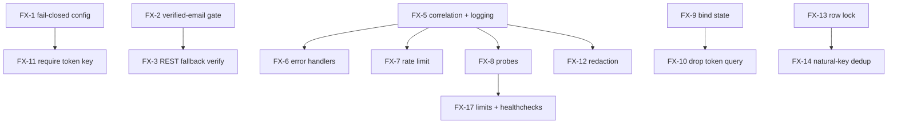

# Fix Plan — Production-Readiness & Security Hardening

> **Spec:** `production-readiness-security-hardening`
> **Deliverable:** 2 of 3 (Audit Report · Fix Plan · Go-Live Checklist)
> **Companion documents:** [`audit-report.md`](./audit-report.md), [`go-live-checklist.md`](./go-live-checklist.md)

## Purpose

This plan maps every [Audit Report](./audit-report.md) finding to one or more remediation actions, assigns each a priority derived from the finding's severity, and makes ordering/dependencies explicit so remediation can be sequenced and tracked. Where a remediation overlaps an existing spec, it references that spec rather than duplicating the work.

This document satisfies Requirement 15 (Fix Plan deliverable):

- **15.1** — every Audit Report finding maps to one or more remediation actions.
- **15.2** — each remediation has a priority derived from the finding's severity.
- **15.3** — dependencies between remediations are identified so ordering is explicit.
- **15.4** — remediations overlapping an existing spec reference that spec.

## Priority scale

Priority is derived directly from severity:

| Priority | Severity | Meaning |
|----------|----------|---------|
| **P0** | Critical | Fix before any production exposure. |
| **P1** | High | Fix in the first hardening pass. |
| **P2** | Medium | Fix before general availability. |
| **P3** | Low | Hygiene / record-keeping. |

Remediations are grouped into ordered phases; later phases depend on earlier ones where noted.

## Finding → fix coverage matrix (Requirement 15.1)

| Finding | Remediation(s) |
|---------|----------------|
| F-01 | FX-2 |
| F-02 | FX-3, FX-12 |
| F-03 | FX-7 |
| F-04 | FX-4 |
| F-05 | FX-6 |
| F-06 | FX-5, FX-8 |
| F-07 | FX-9, FX-12 |
| F-08 | FX-10 |
| F-09 | FX-13, FX-14 |
| F-10 | FX-1, FX-11 |
| F-11 | FX-15 |
| F-12 | FX-16 |
| F-13 | FX-17 |
| F-14 | FX-19 |
| F-15 | FX-20 |
| F-16 | FX-18 |
| F-17 | FX-1 |
| F-18 | FX-4 |
| F-19 | FX-21 |

Every finding F-01…F-19 is covered by at least one remediation.

## Remediations by phase

### Phase 0 — Fail-closed configuration (foundation; no runtime dependencies)

| Fix | Addresses | Priority | Remediation | Depends on |
|-----|-----------|----------|-------------|------------|
| FX-1 | F-10, F-17 | P2 | Extend `config.py` validators: in staging/production require non-default `SECRET_KEY` **and** non-empty `TOKEN_ENCRYPTION_KEY`, and require a non-empty `ALLOWED_ORIGINS`. Fail startup otherwise (R3.5, R6.3). | — |

### Phase 1 — Authentication & authorization correctness (highest risk)

| Fix | Addresses | Priority | Remediation | Depends on |
|-----|-----------|----------|-------------|------------|
| FX-2 | F-01 | P0 | In `_get_or_create_user_from_supabase`, gate account linking on `email_verified`; on unverified email that collides with an existing account, raise `401` and create nothing (R1.1, R1.4). | — |
| FX-3 | F-02 | P1 | In `_fetch_supabase_user`, enforce verified identity and bounded timeout; on any non-verified/non-2xx result return `None` → `401` (R1.5). | FX-2 |
| FX-4 | F-04, F-18 | P1 | Define an explicit public-route allowlist; add the Property 3 test enumerating `app.routes`; publish the per-router scope table (R2.1, R2.4). | — |

### Phase 2 — Cross-cutting middleware (correlation → CORS guard → rate limit → errors)

| Fix | Addresses | Priority | Remediation | Depends on |
|-----|-----------|----------|-------------|------------|
| FX-5 | F-06 | P1 | Add `CorrelationIdMiddleware` + JSON structured logging with secret redaction (R11.1, R11.4). | — |
| FX-6 | F-05 | P1 | Add global exception + validation handlers returning `Error_Envelope` with the correlation id; wrap `HTTPException` (R7.1–R7.4). | FX-5 |
| FX-7 | F-03 | P1 | Register `RateLimitMiddleware`; rework to a Redis-backed sliding window, per-tier limits (stricter for `/api/v1/auth/*`), `429` + `Retry-After` (R5.1–R5.5). | FX-5 |
| FX-8 | F-06 | P1 | Add `/health/live` and `/health/ready` (DB + broker) probes; keep `/health` as liveness alias (R11.2, R11.3). | FX-5 |

### Phase 3 — OAuth & secrets hardening

| Fix | Addresses | Priority | Remediation | Depends on |
|-----|-----------|----------|-------------|------------|
| FX-9 | F-07 | P1 | Bind connect-state to the initiating session and make it single-use for all platforms (extend the X PKCE pattern in `x-integration-hardening` to LinkedIn/Instagram) (R4.1). | — |
| FX-10 | F-08 | P2 | Remove the `?token=` raw-JWT fallback in `_resolve_start_user`; replace upstream-payload error strings with category messages (R4.2, R4.5). | FX-9 |
| FX-11 | F-10 | P2 | Require `TOKEN_ENCRYPTION_KEY` in prod (via FX-1); document/record any env still on the fallback key (R3.2). | FX-1 |
| FX-12 | F-02/F-07 logs | P2 | Apply secret-redaction to OAuth and external-platform error logs platform-wide; reference `x-integration-hardening` secret-safe logging for X (R4.4, R7.2). | FX-5 |

### Phase 4 — Background-job exactly-once

| Fix | Addresses | Priority | Remediation | Depends on |
|-----|-----------|----------|-------------|------------|
| FX-13 | F-09 | P1 | Select due drafts under a row-level lock (`SELECT ... FOR UPDATE SKIP LOCKED`, reusing the `_lock_draft` pattern) before transitioning to `publishing` (R8.1). | — |
| FX-14 | F-09 | P1 | Add a natural-key idempotency guard (`publish_idempotency_key` / `platform_post_id` check) before the platform call; reference `iterra-platform-stabilization-and-twitter` + `self-learning-content-loop` for the publish path (R8.5). | FX-13 |

### Phase 5 — Data integrity

| Fix | Addresses | Priority | Remediation | Depends on |
|-----|-----------|----------|-------------|------------|
| FX-15 | F-11 | P2 | Replace naive/machine-local datetimes (`predictions.py`, `storage_service.py`, `reporting_service.py`) with `utc_now()`/`ensure_aware`; ensure all windows use `timedelta` (R9.1–R9.3). | — |

### Phase 6 — Infrastructure & deployment

| Fix | Addresses | Priority | Remediation | Depends on |
|-----|-----------|----------|-------------|------------|
| FX-16 | F-12 | P2 | Add a 443 server, HTTP→HTTPS redirect, HSTS + security headers to `infra/nginx/nginx.conf` (R12.1, R12.2). | — |
| FX-17 | F-13 | P2 | Add CPU/memory limits and healthchecks for api/worker/web in compose/k8s; source secrets from env-specific stores (R12.3, R12.4, R12.6). | FX-8 |
| FX-18 | F-16 | P3 | Record revision 009 as irreversible in the audit; ensure new additive migrations are reversible (R10.1, R10.2). | — |

### Phase 7 — Test-suite reliability & hygiene

| Fix | Addresses | Priority | Remediation | Depends on |
|-----|-----------|----------|-------------|------------|
| FX-19 | F-14 | P2 | Add outbound-network block fixture, `pytest-timeout`, and per-test transaction rollback isolation to `conftest.py` (R13.1–R13.3). | — |
| FX-20 | F-15 | P3 | Gitignore and untrack `.coverage`, `.hypothesis/`, `iterra.db` (R13.4). | — |
| FX-21 | F-19 | P3 | Verify/instrument `CostTracker` per-call attribution at all engine call sites (R11.5); reference `self-learning-content-loop`. | FX-5 |

## Existing-spec references (Requirement 15.4)

| Fix | Existing spec referenced instead of duplicating |
|-----|------------------------------------------------|
| FX-9 | `x-integration-hardening` — extends the X PKCE single-use/binding pattern to LinkedIn/Instagram. |
| FX-11 | `x-integration-hardening` — token encryption-at-rest key separation. |
| FX-12 | `x-integration-hardening` — secret-safe logging for the X publish path, generalized platform-wide. |
| FX-14 | `iterra-platform-stabilization-and-twitter` + `self-learning-content-loop` — publish path and idempotency. |
| FX-21 | `self-learning-content-loop` — `CostTracker` instrumentation. |

## Remediation dependency overview (Requirement 15.3)

Remediations with no inbound dependency edge (FX-1, FX-2, FX-4, FX-5, FX-9, FX-13, FX-15, FX-16, FX-18, FX-19, FX-20) can begin immediately and in parallel; all others wait on the prerequisite shown above.

## Open questions / assumptions

- **Rate-limit backing store** assumes Redis (already present for Celery) is the shared store for multi-replica limits (R5.3). If a different store is preferred, FX-7 changes accordingly.
- **Connect-state session binding** (FX-9) assumes a short-lived server-side store (the existing PKCE/connect-token stores) can hold a per-session nonce; if popups run without first-party cookies, a double-submit nonce passed back via `postMessage` is the fallback.
- **F-19 (LLM cost attribution)** is the only *Unverified* finding; confirming it requires reading every engine call site in `packages/ai-engine` and the services that invoke them.
- New additive fields (`publish_idempotency_key`, `requires_reconnect`) are proposed; if the existing `platform_post_id` + connection metadata already suffice, the migration can be skipped to minimize schema churn.

---

*Each remediation above is verified by a step in the [Go-Live Checklist](./go-live-checklist.md), and each finding it addresses is detailed in the [Audit Report](./audit-report.md).*
