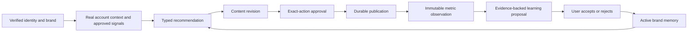
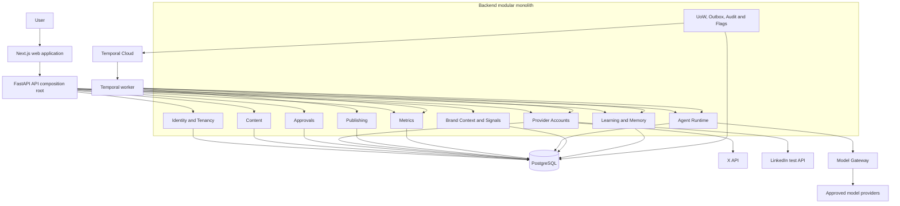
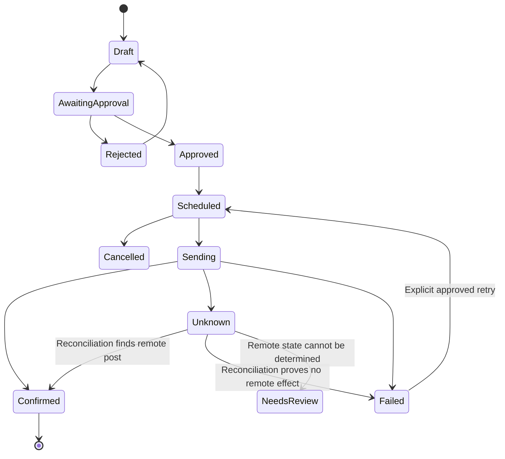

# Ittera Thin Closed-Loop MVP Implementation Plan

**Status:** Approved for execution  
**Delivery model:** Vertical strangler migration  
**Team:** Two junior generalist developers, each available approximately 15–25 hours per week  
**Primary provider:** Official X pay-as-you-go API  
**Secondary provider:** LinkedIn free-tier/testing capabilities only  
**Workflow runtime:** Temporal Cloud, gated by a mandatory readiness exercise  
**MVP objective:** Prove one safe, real-data, evidence-backed content-improvement loop  
**Release restriction:** Customer-account publishing and a public pilot remain disabled until an independent review covers tenancy, migrations, OAuth, Temporal, and publishing reliability.

## Problem Statement

Ittera should reduce the time creators and organizations spend determining why content underperforms. It must connect verified identity and brand context, real signals, content creation, approval, reliable publication, immutable measurement, evidence-backed learning, and improved later recommendations.

The current repository contains valuable product intent and reusable code, but it does not yet operate as one trustworthy production system. The audited implementation has inconsistent tenancy, duplicated or unsafe OAuth paths, approval that does not reliably gate publishing, duplicate-publication risk, synthetic or incomplete trend data, fixed Celery choreography, inconsistent model governance, weak frontend isolation, and incomplete production controls.

A full rewrite would delay traction and create excessive risk for a two-person, part-time junior team. The project will therefore use vertical strangler slices: contain immediate safety problems, introduce a narrow modular foundation, replace one complete X-based workflow, and prove one thin learning loop before expanding the platform.

## Requirements

### Staging MVP capabilities

The staging MVP must support:

1. Verified login and default organization, workspace, and brand provisioning.
2. Strict workspace and brand isolation.
3. Provider-neutral content and immutable revisions.
4. Official X OAuth and an accurate capability display.
5. LinkedIn test connection and capability display without assuming unavailable analytics or publishing.
6. Approval bound to the exact content revision, provider, target, and action.
7. Durable scheduling and publication to a developer-owned X test account.
8. Safe recovery from worker restart, retries, timeout, and ambiguous provider outcomes.
9. At least one meaningful immutable metric window supported by the active X tier.
10. A versioned brand profile with protected user-confirmed facts.
11. One governed, typed recommendation agent.
12. One evidence-backed learning proposal requiring user acceptance or rejection.
13. Proof that an accepted lesson changes a later recommendation.
14. Product visibility into workflow state, provider capability, data freshness, audit history, model/provider cost, and supporting evidence.

### Nonfunctional requirements

- Canonical tenant records have non-null workspace ownership; brand-intelligence records also have non-null brand ownership.
- The URL path, authorization context, explicit request context, command payload, and loaded resource tenancy must agree.
- Provider and backend access tokens never appear in URLs, popup payloads, logs, traces, or API responses.
- CI never calls live providers. Live smoke tests are manual, budgeted, and restricted to allowlisted developer-owned accounts.
- Publication uses intents, attempts, checkpoints, and reconciliation; Ittera does not claim exactly-once behavior from an external platform.
- Every model run records typed input/output, model and prompt versions, usage, cost, latency, evidence, and trace correlation.
- PostgreSQL migrations define schema truth. SQLite `create_all()` is not accepted as proof that the deployed schema is valid.
- The primary flow meets baseline keyboard, focus, labeling, error-state, loading-state, and reduced-motion accessibility expectations.
- Customer-account publishing and a public pilot remain blocked until an independent review is completed and high-severity findings are resolved.
- PostgreSQL remains canonical business state. Temporal owns orchestration history. Redis is non-canonical.
- Agents may read, analyze, generate, and propose. Deterministic application services own permissions, approval, publishing, deletion, billing, statistics, and memory promotion.

### Explicit post-MVP non-goals

The following are intentionally outside this MVP:

- A full Experiment module and automatic experiment execution.
- Broad autonomous multi-agent orchestration or LangGraph.
- A full multi-source Trend Radar.
- Competitor intelligence, predictive forecasting, advanced reports, or a conversational strategist.
- Stripe billing and automated entitlements.
- Agency templates, additional channels, Google Drive mirroring, or broad LinkedIn analytics.
- A full Kubernetes, multi-region, or general-availability platform.
- Complete legacy retirement beyond unsafe or conflicting paths required for the MVP.

These capabilities require a separate post-MVP plan after the thin loop demonstrates product value and operational reliability.

## Background

### Audited current-state drivers

The approved sequence is based on the following verified repository findings:

- `apps/api/main.py` combines mount prefixes with six routers that already declare the same prefix, producing accidental doubled paths.
- Workspace context can be selected from `X-Workspace-ID` while disagreeing with the route or loaded resource.
- Mature services remain user-scoped while newer tenant fields are nullable.
- Organization and workspace permission constants, role maps, and model methods have drifted.
- Approval decisions do not consistently enforce current-step approver eligibility, and approval does not gate the publication state machine.
- OAuth implementations are duplicated; a legacy Drive flow trusts raw state; some redirects put tokens in query strings; first-time Supabase provisioning can accept an unverified identity.
- Services commit internally, with no request-level unit of work or transactional outbox.
- A remote publication can succeed before local persistence fails, allowing duplicate retry; thread retry can restart at segment zero.
- Celery provides jobs but not durable multi-day workflow history, replay, approval waits, or reliable long timers.
- Trend Radar contains synthetic or no-op behavior, and learning windows can reuse stale analysis.
- AI engines differ in provider, timeout, retry, cost, and output handling; the evaluation corpus is empty.
- The frontend persists product state globally, does not propagate workspace context consistently, and has unsafe popup behavior.
- The web test command and current E2E coverage do not meaningfully protect the authenticated product.
- Deployment, telemetry, backup, restoration, rollout, and recovery evidence are incomplete.

### Architecture choices

| Concern | Approved direction |
|---|---|
| Application architecture | Modular monolith with strict module ownership |
| Backend | Retain FastAPI, Python, SQLAlchemy, Alembic, and PostgreSQL |
| Frontend | Retain Next.js and TypeScript |
| Deployable processes | Separate API and Temporal worker composition roots |
| Durable workflows | Temporal Cloud after the readiness gate |
| Agent framework | PydanticAI inside bounded activities |
| Model governance | Domain-owned Model Gateway |
| Canonical business data | PostgreSQL |
| Files and artifacts | S3-compatible storage where required |
| Cache and rate limits | Redis only where loss is acceptable |
| Authentication | Supabase Auth may remain the OIDC identity provider |
| Social integrations | Official provider adapters with runtime capability negotiation |
| Migration | Feature-flagged strangler slices with one source of truth per aggregate |
| Deployment direction | Managed-first and portable through OCI containers |

### Closed product loop

### Target topology

## Proposed Solution

### MVP modules

| Module | Owns |
|---|---|
| Identity and Tenancy | Verified identity, organization, workspace, brand, membership, invitation, role, and authorization context |
| Content | Provider-neutral content, immutable revisions, lineage, variants, and channel renderings |
| Approvals | Approval requests, exact-action envelopes, current-step policy, and immutable decisions |
| Provider Accounts | OAuth sessions, encrypted credential references, provider identity, capabilities, quotas, and cursors |
| Publishing | Schedules, publication intents, attempts, checkpoints, remote posts, and reconciliation |
| Metrics | Metric definitions, immutable observations, source freshness, and deterministic summaries |
| Agent Runtime | Agent manifests, tools, runs, artifacts, budgets, provenance, and evaluations |
| Brand Context | Versioned brand profile, goals, audience, voice, constraints, and confirmed facts |
| Signals | Approved source observations, provenance, freshness, and retention metadata |
| Learning and Memory | Learning proposals, evidence, user decisions, active facts, contradiction, and supersession |
| Audit and Operations | Security/business audit, health, telemetry, budgets, alerts, and test-account controls |
| Foundation | Unit of work, outbox/inbox, idempotency, feature flags, configuration, and shared observability |

### Dependency rules

- Modules cannot import another module's ORM models or repositories.
- Cross-module behavior uses public application ports or versioned events.
- Domain code has no FastAPI, Temporal, provider SDK, or model SDK dependency.
- Temporal workflows orchestrate stable identifiers and state transitions.
- Activities perform database, clock, network, provider, model, and filesystem side effects.
- Agents receive restricted tools rather than credentials or repositories.
- PostgreSQL owns business truth; Temporal workflow history contains small references rather than secrets or large sensitive payloads.
- Publishing is the only module authorized to create or delete external posts.
- Learning and Memory is the only module authorized to activate durable learned facts.

### Core data invariants

1. Solo customers still use an organization, workspace, and brand; there is no separate personal tenancy model.
2. Every tenant-owned aggregate has one authoritative workspace.
3. Brand intelligence additionally has one authoritative brand.
4. Content revisions are immutable.
5. An approval binds the exact revision, provider account, target, and consequential action.
6. A provider account belongs to one workspace and exposes a capability snapshot.
7. Publishing alone owns external post and delete actions.
8. Remote identifiers are unique within a provider account and provider.
9. Metric observations are append-only and deduplicated.
10. Learning facts require evidence and deterministic or user-approved promotion.

### Publishing state and reliability model

Reliability controls:

- A unique publication intent for revision, provider account, target, and schedule.
- A unique attempt key for each external operation.
- Provider idempotency keys where supported.
- Persisted remote identifiers before nonessential follow-up work.
- An `unknown` outcome after timeout or process loss when success cannot be excluded.
- Reconciliation before retrying an unknown attempt.
- Per-segment checkpoints for threads.
- One active executor lease per provider account during migration.
- Human review when the provider cannot reveal conclusive remote state.
- No external shadow publication.

### Provider policy

#### X

- X is the first complete provider.
- Routine development and CI use the simulator and sanitized fixtures.
- Live calls require an explicit environment flag and developer-owned account allowlist.
- Configurable per-run, daily, and monetary budgets fail closed.
- Rate-limit response headers are captured and honored.
- Live publishing remains an explicit manual test until the pilot gate is passed.

#### LinkedIn

- LinkedIn remains test-only for this MVP.
- The adapter inspects actual products, scopes, quotas, and operations.
- Missing capability returns a typed degraded state.
- No member analytics, organization analytics, retrieval, or publishing capability is assumed.
- Unofficial credential login and scraping are prohibited.
- LinkedIn limitations do not block completion of the X-based loop.

### Temporal readiness gate

Before real workflow implementation, both developers must demonstrate:

1. A durable timer.
2. An approval Signal.
3. An idempotent Activity retry.
4. Worker termination and restart.
5. Successful history replay.
6. Cancellation and timeout handling.
7. Compatible workflow-code evolution.
8. A simulated remote operation that succeeds before its response is lost.
9. Workflow history free of credentials and oversized sensitive payloads.
10. Time-skipping tests using Temporal's test environment.

If the gate is not passed after two focused iterations:

- Pause live workflow work.
- Continue domain, API, UI, simulator, and contract work.
- Record the unresolved issues in an ADR.
- Obtain help or formally reconsider the workflow runtime.
- Do not silently restore Celery as the target workflow engine.

### Minimum agent boundary

The MVP contains one `RecommendationAgent`. Its manifest defines:

- Purpose and owner.
- Typed input and output.
- Allowed read and proposal tools.
- Prohibited operations.
- Provider and model policy.
- Prompt version.
- Token, latency, request, and cost budgets.
- Evidence behavior.
- Data sensitivity.
- Evaluation suite.
- Proposal-only authority.

The agent cannot approve, publish, delete, change membership, alter billing, access credentials, or activate permanent memory.

### Testing layers

| Layer | Required evidence |
|---|---|
| Domain unit and property tests | Policies, state machines, tenant denial, idempotency, and invariants |
| PostgreSQL integration tests | Migrations, constraints, repositories, transactions, and outbox atomicity |
| Contract tests | OpenAPI, provider adapters, module ports, events, and generated client |
| Temporal tests | Replay, time skipping, Signals, retries, cancellation, restart, and evolution |
| Provider simulator tests | Rate limits, token states, ambiguous outcomes, duplicate calls, and partial threads |
| AI evaluations | Typed output, evidence, unsupported claims, safety, cost, and latency |
| Frontend component/accessibility tests | Product states, forms, keyboard, focus, labels, errors, and loading |
| Authenticated E2E | Workspace-isolated closed-loop journeys |
| Fault injection | Process loss, provider timeout, partial persistence, and recovery |
| Manual smoke tests | Budgeted X and permitted LinkedIn test behavior only |

### Release gates

| Gate | Required outcome |
|---|---|
| 0. Safety contained | Critical route, tenant, permission, OAuth, and browser-state regressions pass |
| 1. Foundation ready | PostgreSQL tests, architecture rules, generated contracts, and meaningful CI pass |
| 2. Temporal ready | Both developers pass the mandatory readiness exercise |
| 3. Tenant migration ready | Backfill is repeatable, reconciled, and safely reversible |
| 4. Provider ready | Simulator contracts and budgeted capability probes pass |
| 5. Publication ready | Exact approval and publication fault suites pass |
| 6. Thin loop ready | Measured evidence produces an accepted lesson that changes a recommendation |
| 7. Staging ready | E2E, restore, telemetry, budgets, and runbooks pass |
| 8. Pilot ready | Independent review findings are resolved before any customer account is enabled |

### Capacity guidance

- Work in two-week cycles.
- Reserve 20–25% of early capacity for structured learning.
- Reserve at least 25% for tests, review, integration, and defect correction.
- Keep one primary work item per developer.
- Reforecast after the Temporal readiness gate.
- Treat 14–18 two-week cycles as a provisional staging range, not a commitment.
- Do not promise a public-pilot date before the reliable-publication gate passes.

## Task Breakdown

### Task 1: Establish the MVP source of truth and acceptance contract

**Objective:** Establish canonical terminology, capability status and evidence, the exact E2E scenario, deferred scope, and release gates.

**Implementation guidance:** Make this document the authoritative MVP plan; create a dated capability register; assign owners; preserve historical documents as archives; record ADRs for major decisions; and define the evidence required for each gate.

**Tests:** Validate capability records, owners, internal links, stale evidence, and claims that use `pilot` or `production` status.

**Demo:** Generate a capability report showing every MVP feature, owner, state, evidence, and blocker.

### Task 2: Contain critical backend authorization and routing risks

**Objective:** Fix accidental doubled paths, tenant disagreement, permission drift, approver eligibility, and verified-user provisioning.

**Implementation guidance:** Normalize route composition; reconcile path/header/resource tenancy; centralize effective permissions; enforce approval-step authorization; require verified first-time identity; and keep compatibility behavior explicit and tested.

**Tests:** Route snapshots, doubled-path absence, cross-tenant denial, role/permission matrices, eligible/ineligible approval decisions, and verified/unverified provisioning.

**Demo:** Show unsafe requests being denied while valid canonical legacy behavior continues to work.

### Task 3: Contain browser, OAuth, state-isolation, and truthfulness risks

**Objective:** Remove token-bearing URLs, weak popup validation, auth-state leakage, inconsistent waitlist behavior, and unsupported feature claims.

**Implementation guidance:** Use one-time callback completion; validate popup origin/source; clear auth-bound state; namespace preferences; consolidate waitlist state; and disable unofficial or synthetic capability paths.

**Tests:** OAuth replay/substitution, browser URL/log inspection, logout/workspace isolation, waitlist retries, and degraded-state rendering.

**Demo:** Complete safe simulated OAuth and switch users without credential or state leakage.

### Task 4: Establish meaningful tests, CI, and the modular skeleton

**Objective:** Add API and worker composition roots, the module template, PostgreSQL integration tests, meaningful frontend tests, authenticated E2E, and architecture rules.

**Implementation guidance:** Introduce target folders without migrating all behavior; run migrations against PostgreSQL; establish generated contracts; pin supported runtimes; and wire one real health/readiness path through the new composition.

**Tests:** Architecture import checks, PostgreSQL migration smoke, API/worker health, frontend test smoke, authenticated E2E smoke, and dependency lock checks.

**Demo:** Run the meaningful pipeline and show it rejecting an illegal import and invalid migration.

### Task 5: Complete the mandatory Temporal readiness exercise

**Objective:** Prove timer, Signal, retry, restart, replay, cancellation, evolution, and ambiguous-effect understanding.

**Implementation guidance:** Build a proving workflow; inspect history; test failure recovery; document workflow versus Activity responsibilities; and retain the exercise only as an executable conformance suite or integrate its tests into a real workflow.

**Tests:** Time skipping, idempotent Activity retry, worker restart, replay, cancellation, timeout, version evolution, duplicate Signal, and lost-response reconciliation.

**Demo:** Lose and restart the worker without duplicating the simulated external effect.

### Task 6: Implement identity, progressive tenancy, and legacy mapping

**Objective:** Provide default organization/workspace/brand provisioning, centralized authorization, repeatable backfill, and ambiguous-record quarantine.

**Implementation guidance:** Add the target tenant aggregates; map legacy users deterministically; backfill in checkpoints; keep migrations additive; and report rather than guess ambiguous ownership.

**Tests:** Role matrix, identity linking, tenant isolation, migration rerun, reconciliation, null ownership, and routing rollback.

**Demo:** Migrate representative users and demonstrate isolated workspaces with a simple solo-user experience.

### Task 7: Deliver the versioned API and workspace-aware web shell

**Objective:** Introduce `/v1`, generated clients, tenant propagation, server route authorization, workspace-keyed cache, and route boundaries.

**Implementation guidance:** Standardize errors, pagination, idempotency, and optimistic versions; remove hand-written request variants; add workspace/brand navigation; and provide mocks for incomplete modules.

**Tests:** Contract generation, tenant-context propagation, unauthorized routes, cache isolation, logout, route loading/errors, and accessibility.

**Demo:** Switch between isolated workspaces using the generated client.

### Task 8: Add unit of work, outbox/inbox, idempotency, audit, and flags

**Objective:** Make state, audit, and events atomic while enabling controlled rollout.

**Implementation guidance:** Add request-scoped transaction ownership, event collection, transactional outbox, inbox deduplication, idempotent commands, immutable audit metadata, and workspace-cohort flags. Integrate them into a real command immediately.

**Tests:** Rollback, duplicate command, concurrent update, relay retry, inbox deduplication, audit redaction, and cohort behavior.

**Demo:** Repeat a command through injected failures and produce one logical outcome.

### Task 9: Implement canonical Content and immutable revisions

**Objective:** Create provider-neutral content, immutable history, channel renderings, lineage, and optimistic edits.

**Implementation guidance:** Keep publication outside Content; migrate only required legacy drafts; version renderings; and enforce ownership on every revision.

**Tests:** Immutability, lineage, concurrent edit, channel limits, tenant ownership, contracts, and migration reconciliation.

**Demo:** Create, edit, render, and inspect immutable revision history.

### Task 10: Implement Provider Accounts and the simulator

**Objective:** Establish the secure OAuth, credential, identity, capability, quota, and failure-simulation boundary.

**Implementation guidance:** Implement PKCE where available, signed single-use state, encrypted credentials, capability snapshots, cursors, disconnect behavior, and comprehensive simulator scenarios.

**Tests:** OAuth replay/substitution, refresh races, redaction, capability combinations, token expiry, rate limits, lost responses, partial threads, and disconnect.

**Demo:** Connect, expire, rate-limit, rotate, and disconnect a simulated account.

### Task 11: Implement the official X adapter and LinkedIn capability probe

**Objective:** Use only actual allowed operations, enforce X budgets/rate limits, and expose honest LinkedIn degraded states.

**Implementation guidance:** Implement confirmed X endpoints; persist limits; add live gates and allowlists; inspect LinkedIn products/scopes; and prohibit unofficial fallbacks.

**Tests:** Adapter contracts, recorded fixtures, budget exhaustion, rate-limit reset, token revocation, capability combinations, and manually gated smoke tests.

**Demo:** Connect test accounts and perform one budgeted, non-publishing X smoke test.

### Task 12: Introduce Temporal through `ProviderSyncWorkflow`

**Objective:** Implement a durable non-publishing workflow with deterministic IDs, references, retries, backoff, cancellation, and telemetry.

**Implementation guidance:** Start from an outbox event; pass provider-account IDs rather than credentials; make activities idempotent; update cursors safely; and expose workflow search attributes.

**Tests:** Duplicate start, worker restart, rate-limit timer, expired credentials, cursor replay, cancellation, and deterministic replay.

**Demo:** Restart the worker during backoff and resume one synchronization.

### Task 13: Implement approval-gated Content Lifecycle

**Objective:** Enforce exact revision/action approval with eligible actors, rejection, resubmission, expiration, and a Temporal Signal.

**Implementation guidance:** Make decisions immutable; invalidate stale envelopes; wait durably; and isolate notification failure from approval state.

**Tests:** Actor matrix, stale revision, duplicate decision, rejection/resubmission, expiration, early/duplicate Signal, and notification failure.

**Demo:** Show that only the exact approved payload advances.

### Task 14: Implement durable scheduling, publication, and reconciliation

**Objective:** Make Temporal the sole publisher for enabled accounts using intents, attempts, unknown outcomes, reconciliation, thread checkpoints, and executor leases.

**Implementation guidance:** Transfer ownership per account; persist remote IDs promptly; reconcile before retry; expose human review; and never shadow-publish.

**Tests:** Crash before call, timeout, remote success/local failure, duplicate Activity, partial thread, cancellation race, rate limit, expired credentials, and unknown review.

**Demo:** Recover from remote success plus local failure without a duplicate.

### Task 15: Implement immutable metric collection and minimal analytics

**Objective:** Add versioned metrics, append-only observations, source freshness, and one X-supported window.

**Implementation guidance:** Persist raw observations; normalize cautiously; support missing capability; and key analyses by their actual observation window.

**Tests:** Deduplication, late/corrected data, metric versions, window cutoff, freshness, normalization, and reproducibility.

**Demo:** Trace one displayed analysis to its immutable source observation.

### Task 16: Implement Model Gateway, a bounded agent, and the evaluation corpus

**Objective:** Provide one governed recommendation path with structured output, budgets, provenance, and regression gates.

**Implementation guidance:** Add model/prompt registries, timeout/retry, usage/cost, restricted tools, run records, and a small representative evaluation dataset before prompt tuning.

**Tests:** Structured-output failure, timeout/fallback, budget exhaustion, tool authorization, provenance, cost, evidence, quality, and safety thresholds.

**Demo:** Compare model configurations by quality, evidence, cost, and latency.

### Task 17: Implement minimum brand context, real signals, and recommendations

**Objective:** Combine a versioned profile, protected user facts, one attributed real source, metrics, and a typed recommendation.

**Implementation guidance:** Consolidate persona/context; preserve confirmed facts; store provenance/freshness; use connected-account evidence first; and support attributable manual evidence if external source access is unavailable.

**Tests:** Fact protection, conflicting/stale evidence, provenance completeness, recommendation schema/evaluations, isolation, and budget behavior.

**Demo:** Produce an evidence-traceable recommendation.

### Task 18: Implement evidence-backed learning and close the loop

**Objective:** Create user-reviewed learning proposals, active facts, contradiction/supersession, and a demonstrably changed later recommendation.

**Implementation guidance:** Validate evidence deterministically; require explicit promotion; exclude rejected/expired facts; and show the reason for recommendation changes in the UI.

**Tests:** Insufficient evidence, duplicate proposal, acceptance/rejection, crash-safe promotion, contradiction, supersession, expiration, and before/after recommendation behavior.

**Demo:** Accept a lesson and show the attributable change it causes.

### Task 19: Harden staging, obtain independent review, and prepare the pilot decision

**Objective:** Add observability, budgets, backup/restore, runbooks, threat modeling, and the external review package.

**Implementation guidance:** Correlate HTTP/workflow/provider/agent telemetry; alert on unknown outcomes and spend; restore an isolated backup; exercise incident runbooks; and keep all customer flags disabled until review findings are resolved.

**Tests:** Restore, alert delivery, credential rotation, migration rollback, workflow backlog, unknown outcome, security regression, and full test-account E2E.

**Demo:** Present the complete staging evidence package and explicit pilot blockers.

## Completion Criteria

### Staging-complete

The staging MVP is complete when:

- Critical backend, OAuth, and browser-state risks are contained.
- Tenant isolation and role matrices pass.
- X connects through the official API and LinkedIn reports only verified capabilities.
- Approval gates the exact publication payload.
- Publication survives the defined failure matrix without unresolved duplicate effects.
- At least one immutable metric window is available or honestly reported unavailable.
- One governed agent produces an evidence-backed recommendation.
- One accepted learning fact changes a later recommendation.
- Provider and model spend are bounded and observable.
- Backend, frontend, workflow, agent-evaluation, and E2E suites are meaningful.
- Backup restoration and incident exercises succeed.
- The complete loop works using developer-owned test accounts.

### Pilot-ready

The MVP becomes pilot-ready only when:

- An independent reviewer examines tenancy, migrations, OAuth, Temporal, and publishing reliability.
- Critical and high-severity findings are resolved.
- Provider terms, access, quotas, and costs are revalidated.
- Customer-facing privacy statements match implemented behavior.
- Alerts, support ownership, rollback ownership, and runbooks are active.
- Customer-account flags remain disabled until written go/no-go approval.

## Post-MVP Planning Boundary

A separate implementation plan must cover:

1. A rigorous Experiment module and causal-evidence model.
2. Additional metric windows and statistical analysis.
3. The broader Brand Understanding, Strategy, Calendar, Creator, Repurposer, and Coach agent suite.
4. A broader provenance-aware Trend Radar.
5. Expanded LinkedIn capability after approval.
6. Billing and entitlements.
7. Automated privacy export, retention, and erasure.
8. Competitor intelligence.
9. Predictive forecasting and calibration.
10. Advanced reporting.
11. A limited conversational strategist.
12. Agency and enterprise workflows.
13. Additional providers.
14. General-availability infrastructure and scaling.
15. Complete legacy queue, schema, route, dependency, and credential retirement.
