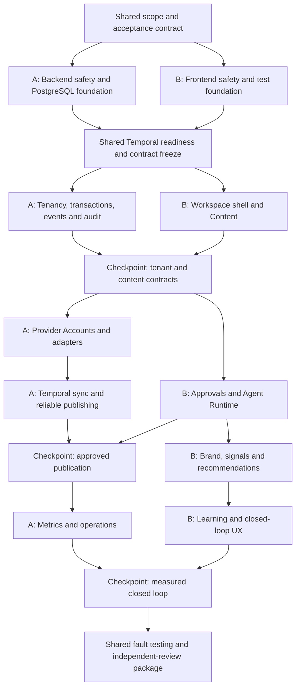

# Ittera Two-Developer MVP Execution Plan

**Status:** Approved for execution  
**Companion plan:** `ITTERA_THIN_CLOSED_LOOP_MVP.md`  
**Team:** Two junior generalist developers  
**Availability:** Approximately 15–25 hours per developer per week  
**Cadence:** Two-week execution cycles with at least weekly integration  
**Goal:** Maximize parallel progress while minimizing shared files, blocking dependencies, and unsafe independent decisions

## Purpose

This document divides the Thin Closed-Loop MVP between two stable ownership tracks:

- **Developer A — Platform, Data, Workflows, and Integrations**
- **Developer B — Product, Web, and Intelligence**

Both developers remain generalists. These labels are temporary ownership boundaries intended to reduce merge conflicts, duplicated decisions, and continuous blocking. They do not create premature services or permanent team silos.

The split relies on contract-first development, provider/workflow simulators, in-memory or fake ports, stable module ownership, and a small number of explicit integration checkpoints.

## Fixed Constraints

1. Neither developer has production Temporal experience.
2. No experienced reviewer is currently available.
3. X pay-as-you-go creates real cost if tests are not controlled.
4. LinkedIn access is test/free-tier capability only for this MVP.
5. Both developers are part-time.
6. Customer-account publishing is prohibited until independent review.
7. Peer review between two junior developers does not replace specialist review.
8. If a safety-critical behavior cannot be demonstrated, its feature flag remains disabled.

## Purpose and Ownership

### Developer A: Platform, Data, Workflows, and Integrations

Developer A owns:

- API and shared backend composition.
- Database and Alembic coordination.
- Identity, tenancy, and authorization context.
- Unit of work, outbox/inbox, idempotency, audit, and flags.
- Provider Accounts and the credential vault boundary.
- Provider simulator.
- X and LinkedIn adapters.
- Temporal worker and Provider Sync.
- Publishing intents, attempts, checkpoints, and reconciliation.
- Metrics.
- Backend telemetry, restoration, and operational runbooks.

Indicative paths:

```text
apps/api/
apps/workflow-worker/
packages/backend/src/ittera/foundation/
packages/backend/src/ittera/modules/identity/
packages/backend/src/ittera/modules/tenancy/
packages/backend/src/ittera/modules/provider_accounts/
packages/backend/src/ittera/modules/publishing/
packages/backend/src/ittera/modules/metrics/
packages/backend/src/ittera/adapters/social/
infra/
```

### Developer B: Product, Web, and Intelligence

Developer B owns:

- Web composition and tests.
- Generated-client consumption and mock handlers.
- Workspace and brand UX.
- Content and revisions.
- Approval domain and UX.
- Workflow-status UI.
- Model Gateway, agent manifest, and evaluations.
- Brand context and signals.
- Recommendations.
- Learning and memory.
- Accessibility and authenticated E2E.

Indicative paths:

```text
apps/web/
packages/backend/src/ittera/modules/content/
packages/backend/src/ittera/modules/approvals/
packages/backend/src/ittera/modules/brand_context/
packages/backend/src/ittera/modules/signals/
packages/backend/src/ittera/modules/agent_runtime/
packages/backend/src/ittera/modules/memory/
packages/agent-evals/
```

### Shared work, intentionally limited

Shared work is limited to:

- Acceptance criteria and capability status.
- Temporal readiness.
- Contract checkpoints.
- Threat modeling.
- Publication fault-injection sessions.
- The final measured E2E loop.
- Independent-review remediation.
- Pilot go/no-go evidence.

A shared task still has one editor for each file or artifact. Both developers do not edit the same shared file concurrently.

## Contract Ownership

| Contract | Owner | Primary consumer |
|---|---|---|
| `AuthorizationContext` | Developer A | Developer B modules and web shell |
| Workspace and brand summaries | Developer A | Developer B web shell |
| `ProviderCapabilities` | Developer A | Content, web, and intelligence |
| Publication request/status | Developer A | Approval and product UI |
| Metric observation/summary | Developer A | Recommendation and learning |
| Content snapshot/revision reference | Developer B | Publishing |
| Approval envelope | Developer B | Content Lifecycle workflow |
| Recommendation artifact | Developer B | Product UI and audit references |
| Learning proposal/active memory fact | Developer B | Recommendation inputs |

Every shared schema has:

- An explicit version.
- A valid fixture.
- A fake implementation.
- A producer contract test.
- A consumer compatibility test.
- A named owner.
- Typed unavailable or degraded states.

Contract changes merge before implementation changes. Breaking changes occur only at an integration checkpoint and require both developers' approval.

## Parallelization Rules

1. Continue against fakes rather than waiting for the other track.
2. Merge contract changes before implementation changes.
3. Do not edit the other developer's module without agreement.
4. Do not create concurrent, uncoordinated Alembic heads; Developer A coordinates migration reservations.
5. Never hand-edit generated code.
6. Never place live credentials in web or local test fixtures.
7. Never run live provider calls in CI.
8. Keep branches short and integrate at least weekly.
9. Keep one primary implementation task per developer.
10. Choose fail-closed behavior when security or external-effect state is ambiguous.
11. Replace a dependency blocked for more than one working day with an agreed fake or fixture.
12. Require fakes and real adapters to pass the same contract suite.
13. Do not shadow-publish externally.
14. Do not waive a release gate to maintain a forecast.

## Parallel Workstream



## Developer A Work Packages

### Task A1: Backend safety containment and PostgreSQL test foundation

**Objective:** Correct immediate routing, authorization, approval, and verified-identity defects while establishing a real PostgreSQL migration/integration path.

**Implementation guidance:** Verify router composition; make tenant resolution fail closed; centralize existing effective permission behavior; enforce current-step approver eligibility; require verified first-time Supabase identities; add route/tenant/approval/auth tests; run Alembic against an isolated PostgreSQL test database; and prove one affected PostgreSQL path. Do not begin target tenancy or Temporal implementation.

**Dependencies:** Approved scope and existing repository behavior only.

**Tests:** Canonical route table, doubled-path absence, path/header/resource disagreement, missing tenant context, role matrix, approval actor matrix, verified/unverified provisioning, PostgreSQL migration smoke, one PostgreSQL integration path, and relevant legacy regressions.

**Demo:** Show unsafe requests denied, valid canonical routes working, and the migration chain plus one production-shaped path passing on PostgreSQL.

**Can proceed without Developer B:** Yes. Publish only minimal authorization fixtures required for later compatibility.

### Task A2: Tenancy, unit of work, outbox, audit, and migration

**Objective:** Establish the target tenant foundation, transactions, events, idempotency, feature flags, and repeatable legacy backfill.

**Implementation guidance:** Implement organization/workspace/brand/member ownership; provide a request-scoped unit of work; atomically persist state/audit/outbox; add inbox deduplication; publish workspace contracts; and backfill with checkpoints and reconciliation. Quarantine ambiguous data.

**Dependencies:** A1, the modular skeleton, and the Gate 1 contract freeze.

**Tests:** Role matrix, cross-tenant properties, rollback, duplicate commands, relay retry, backfill rerun, reconciliation, and routing rollback.

**Demo:** Migrate representative users and execute one idempotent tenant command with atomic audit/outbox evidence.

**Can proceed without Developer B:** Yes. Developer B consumes authorization and workspace fakes until integration.

### Task A3: Provider Accounts, simulator, and official adapters

**Objective:** Implement the secure provider boundary, comprehensive simulator, budgeted X behavior, and LinkedIn capability probing.

**Implementation guidance:** Add OAuth sessions, PKCE where available, signed state, encrypted credentials, identities, capabilities, quotas, cursors, simulator failures, X budgets/allowlists, and typed LinkedIn degraded states.

**Dependencies:** A2 and frozen provider/content contracts.

**Tests:** OAuth replay/substitution, refresh races, credential redaction, simulator failure matrix, budgets, rate limits, token states, and provider contract fixtures.

**Demo:** Connect the simulator and official test providers through a diagnostic/test interface and compare capabilities.

**Can proceed without Developer B:** Yes. UI integration uses fixtures later.

### Task A4: Temporal Provider Sync and reliable publishing

**Objective:** Implement durable synchronization and publication using intents, attempts, reconciliation, checkpoints, and an executor lease.

**Implementation guidance:** Begin only after Temporal readiness; consume frozen content and approval contracts; implement Provider Sync and Content Lifecycle workflows; keep activities idempotent; reconcile ambiguous outcomes; and use fakes until Developer B's real modules are integrated.

**Dependencies:** Temporal readiness, A3, and frozen `ContentSnapshot`/`ApprovalEnvelope` contracts.

**Tests:** Replay, restart, duplicate start, Signal behavior, lost response, remote success/local crash, partial thread, cancellation, rate limit, and lease contention.

**Demo:** Complete one approval-gated simulated publication through failure and reconciliation.

**Can proceed without Developer B:** Yes after schema freeze, using fake content/approval producers.

### Task A5: Immutable metrics and metric contracts

**Objective:** Produce reliable observations and stable metric contracts for the learning track.

**Implementation guidance:** Add metric definitions, append-only observations, deduplication, freshness, one X-supported window, fixture/live parity, request/spend accounting, and provider/workflow telemetry.

**Dependencies:** A4 and confirmed X metric capability.

**Tests:** Deduplication, corrected observations, window boundaries, freshness, missing capability, budget enforcement, trace correlation, and contract compatibility.

**Demo:** Produce the same metric-summary schema from simulator, fixture, and real test-account data.

**Can proceed without Developer B:** Yes. Publish fixtures before live ingestion is complete.

### Task A6: Backend hardening, restore, and operational evidence

**Objective:** Make the staging backend observable, recoverable, and reviewable.

**Implementation guidance:** Add OpenTelemetry correlation, dashboards, alerts, backup/restore, credential rotation, migration rollback, incident runbooks, and the backend evidence package.

**Dependencies:** A4 and A5.

**Tests:** Restore, alerts, rotation, failed migration, workflow backlog, unknown publication outcome, and clean staging smoke.

**Demo:** Restore into an isolated environment and trace one publication from request through workflow and provider attempt.

**Can proceed without Developer B:** Mostly. Final trace verification uses one integrated E2E run.

## Developer B Work Packages

### Task B1: Frontend safety and executable tests

**Objective:** Remove token/state/popup/waitlist risks and establish meaningful frontend test execution.

**Implementation guidance:** Remove token-bearing URLs; validate popup origin/source; clear auth-bound persisted state; consolidate waitlist behavior; add unit/component/authenticated E2E harnesses; and build initial fixtures.

**Dependencies:** Approved scope only.

**Tests:** URL/log token absence, popup security, logout, workspace isolation, waitlist retry, and test-command smoke.

**Demo:** Complete a mocked connection and user/workspace switch without state leakage.

**Can proceed without Developer A:** Yes, using agreed fixtures.

### Task B2: Workspace web shell and Content

**Objective:** Build server-authorized workspace UX plus content, immutable revisions, and channel renderings.

**Implementation guidance:** Consume generated contracts; add workspace/brand routing and keyed caches; implement Content; publish content snapshot fixtures; and use fake authorization until A2 integration.

**Dependencies:** B1 and the initial contract freeze.

**Tests:** Route authorization, cache isolation, revision immutability, concurrent edits, render limits, loading/errors, and accessibility.

**Demo:** Create and revise content in two isolated mocked workspaces.

**Can proceed without Developer A:** Yes until the real tenant checkpoint.

### Task B3: Approval domain, UX, and workflow contracts

**Objective:** Implement exact revision/action approvals and an approval UX without waiting for Temporal.

**Implementation guidance:** Add immutable requests/decisions; publish `ApprovalEnvelope`; support rejection/resubmission/expiration; and use a fake `WorkflowPort` until A4.

**Dependencies:** B2 and provider-capability fixtures.

**Tests:** Eligible actor, stale revision, duplicate decision, rejection/resubmission, expiry, fake workflow contract, keyboard, and focus.

**Demo:** Submit, reject, revise, and approve content against the fake workflow.

**Can proceed without Developer A:** Yes. A later replaces the workflow fake.

### Task B4: Model Gateway, bounded agent, and evaluations

**Objective:** Implement a structured, budgeted, restricted recommendation path and its evaluation corpus.

**Implementation guidance:** Add model/prompt registries, run provenance, usage/cost, tool restrictions, `RecommendationAgent`, fixture inputs, and quality/evidence/safety evaluators.

**Dependencies:** Initial architecture and authorization contracts.

**Tests:** Schema, timeout/fallback, budget, tool authorization, evidence, provenance, cost, and evaluation thresholds.

**Demo:** Compare two allowed model configurations on the same fixture set.

**Can proceed without Developer A:** Yes, using provider and metric fixtures.

### Task B5: Brand context, signals, learning, and closed-loop UX

**Objective:** Build the intelligence loop against fixtures before replacing them with real publication and metric contracts.

**Implementation guidance:** Add versioned brand context, protected confirmed facts, one attributed signal source, recommendation evidence, user-reviewed learning proposals, active memory, and a product timeline.

**Dependencies:** B4 and frozen publication/metric schemas.

**Tests:** Fact protection, provenance, stale evidence, insufficient evidence, acceptance/rejection, supersession, recommendation before/after, isolation, and accessibility.

**Demo:** Accept a lesson from fixture metrics and show a changed recommendation.

**Can proceed without Developer A:** Yes until final provider/metric integration.

### Task B6: Integrated E2E, product evidence, and review package

**Objective:** Replace fakes, prove the full user journey, and document limits accurately.

**Implementation guidance:** Integrate real contracts one boundary at a time; add capability/freshness/workflow/evidence UI; complete accessibility and authenticated E2E; generate evaluation evidence; and document blocked capabilities.

**Dependencies:** A4, A5, and B5.

**Tests:** Complete E2E, workspace isolation, degraded provider states, reconciliation states, accessibility, evaluation thresholds, and browser security.

**Demo:** Complete the staging loop and present the product/intelligence evidence package.

**Can proceed without Developer A:** Most preparation can; the final integrated run cannot.

## Shared Tasks

### Task S1: Scope, acceptance, and contract workshop

**Objective:** Prevent continuous cross-track dependency and scope drift.

**Implementation guidance:** Freeze the E2E scenario, shared contracts, file ownership, provider assumptions, simulator cases, and integration checkpoints.

**Dependencies:** Approved plans.

**Tests:** Schema examples validate and fake producers/consumers pass.

**Demo:** Both tracks run independently against the same fixtures.

### Task S2: Temporal readiness

**Objective:** Ensure both developers can diagnose Temporal behavior even though Developer A becomes primary owner.

**Implementation guidance:** Developer A drives; Developer B independently explains replay, retries, Signals, and ambiguous effects; then swap roles for one failure scenario.

**Dependencies:** Test and worker skeleton.

**Tests:** Every readiness case from the companion plan.

**Demo:** Either developer can terminate, restart, and explain the workflow without causing a duplicate effect.

### Task S3: Publication fault-injection checkpoint

**Objective:** Integrate Content/Approval with Publishing only after isolated contract suites pass.

**Implementation guidance:** Replace content and approval fakes, run the complete fault matrix, and preserve unresolved ambiguity as a blocker.

**Dependencies:** A4 and B3.

**Tests:** Stale approval, duplicate Activity, remote success/local crash, partial thread, and unknown outcome.

**Demo:** One exact approved simulated publication survives injected failure.

### Task S4: Measured closed-loop checkpoint

**Objective:** Replace metric fixtures with real contract output without changing intelligence semantics.

**Implementation guidance:** Compare fixture/live schemas; run recommendation before metrics; ingest metrics; accept one lesson; rerun recommendation; and explain the change.

**Dependencies:** A5 and B5.

**Tests:** Cross-module E2E, audit correlation, and before/after evidence.

**Demo:** Show the exact accepted evidence responsible for the recommendation change.

### Task S5: Security and operational review package

**Objective:** Make high-risk behavior independently reviewable.

**Implementation guidance:** Package architecture, tenant tests, migration evidence, OAuth threats, replay tests, publication faults, credential handling, budgets, restoration evidence, known risks, and deferred scope.

**Dependencies:** A6 and B6.

**Tests:** Checklist completeness and reproduction by the other developer.

**Demo:** Each developer independently follows the runbooks and reproduces the evidence.

### Task S6: Independent review and pilot decision

**Objective:** Prevent staging success from being mistaken for customer readiness.

**Implementation guidance:** Obtain focused review; classify findings; resolve critical/high findings; record accepted residual risks; and enable pilot flags only after written approval.

**Dependencies:** S5 and an independent reviewer.

**Tests:** Regression tests for every corrected finding.

**Demo:** Produce a signed pilot decision with evidence and rollback ownership.

## Checkpoints

### Checkpoint 0: Safety

- Backend route and tenant regressions pass.
- Browser token and persisted-state regressions pass.
- Unsupported provider claims are removed or degraded.

### Checkpoint 1: Contracts and readiness

- Shared schemas validate.
- Fakes and real stubs pass the same contracts.
- Both developers pass Temporal readiness.
- PostgreSQL and frontend tests run meaningfully in CI.

### Checkpoint 2: Tenant and Content

- Real authorization replaces the frontend fake.
- Content remains isolated between workspaces.
- Backfill reconciliation is clean.

### Checkpoint 3: Approved publication

- Exact revision approval reaches Temporal.
- The simulator fault matrix passes.
- Unknown outcomes are never blindly retried.
- Live X publication remains manually gated.

### Checkpoint 4: Metrics and intelligence

- Fixture and live metric schemas match.
- Freshness is visible.
- Agent evaluations pass.
- Provider/model costs remain inside budgets.

### Checkpoint 5: Closed loop

- Accepted evidence changes a recommendation.
- Full audit correlation exists.
- Authenticated E2E passes.
- Limitations are accurate.

### Checkpoint 6: Pilot

- Independent review is complete.
- Required findings are resolved.
- Restore and incident exercises pass.
- Customer flags remain off until written approval.

## Pull Request Rules

- Write a failing behavioral test or executable acceptance case first.
- Cross-review every nontrivial pull request.
- Review high-risk changes synchronously.
- Separate generated output from authored changes where practical.
- Isolate migrations from unrelated refactoring.
- Provider SDK calls do not appear in domain or UI code.
- Every workflow change includes a replay test.
- Every tenant change includes a cross-tenant negative test.
- Every external-effect change includes duplicate and unknown-outcome tests.
- Every agent change includes an evaluation delta.
- Never disable a required test to force a merge.
- Record known limitations immediately.

## Migration Coordination

1. Reserve one migration slot at a time.
2. The owning module developer specifies the schema and invariants.
3. Developer A coordinates revision ordering and PostgreSQL validation.
4. Every migration includes upgrade verification and rollback/routing notes.
5. Backfills are resumable and idempotent.
6. Reconciliation queries ship with the migration.
7. Destructive contraction happens only after a later rollback window.
8. Do not rewrite a shared migration without explicit coordination.

## Provider Cost Controls

- Live provider calls are disabled by default.
- CI receives no live provider credentials.
- Every live test requires a manual environment gate.
- X has per-run, daily, and monetary limits.
- LinkedIn remains a capability probe unless access is independently verified.
- Fixtures are sanitized before storage.
- Provider responses containing secrets or customer data are never committed.
- Usage and cost are reviewed at each checkpoint.

## Learning Allocation

### Both developers

Both must understand:

- Tenant isolation.
- OAuth threats.
- Transaction and outbox principles.
- Idempotency versus exactly-once claims.
- Temporal replay and Activity retries.
- Provider capability negotiation.
- Test-credential handling.

### Developer A emphasis

- PostgreSQL and Alembic.
- SQLAlchemy transaction boundaries.
- Temporal Python SDK.
- OAuth and token refresh.
- External-effect reconciliation.
- Provider rate limits.
- OpenTelemetry and restoration.

### Developer B emphasis

- Next.js server/client boundaries.
- Authenticated caching and workspace isolation.
- Content and Approval domain modeling.
- PydanticAI typed tools and output.
- AI evaluation.
- Evidence/provenance UX.
- Accessibility and authenticated E2E.

During the first three cycles, each developer reserves approximately 20–25% of available time for structured learning and proving exercises.

## Blocker Policy

1. Replace a missing dependency with an agreed fake when possible.
2. Resolve unclear contracts before implementation.
3. Choose fail-closed behavior for security, tenancy, migrations, and external effects.
4. If both developers cannot explain a high-risk design, record it as blocked rather than guessing.
5. If Temporal readiness fails, continue non-workflow modules and seek help.
6. If provider capability is unavailable, return a degraded state rather than adding an unofficial workaround.
7. Do not hide blockers to preserve an estimate.

## Capacity Forecast

The team has approximately 30–50 combined engineering hours per week before coordination and learning overhead.

- Safety demonstrations should appear in the first few cycles.
- Workspace and Content demonstrations should precede provider completion.
- Simulated approval/publication must precede live X publication.
- Reforecast after Temporal readiness and the first real X capability probe.
- Treat 14–18 two-week cycles for staging completion as a provisional range, not a commitment.
- Independent review and remediation add an external calendar dependency.

## Definition of Done

A work package is done only when:

- Its objective works through a user-visible or operational path.
- A behavioral test was written first or an executable acceptance case proves the change.
- Success, failure, and tenant behavior are covered.
- API/event contracts are versioned.
- Workflow changes have replay coverage.
- Tenant changes have cross-tenant negative coverage.
- External-effect changes have duplicate and unknown-outcome coverage.
- Agent changes include evaluation deltas.
- Audit and telemetry are present where applicable.
- Provider/model costs are bounded where applicable.
- Documentation states actual capabilities and limitations.
- No test is disabled to force completion.
- No unused infrastructure or orphan implementation remains.
- The other developer can reproduce the demo.
- Integration evidence is retained.
- Deferred work is explicitly recorded rather than implied complete.
