# Iterra — User Flows & User Stories

> Complete user flow and user story reference for the entire product and the
> north-star vision. Covers what is demo-ready today and what the closed-loop
> vision requires.
>
> **Related:** [VC Demo MVP Plan](../vc-demo-mvp-plan.md) ·
> [Feature maturity matrix](../features/maturity-matrix.md) ·
> [Architecture Overview](../../ARCHITECTURE_OVERVIEW.md)

**Maturity legend:** ✅ demo-ready · 🔶 in progress / partial · ⏳ vision / planned

---

## 1. Product Vision in One Line

Iterra is a closed-loop AI content strategist: it **remembers who you are**
(permanent context), **learns how you write and how your content performs**
(persona + metrics on Google Drive), **generates and optimizes every post**
using all those layers, and **promotes proven patterns back into its memory**
over time so its advice keeps improving.

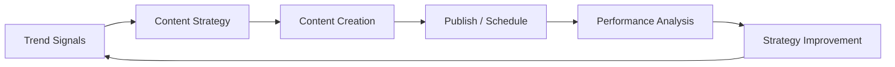

---

## 2. Personas

| Persona | Description | Primary goals |
|---|---|---|
| **Solo Creator ("Maya")** | Personal-brand builder on LinkedIn/X. Posts inconsistently, unsure what works. | Know what to post, stay consistent, grow engagement without burnout. |
| **Founder / Thought Leader ("Dev")** | Builds company + personal brand. Time-poor. | Repurpose one idea across platforms, sound on-brand, schedule ahead. |
| **Marketer / Ghostwriter ("Sam")** | Manages content for self or clients. | Data-informed calendars, performance proof, repeatable workflow. |
| **Waitlisted Prospect** | Signed up, not yet granted workspace access. | Get in, understand the value. |
| **Admin / Operator** | Internal. Approves waitlist, manages access. | Control who enters, run demos. |

---

## 3. End-to-End User Flows

The codebase is mid-transition between a legacy mock path and the
permanent-context vision. Flows are labeled accordingly.

### 3.1 Acquisition & Waitlist ✅

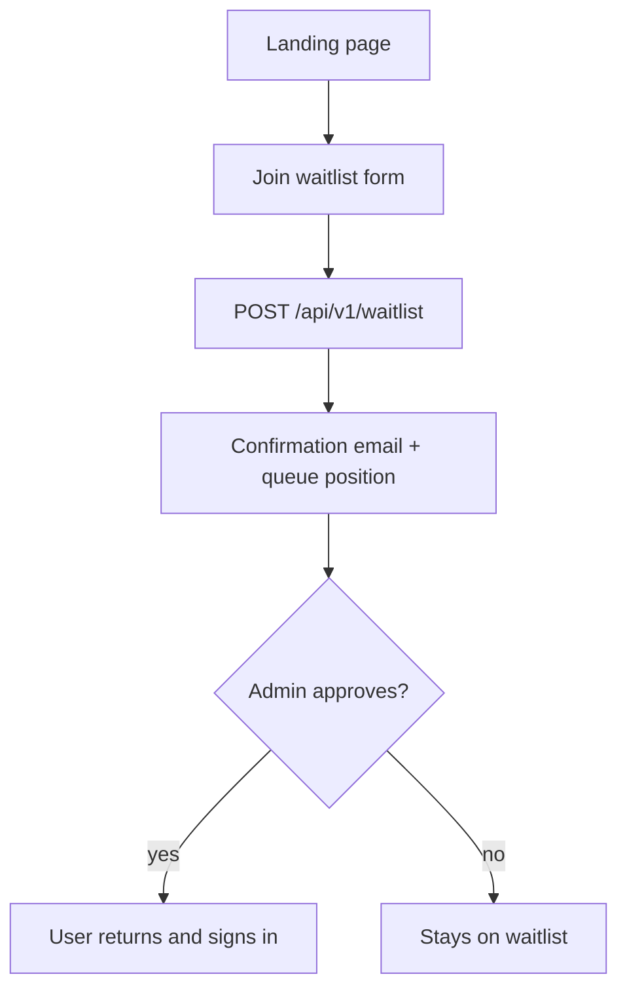

### 3.2 Authentication ✅

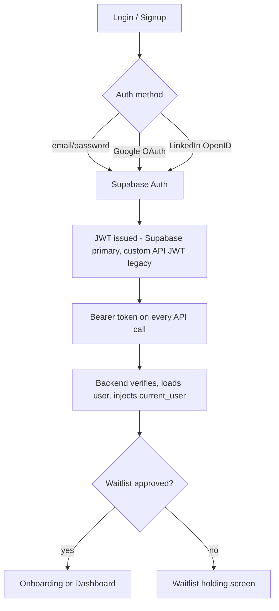

### 3.3 Onboarding — VISION (north star) ⏳

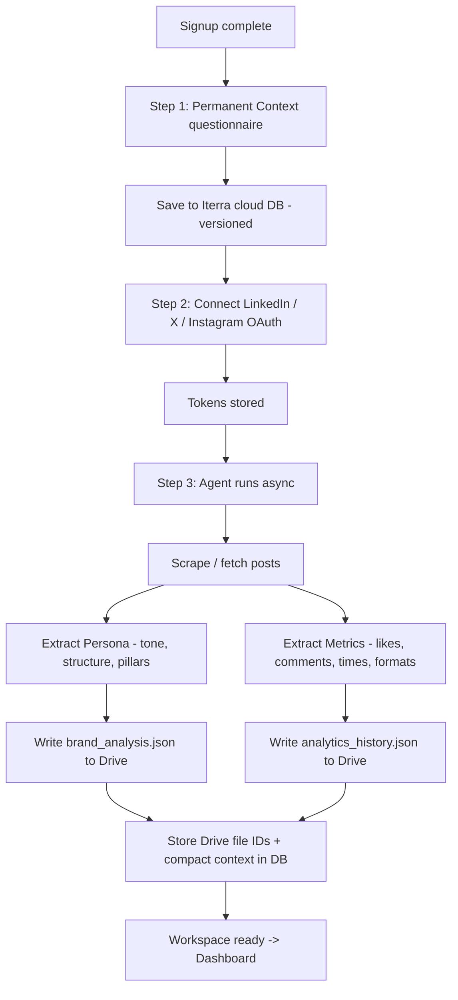

### 3.4 Onboarding — CURRENT legacy path 🔶

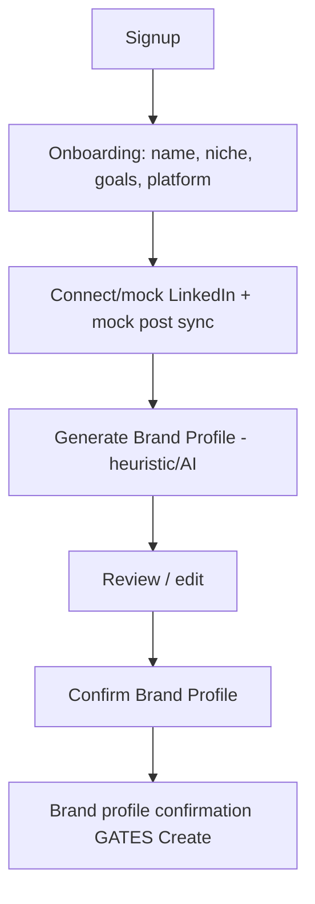

### 3.5 Content Creation — core loop ✅ (LLM context ⏳)

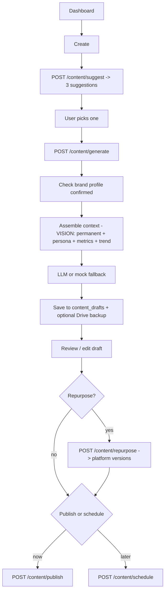

### 3.6 Trend Radar ✅ (real sources ⏳)

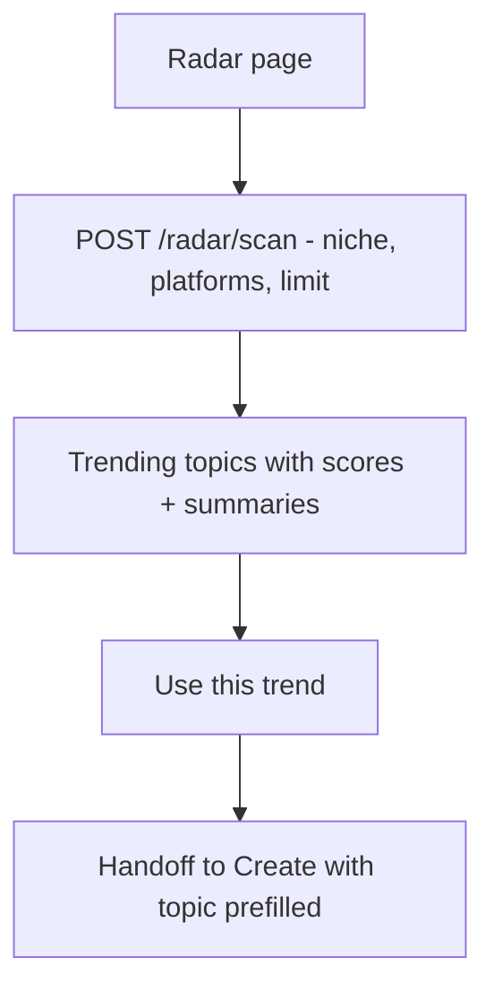

### 3.7 AI Engagement Coach ✅ (LLM ⏳)

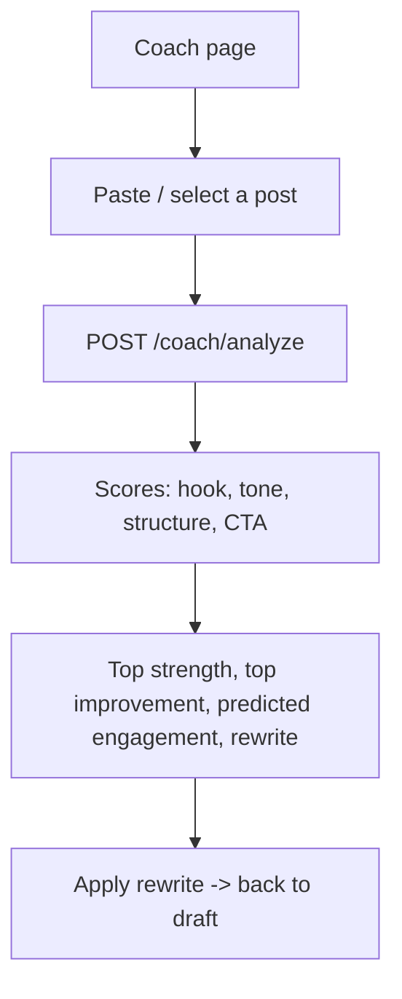

### 3.8 Smart Content Calendar ✅ (LLM + persona ⏳)

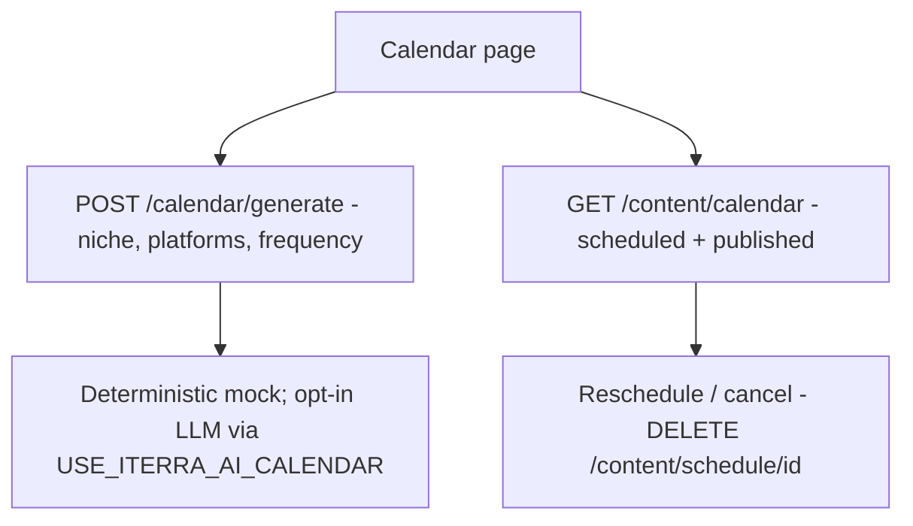

### 3.9 Social Sync & Publishing — background 🔶

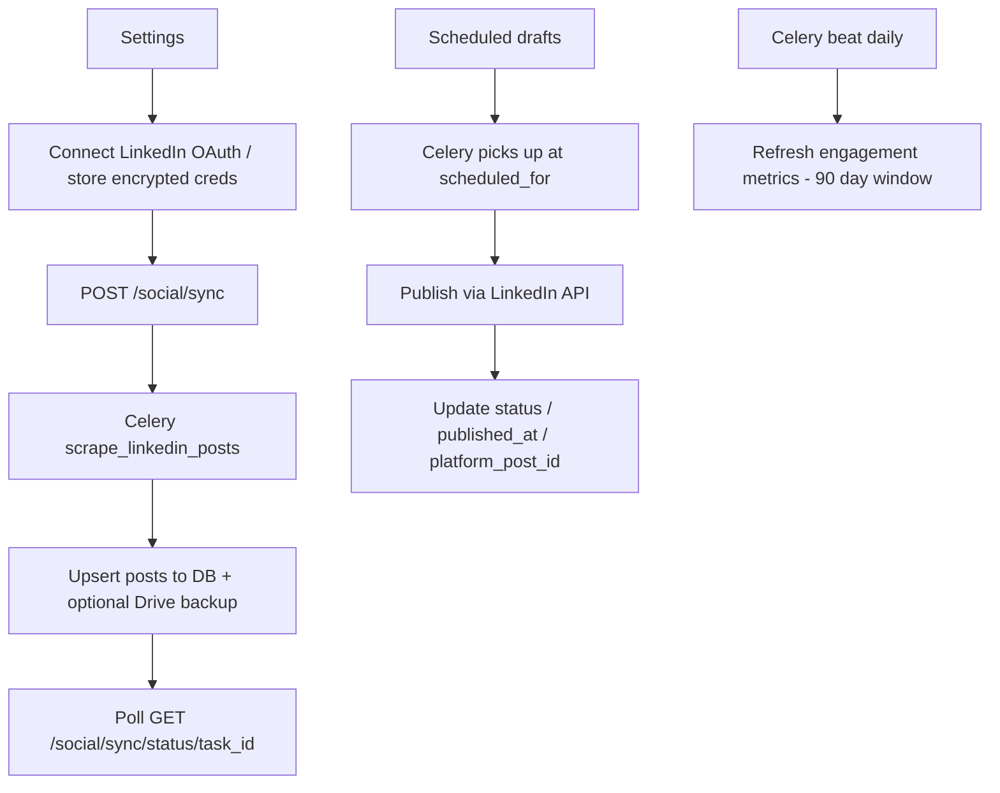

### 3.10 Analytics & Learning Loop ✅ summary / ⏳ promotion

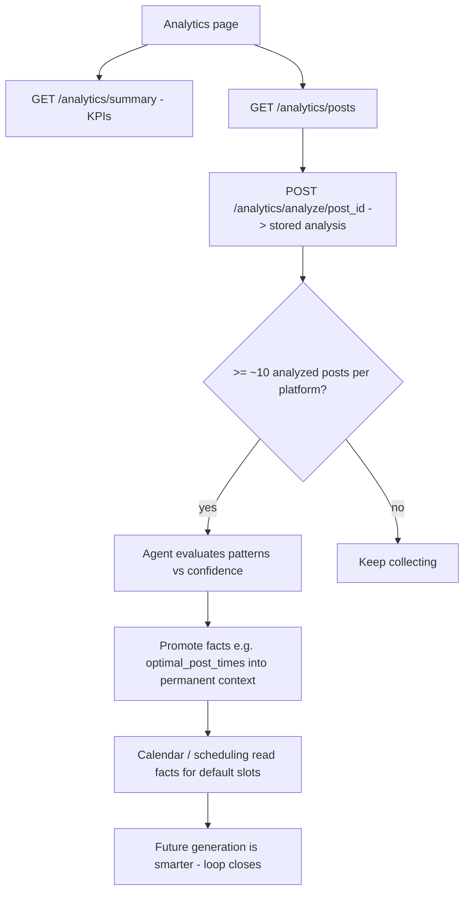

### 3.11 Storage & Privacy — Google Drive 🔶

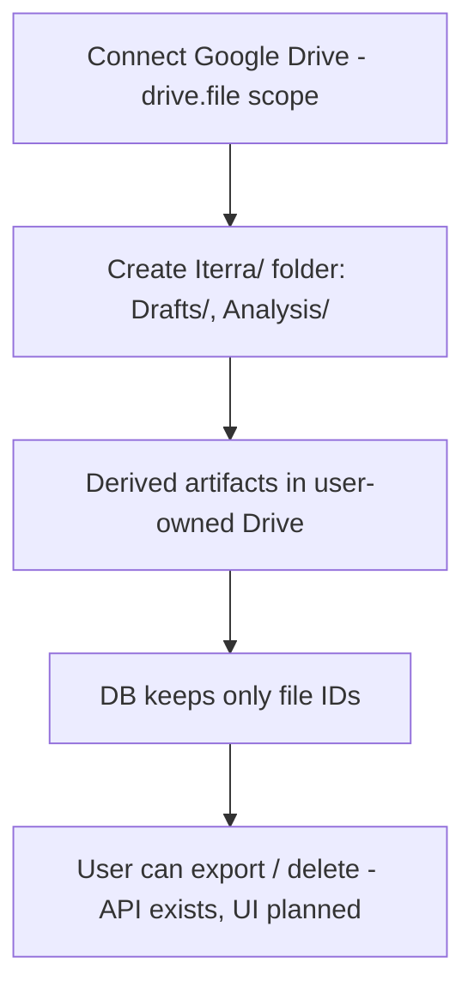

---

## 4. User Stories by Epic

Format: *As a [persona], I want [capability], so that [outcome].*

### Epic 1 — Waitlist & Access
- ✅ As a **prospect**, I want to join a waitlist with my email and profession, so that I can request early access.
- ✅ As a **prospect**, I want a confirmation email and my queue position, so that I know I'm in.
- 🔶 As an **admin**, I want to approve specific emails, so that only granted users reach the workspace.
- 🔶 As a **user**, I want the app to gate the product behind approval, so that access is controlled.

### Epic 2 — Authentication
- ✅ As a **user**, I want to sign up/log in with email/password or Google/LinkedIn, so that I can access my workspace securely.
- ✅ As a **user**, I want my session to persist and protected routes to redirect when logged out, so that my data stays private.
- ✅ As a **user**, I want to log out and clear my session, so that I can secure shared devices.

### Epic 3 — Permanent Context (vision core)
- ⏳ As a **creator**, I want to declare my brand/name, summary, niche, audience, goals, and platforms once, so that Iterra never forgets who I am.
- ⏳ As a **creator**, I want to choose self-brand vs company-brand, so that the voice matches my intent.
- ⏳ As a **user**, I want to edit my permanent context in Settings and have it versioned, so that strategy changes are tracked.
- ⏳ As a **user**, I want this context loaded on every AI call, so that all output is consistent with my strategy.

### Epic 4 — Account Connection & Agent Analysis
- 🔶 As a **creator**, I want to connect LinkedIn/X/Instagram via OAuth, so that Iterra can learn from my real content.
- ⏳ As a **creator**, I want the agent to automatically analyze my posts after connecting, so that onboarding feels effortless.
- ⏳ As a **creator**, I want a persona summary (tone, structure, content pillars) extracted from my posts, so that generated content sounds like me.
- ⏳ As a **creator**, I want engagement metrics analyzed (likes, comments, posting times, format performance), so that strategy is data-informed.
- 🔶 As a **privacy-conscious user**, I want summaries stored in my own Google Drive and only file IDs kept in Iterra, so that I own my data.

### Epic 5 — Brand Profile (legacy, unifying into persona)
- ✅ As a **creator**, I want an AI-generated brand profile from my posts, so that I have a starting voice definition.
- ✅ As a **creator**, I want to review, edit, and confirm my brand profile, so that I control how I'm represented.
- ✅ As a **creator**, I want a confidence score on the profile, so that I know how much to trust it.

### Epic 6 — Trend Radar
- ✅ As a **creator**, I want to scan trending topics in my niche, so that I can post on timely angles before saturation.
- ✅ As a **creator**, I want each trend scored and summarized, so that I can quickly judge relevance.
- ⏳ As a **creator**, I want trends sourced from Reddit/YouTube/Google Trends in real time, so that signals are current.
- ✅ As a **creator**, I want to send a trend straight into Create, so that I can act on it immediately.

### Epic 7 — Content Creation & Repurposing
- ✅ As a **creator**, I want 3 content suggestions based on my trends, so that I never face a blank page.
- ✅ As a **creator**, I want to generate a full draft from a suggestion, so that I save writing time.
- ⏳ As a **creator**, I want generation to use my permanent + persona + metrics context, so that drafts are on-brand and proven-effective.
- 🔶 As a **founder**, I want to repurpose one draft into platform-specific versions, so that one idea reaches every channel.
- ✅ As a **creator**, I want to edit drafts and manage their status, so that I stay in control of what publishes.

### Epic 8 — AI Engagement Coach
- ✅ As a **creator**, I want my post scored on hook, tone, structure, and CTA, so that I know its strengths and weaknesses.
- ✅ As a **creator**, I want a concrete rewrite suggestion and predicted engagement, so that I can improve before posting.
- ⏳ As a **creator**, I want coach feedback powered by an LLM using my brand context, so that advice is specific to me.

### Epic 9 — Smart Content Calendar
- ✅ As a **marketer**, I want to generate a content calendar from niche/platforms/frequency, so that I have a strategic plan.
- ⏳ As a **marketer**, I want the plan informed by my persona and permanent context, so that it fits my voice and goals.
- ✅ As a **creator**, I want to see scheduled and published posts on a calendar, so that I can manage my pipeline.
- ⏳ As a **creator**, I want default scheduling slots to use my learned optimal posting times, so that I post when engagement is highest.

### Epic 10 — Publishing & Scheduling
- ✅ As a **creator**, I want to publish immediately or schedule for later, so that I control timing.
- ✅ As a **creator**, I want to cancel a scheduled post, so that I can change plans.
- 🔶 As a **creator**, I want scheduled posts auto-published to LinkedIn via background jobs, so that I don't have to be online.
- ⏳ As a **creator**, I want publish failures surfaced with errors, so that nothing silently fails.

### Epic 11 — Analytics & Learning Loop
- ✅ As a **creator**, I want a KPI dashboard (posts, engagement, coverage), so that I see performance at a glance.
- ✅ As a **creator**, I want per-post AI analysis stored and refreshable, so that I learn what works.
- 🔶 As a **creator**, I want engagement metrics synced periodically from the platform, so that data stays fresh.
- ⏳ As a **creator**, I want proven patterns promoted into my permanent context after enough data, so that Iterra gets smarter automatically.
- ⏳ As a **creator**, I want to watch the strategy improve over time, so that I trust the system as a real strategist.

### Epic 12 — Storage & Privacy
- 🔶 As a **user**, I want to connect Google Drive so that my derived artifacts are user-owned.
- ⏳ As a **user**, I want to export or delete all my data (GDPR), so that I stay in control.
- ✅ As a **user**, I want my social credentials encrypted at rest, so that connections are secure.

### Epic 13 — Settings & Account
- ✅ As a **user**, I want to view connected accounts and their status, so that I know what's linked.
- 🔶 As a **user**, I want to reconnect Drive/social when tokens expire, so that syncs keep working.
- ⏳ As a **user**, I want to edit permanent context and preferences, so that the product adapts to me.

### Epic 14 — Admin
- 🔶 As an **admin**, I want to approve/reject waitlist members, so that I control onboarding.
- ⏳ As an **admin**, I want a backend admin-role check, so that admin actions are authorized.

---

## 5. The Closed Loop, Summarized as a Story

> As **Maya**, I declare who I am once. Iterra connects my accounts, studies how
> I write and what performs, and stores that as my private memory. When I open
> Create, it already knows my voice, my best topics, and my best times. It hands
> me a trend, drafts a post that sounds like me, coaches it sharper, and
> schedules it for my proven peak time. After it publishes, it measures the
> result, updates my memory, and gets a little smarter — so next week's advice
> is better than this week's. I stopped guessing. I started strategizing.

---

## 6. Sprint-Ready Tickets (vision build-out)

These are the gap-closing tickets to move from the legacy mock path to the
closed-loop vision. Each has acceptance criteria (Given/When/Then) and owner
hints aligned with the cofounder split in the VC demo plan (A = frontend/UX,
B = backend/AI/workers).

### ITR-301 — Permanent Context model & API  ·  Owner: B  ·  Epic 3
Create the cloud-stored `PermanentContext` (display_name, is_self_brand,
summary, niche, audience, goals, primary_platforms, promoted_facts, version).

**Acceptance criteria**
- Given a logged-in user, when they POST permanent context, then it persists in PostgreSQL with `version = 1`.
- Given an existing record, when fields are updated, then `version` increments and prior values are recoverable.
- Given any AI generate call, when context is loaded, then the permanent context is included in the assembled bundle.
- Pydantic schemas defined before models; `make types` run and `shared-types` committed; Alembic migration has `upgrade()` and `downgrade()`.

### ITR-302 — Permanent Context questionnaire UI  ·  Owner: A  ·  Epic 3
Build `/onboarding/context` as Step 1 before Connect.

**Acceptance criteria**
- Given a new user, when they reach onboarding, then Step 1 (context) appears before Step 2 (connect).
- Given valid input, when submitted, then it calls the ITR-301 API and advances to Connect.
- Given self-brand vs company-brand toggle, when chosen, then the label/copy adapts.
- Editable later from Settings; flows through `component → hook → store → service → api.ts`.

### ITR-303 — Mount & fix persona + social_oauth routers  ·  Owner: B  ·  Epic 4
Resolve P0 wiring so connect flows are reachable.

**Acceptance criteria**
- Given the API boots, then `persona` is mounted at `/api/v1/persona` and `social_oauth` at `/api/v1/connect`.
- Given the import path, then `_fetch_supabase_user` resolves (no crash on import).
- Given persona models, then they are registered in `models/__init__.py` and autoload.
- `pytest` green; OpenAPI export shows the new routes.

### ITR-304 — Connect accounts UI (X minimum)  ·  Owner: A  ·  Epic 4
OAuth popup connect for X (LinkedIn/Instagram if available).

**Acceptance criteria**
- Given Step 2, when the user clicks Connect X, then an OAuth popup completes and the account shows "connected".
- Given source type, then UI sends `x` (not `twitter`) to match the scraper.
- Given a connected account, then status is reflected in Settings.

### ITR-305 — Post-connect agent pipeline (Celery)  ·  Owner: B  ·  Epic 4
Auto-trigger scrape → persona → metrics → Drive write after OAuth success.

**Acceptance criteria**
- Given a successful connect, when tokens are stored, then a Celery job is enqueued without user action.
- Given scraped posts, then a Persona summary and a Metrics summary are produced.
- Given Drive is connected, then `brand_analysis.json` and `analytics_history.json` are written and file IDs stored in DB.
- Given Drive is not connected, then the step is skipped gracefully and surfaced in UI.
- Raw bulk scrape is not persisted long-term.

### ITR-306 — Context assembler & 3-layer generation  ·  Owner: B  ·  Epic 7
Build `ContextBundle` (permanent + persona + metrics + ephemeral) feeding the LLM.

**Acceptance criteria**
- Given a generate request, when assembled, then the bundle contains all available layers.
- Given the LLM path is enabled, then generation uses the bundle, not static templates.
- Given a layer is missing (e.g. no metrics yet), then generation degrades gracefully with available context.
- Token usage logged via `CostTracker`.

### ITR-307 — LLM upgrades: coach, calendar, radar, repurpose  ·  Owner: B  ·  Epics 6–9
Replace heuristic/mock primary paths with LLM (mock = fallback only).

**Acceptance criteria**
- Given valid LLM keys, when coach/calendar/radar/repurpose run, then output comes from the LLM using brand context.
- Given an LLM/API failure, then deterministic mock output is returned and labeled as fallback.
- Prompts live in `packages/ai-engine/iterra_ai/prompts/`, versioned, never inlined.

### ITR-308 — Optimal-time fact promotion (learning loop)  ·  Owner: B  ·  Epic 11
After ~10 analyzed posts/platform, promote high-confidence facts into permanent context.

**Acceptance criteria**
- Given ≥10 analyzed posts on a platform, when patterns exceed the confidence threshold, then `optimal_post_times` (and similar) merge into permanent context.
- Given promoted facts, then Calendar/scheduling read them for default slots.
- Given insufficient data, then no promotion occurs and the Drive report is updated instead.
- For demo: a seeded fact (`linkedin: "17:00"`) is supported if automation is incomplete.

### ITR-309 — Scheduled publishing & performance sync workers  ·  Owner: B  ·  Epics 10–11
Wire real Celery beat for publishing scheduled drafts and refreshing metrics.

**Acceptance criteria**
- Given a draft scheduled for time T, when T arrives, then the worker publishes and updates `status`, `published_at`, `platform_post_id`.
- Given a publish failure, then `publish_error` is set and surfaced in UI.
- Given published posts in a 90-day window, when the daily sync runs, then engagement metrics and `engagement_rate` update.

### ITR-310 — Google Drive connect UI + GDPR export/delete  ·  Owner: A + B  ·  Epic 12
Surface Drive connection in Settings and expose export/delete.

**Acceptance criteria**
- Given Settings, when the user clicks Connect Drive, then OAuth completes and folder structure is created.
- Given an expired token, when a sync runs, then refresh is attempted (StorageService) and reconnection is prompted on failure.
- Given a delete request, when confirmed, then user data is removed and Drive file references are cleared.

### ITR-311 — Waitlist approval gating & admin API  ·  Owner: A + B  ·  Epics 1, 14
Complete approval gating end-to-end with an authorized admin role.

**Acceptance criteria**
- Given an unapproved user, when they sign in, then they see a waitlist holding state, not the product.
- Given an admin, when they approve an email, then that user gains workspace access on next load.
- Given a non-admin, when they call admin routes, then the backend rejects with 403.
- Waitlist model, schemas, and migration (`access_approved`) are in sync.

### ITR-312 — Analytics score-bar fix & dashboard checklist  ·  Owner: A  ·  Epics 11, 3
Fix score normalization and reframe the dashboard around the vision.

**Acceptance criteria**
- Given analysis scores, when rendered, then bars use correct normalization (no divide-by-100 bug).
- Given the dashboard, then it shows a Context → Connect → Analysis → Ready checklist instead of mock-LinkedIn-first.
- Given the auth callback, then it respects waitlist gating instead of always routing to `/dashboard`.

---

## 7. Suggested Sprint Sequencing

| Sprint | Theme | Tickets |
|---|---|---|
| Sprint 1 — Foundation | Permanent context + P0 wiring | ITR-301, ITR-302, ITR-303, ITR-311 |
| Sprint 2 — Connect & analyze | Real agent pipeline | ITR-304, ITR-305, ITR-310 |
| Sprint 3 — Real intelligence | Context-driven generation | ITR-306, ITR-307, ITR-312 |
| Sprint 4 — Close the loop | Learning + automation | ITR-308, ITR-309 |

---

## 8. Reality Check (current vs vision)

Biggest gaps between today's code and the full vision:

- **Permanent context questionnaire + model** — not built (legacy `niche/goals` onboarding stands in).
- **Auto agent after OAuth** — currently manual; social_oauth/persona routers partially wired.
- **Context assembler (3-layer prompt)** — not built; generation uses templates/mock.
- **Drive write after analysis** — service exists, not wired into the flow.
- **Fact promotion / learning loop** — narrated for demo, not automated.
- **Real trend sources & LLM coach/calendar** — currently curated/heuristic/mock with opt-in LLM flags.

Everything in Epics 1–2, 5–9, and parts of 10–11 has a working demo path today;
Epics 3, 4, and the learning-loop portions of 11 are the vision build-out.
