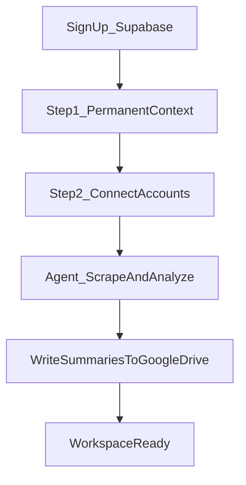
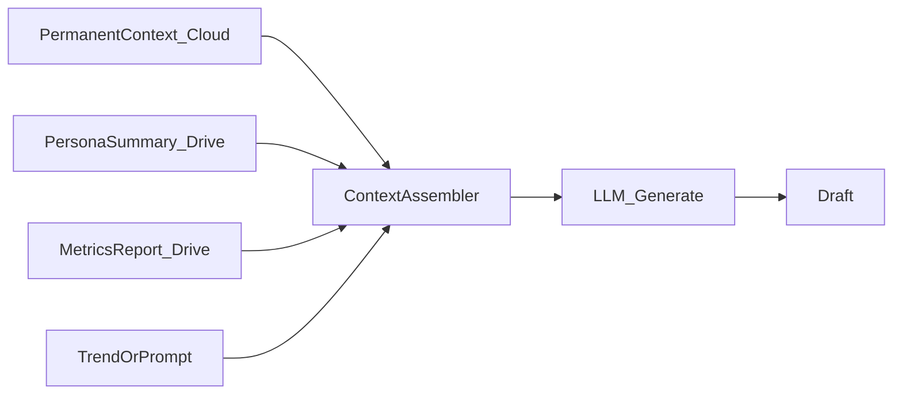
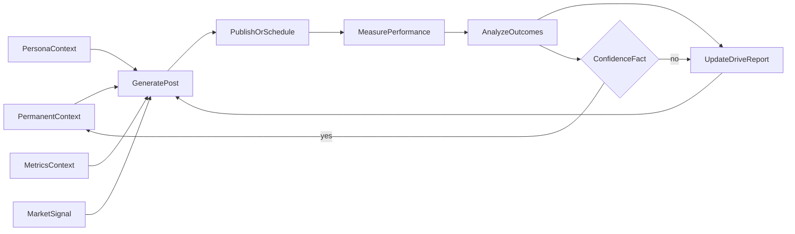
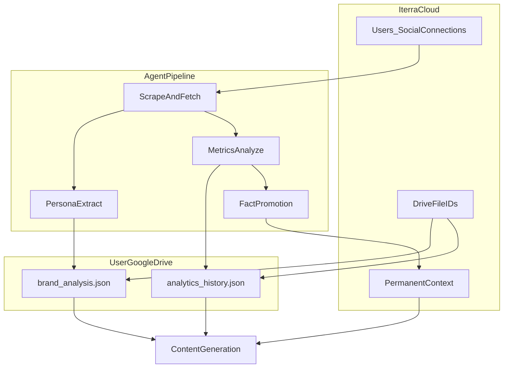

# Iterra — VC Demo MVP Plan

> **Goal:** Demo-ready MVP for VC presentation — functional end-to-end with a **real agentic loop**.  
> Mock/fallback paths are acceptable only when LLM or external APIs fail, not as the primary demo path.  
> **Last updated:** 2026-05-23  
> **Status:** Split repo — stable legacy mock MVP + in-progress persona/waitlist/permanent-context vision

**Related:** [Feature maturity matrix](features/maturity-matrix.md) · [P0 integration fix prompt](prompts/p0-integration-fix.md)

---

## Table of contents

1. [Executive summary](#1-executive-summary)
2. [Product vision — permanent context and learning loop](#2-product-vision--permanent-context-and-learning-loop)
3. [Two-tier storage model](#3-two-tier-storage-model)
4. [Content generation context stack](#4-content-generation-context-stack)
5. [Agentic loop and demo requirements](#5-agentic-loop-and-demo-requirements)
6. [VC demo script (8–10 minutes)](#6-vc-demo-script-810-minutes)
7. [Context model unification](#7-context-model-unification)
8. [Cofounder work split](#8-cofounder-work-split)
9. [Golden rules (merge conflict prevention)](#9-golden-rules-merge-conflict-prevention)
10. [Phased schedule (Phase 0–3)](#10-phased-schedule-phase-03)
11. [Gap list — P0 Broken](#11-gap-list--p0-broken)
12. [Gap list — Vision vs codebase](#12-gap-list--vision-vs-codebase)
13. [Gap list — P1 Mock → real](#13-gap-list--p1-mock--real)
14. [Gap list — P2 Incomplete / scaffolding](#14-gap-list--p2-incomplete--scaffolding)
15. [Gap list — P3 UI bugs](#15-gap-list--p3-ui-bugs)
16. [Architecture reference](#16-architecture-reference)
17. [Feature maturity snapshot](#17-feature-maturity-snapshot)
18. [Environment checklist for demo](#18-environment-checklist-for-demo)
19. [Integration fix prompt](#19-integration-fix-prompt)

---

## 1. Executive summary

**Vision:** Ittera remembers who you are (**permanent context** on cloud), learns how you write and how your posts perform (**persona + metrics summaries** on Google Drive), generates every post from all context layers, and **promotes proven facts** (e.g. optimal posting times per platform) back into permanent context over time.

**Current repo:**

- Step 1 permanent-context questionnaire **not built**
- Step 2 OAuth connect **partial** (`social_oauth.py` exists, not mounted)
- Step 3 agent scrape/analyze **partial** (X scrape only; no metrics pipeline; no Drive write after analyze)
- Learning loop and fact promotion **not built**
- Legacy mock LinkedIn → brand profile path still gates Create

**VC demo target:** Live Step 1 → Step 2 (X minimum) → agent analyze → generate post with **real LLM** using assembled context → coach → schedule using seeded or derived optimal time → narrate learning loop.

**Out of scope for this document:** Implementing fixes. This doc defines what to build, who owns what, and the order of work. Implementation starts with the [P0 integration PR](prompts/p0-integration-fix.md).

---

## 2. Product vision — permanent context and learning loop

This section is the **north star** for demo scope, gap lists, and cofounder split.

### Onboarding flow



### Step 1 — Permanent context questionnaire (cloud, never forgotten)

On first signup, the user answers strategic questions:

| Field | Purpose |
|-------|---------|
| Brand name OR your name | Self-branding vs company brand |
| Brand/self summary | What this account represents |
| Niche / audience / goals | Strategic direction |
| Primary platforms | Where they create (LinkedIn, X, Instagram) |

**Storage:** Iterra cloud (PostgreSQL + API) — **not** Google Drive.

**Behavior:**

- Loaded on **every** agent and generate call
- User can edit in Settings; updates version the baseline
- Over time, **LLM-promoted facts** merge into this record (see learning loop)

### Step 2 — Connect social accounts (OAuth redirect)

- LinkedIn, Twitter/X, Instagram
- Popup OAuth ([`apps/api/app/routers/social_oauth.py`](../apps/api/app/routers/social_oauth.py))
- After tokens stored, user sees “you’re set”; agent runs **async**

### Step 3 — Automatic agent pipeline (no user action)

After connect, the agent automatically:

1. Calls platform APIs / scrapes public posts where APIs are unavailable
2. Extracts **Persona** — tone, structure, voice, content pillars
3. Extracts **Engagement metrics** — likes, comments, shares, reach proxies, posting times, format performance
4. Processes internally — **does not persist raw scrape bulk**
5. Writes **summarized artifacts** to the user’s Google Drive via [`StorageService`](../apps/api/app/services/storage_service.py):
   - `brand_analysis.json` — persona summary
   - `analytics_history.json` — metrics summary + derived facts (pre-promotion)
   - `scraped_posts.json` — optional lightweight history, not full raw dump

### Learning loop — fact promotion (Phase 2 for automation; narrate at VC)

After sufficient analyzed posts (e.g. **10 per platform**):

- Agent evaluates patterns against a confidence threshold
- Established facts promote to **permanent context** on cloud  
  Example: `optimal_post_times: { "linkedin": "17:00", "twitter": "21:00" }`
- Calendar/scheduling reads permanent context for default slots

**VC demo minimum:** Seed one optimal-time fact manually **or** narrate the loop with a slide. Full automation is Phase 2 if time-constrained.

---

## 3. Two-tier storage model

| Tier | What | Where | Examples |
|------|------|-------|----------|
| **Permanent context** | User-declared strategy + LLM-promoted learned facts | Iterra cloud DB | Brand name, summary, confirmed optimal times |
| **Derived context** | Persona summary, metrics report, analysis outcomes | User’s Google Drive (file IDs in DB) | `brand_analysis.json`, `analytics_history.json` |
| **Ephemeral / processing** | Raw scrape, full post history | Not stored long-term | Discarded after summarization |

**Privacy:** Drive files are user-owned (`drive.file` scope). DB stores file IDs and compact permanent context only. See [`StorageService`](../apps/api/app/services/storage_service.py).

---

## 4. Content generation context stack

Every post generation must assemble:

```text
1. Permanent context     (cloud — questionnaire + promoted facts)
2. Persona context       (Drive — how you write)
3. Metrics context       (Drive — derived performance facts)
4. Ephemeral inputs      (trend/radar topic, user prompt, platform)
```



---

## 5. Agentic loop and demo requirements

### Closed loop (target architecture)



### Must be real (LLM + user data)

| Step | Requirement |
|------|-------------|
| Permanent context | Questionnaire saved to cloud; loaded on every generate |
| Connect | OAuth for at least X/Twitter for demo |
| Persona | OpenAI (or equivalent) extraction from scraped/API data |
| Metrics | Analysis producing derived facts (even if partial metrics initially) |
| Generate | LLM draft using **ContextBundle** (all three layers) |
| Coach | LLM feedback with actionable suggestions |
| Radar/Trends | Timely signal into Create (real API or refreshed + LLM summary) |
| Calendar | LLM plan informed by persona + permanent context |

### Can be simulated (label honestly on stage)

| Step | Acceptable for demo |
|------|---------------------|
| Publish | “Simulated publish” → draft marked published + calendar event |
| Drive artifact | Narrate if Drive OAuth not configured in demo env |
| Fact promotion | Seeded optimal time or narration vs live promotion |
| Historical platform metrics | Coach-on-generated-draft as proof if live sync unavailable |

### Mocks = fallback only

Use deterministic mock output **only** when API keys fail or scrape errors. Demo rehearsal uses real paths with real keys.

---

## 6. VC demo script (8–10 minutes)

| # | Step | Route / surface | What must work |
|---|------|-----------------|----------------|
| 1 | Sign in + waitlist approved | Auth | Supabase + API JWT; admin pre-approves email |
| 2 | **Step 1:** Permanent context | `/onboarding/context` (or wizard step 1) | Brand/name + summary saved to cloud |
| 3 | **Step 2:** Connect X | Onboarding connect step | OAuth popup → connected |
| 4 | Agent processing | Loading UI | Scrape + persona + metrics analysis |
| 5 | Drive artifact | Settings or narrate | `brand_analysis.json` exists (or explain Drive step) |
| 6 | Radar → signal | `/radar` | Trend → Create handoff |
| 7 | **Generate post** | `/create` | LLM + three context layers (preview panel if built) |
| 8 | Coach | `/coach` | Real LLM feedback |
| 9 | Schedule | Create or Calendar | Default slot from `optimal_post_times` (seeded if needed) |
| 10 | Close loop | Narration | “After 10 posts, 5pm LinkedIn becomes permanent fact” |

**Pre-demo checklist:**

- Pre-approve presenter email in admin
- Set `OPENAI_API_KEY`, `SUPABASE_JWT_SECRET`, `TWITTER_*` OAuth vars
- Seed `optimal_post_times.linkedin: "17:00"` in permanent context if promotion not built
- Rehearse X-only if LinkedIn/Instagram scrape not ready

---

## 7. Context model unification

Replace the legacy split between mock brand profile and new persona with one model:

| Legacy | New vision | Action |
|--------|------------|--------|
| `BrandProfile` (mock LinkedIn heuristic) | Persona slice of Drive summary | Deprecate mock path |
| `PersonaProfile` (OpenAI extraction) | Persona + Drive file link | Keep, extend |
| `User.niche`, `goals`, onboarding | Part of permanent context | New model or extend User |
| `brand_profile_service` | Context assembler reads cloud + Drive | Migrate |

### Conceptual schema (implement Phase 1–2)

```python
# Conceptual — not yet in codebase
PermanentContext:
  user_id: str
  display_name: str           # brand name or personal name
  is_self_brand: bool
  summary: str
  niche: str | None
  audience: str | None
  goals: list[str]
  primary_platforms: list[str]
  promoted_facts: dict        # e.g. optimal_post_times, format_preferences
  version: int
  updated_at: datetime
```

### Drive file layout (existing design)

From [`storage_service.py`](../apps/api/app/services/storage_service.py):

```
Iterra/
  brand_analysis.json      # persona summary
  analytics_history.json   # metrics + derived facts
  scraped_posts.json       # optional lightweight history
  drafts/
    {draft-uuid}.json
```

---

## 8. Cofounder work split

### Cofounder A — Onboarding UX and product surfaces

**Exclusive write access:**

```text
apps/web/
  src/app/
  src/components/
  src/context/          # AuthContext — SOLE OWNER
  src/hooks/
  src/stores/
  src/services/
  src/lib/
```

**Responsibilities:**

- Step 1: Permanent context questionnaire UI
- Refactor onboarding wizard: Context → Connect → Processing → Results
- Settings: edit permanent context; connected accounts; Drive reconnect
- Generate UI: optional context preview panel
- Waitlist gating, admin portal, auth flows
- Dashboard checklist: Context → Connect → Analysis complete → Ready to create
- Analytics score bar fix; auth callback respects waitlist

**Do not touch:** `apps/api/`, `packages/ai-engine/`, `workers/`, migrations.

---

### Cofounder B — Agent pipeline, storage, and LLM

**Exclusive write access:**

```text
apps/api/
packages/ai-engine/
workers/celery/
scripts/
.env.example
```

**Responsibilities:**

- `PermanentContext` model, migration, API (schemas first)
- Context assembler service → `ContextBundle` for all engines
- Post-connect Celery job: scrape → persona → metrics → Drive write → DB file IDs
- Mount `persona` + `social_oauth` routers; fix auth imports
- Waitlist model sync + admin API
- LLM paths: content generate, coach, calendar, radar
- Metrics analysis service; Phase 2 fact promotion worker
- Run `make types` after every schema change

**Do not touch:** `apps/web/` except consuming generated shared-types.

---

### Shared touchpoints

| Artifact | Owner | Other person |
|----------|-------|--------------|
| Pydantic / OpenAPI schemas | B | A reviews before UI |
| `packages/shared-types/` | B generates | A consumes only |
| `main.py` | B | — |
| `AuthContext.tsx` | A | B provides API fields |
| `PermanentContext` schema | B | A implements form |
| `ContextBundle` schema | B | A may show preview |
| Drive JSON shapes | B defines | A displays |
| Onboarding routes / step order | A implements | B reviews |
| `.env.example` | B | A documents frontend vars |

---

## 9. Golden rules (merge conflict prevention)

1. **Contracts before code** — New endpoints start in `apps/api/app/schemas/`.
2. **One person runs `make types`** — Never hand-edit `packages/shared-types/src/index.ts`.
3. **One owner per hot file** — `main.py`, `AuthContext.tsx`, `product.store.ts`, `.env.example`.
4. **Vertical slices** — Each PR demoable alone (e.g. “permanent context save works E2E”).
5. **Daily 15-min sync** — What schema/API changed today.

---

## 10. Phased schedule (Phase 0–3)

### Phase 0 — Integration PR (~2–3 days, one cofounder)

Cross-cutting P0 wiring per [prompts/p0-integration-fix.md](prompts/p0-integration-fix.md).  
Agree onboarding route names; stub `/onboarding/context` OK if Step 1 lands in Phase 1.

### Phase 1 — Week 1: Foundation matches vision

| Cofounder A | Cofounder B |
|-------------|-------------|
| Permanent context form UI | `PermanentContext` model + migration + API |
| Refactor onboarding wizard steps | Mount persona + social_oauth routers |
| AuthContext + waitlist gating | Post-connect Celery job skeleton |
| Wire AuthShell in layout | Scrape X + persona OpenAI extract |
| | Write persona summary to Drive (when Drive connected) |

### Phase 2 — Week 2: Real loop for VC

| Cofounder A | Cofounder B |
|-------------|-------------|
| Agent processing/loading UX | Metrics → `analytics_history.json` on Drive |
| Generate page + context preview | Context assembler + LLM content generate |
| Calendar defaults from `optimal_post_times` | Coach LLM; calendar LLM plan |
| Demo rehearsal | Radar/trends; seed promoted fact for schedule |
| Analytics score bar fix | Optional minimal fact promotion |

### Phase 3 — Post-VC (document, do not block demo)

- Full LinkedIn/Instagram scrape/API
- Automatic fact promotion at confidence threshold
- Real platform publish APIs
- Performance sync Celery from live APIs

---

## 11. Gap list — P0 Broken

Blocks VC demo and Phase 1 parallel work. Fix in **Phase 0 integration PR** before A/B split.

| # | Item | Location | What's wrong | Owner |
|---|------|----------|--------------|-------|
| 1 | Persona API not mounted | [`apps/api/main.py`](../apps/api/main.py) | No `persona` router registered | Integration / B |
| 2 | Wrong persona prefix | [`persona.py`](../apps/api/app/routers/persona.py) L13 | `prefix="/v1/persona"` not `/api/v1/persona` | B |
| 3 | Social OAuth not mounted | [`main.py`](../apps/api/main.py) | `social_oauth` not registered | Integration / B |
| 4 | Social OAuth import crash | [`social_oauth.py`](../apps/api/app/routers/social_oauth.py) | Imports missing `_fetch_supabase_user` | B |
| 5 | Missing API client methods | [`apps/web/src/lib/api.ts`](../apps/web/src/lib/api.ts) | No `api.persona`, `api.connect` | A |
| 6 | Waitlist model out of sync | [`waitlist.py` model](../apps/api/app/models/waitlist.py) vs [migration 003](../apps/api/app/db/migrations/versions/003_add_waitlist_access_approval.py) | `access_approved` missing from model | B |
| 7 | Waitlist admin API missing | [`waitlist.py` router](../apps/api/app/routers/waitlist.py) | [`admin.ts`](../apps/web/src/services/admin.ts) calls non-existent routes | B |
| 8 | AuthContext incomplete | [`AuthContext.tsx`](../apps/web/src/context/AuthContext.tsx) | No `hasWorkspaceAccess`, `isAdmin`, etc. | A |
| 9 | Session guard not wired | [`AuthShell.tsx`](../apps/web/src/components/auth/AuthShell.tsx), [`layout.tsx`](../apps/web/src/app/layout.tsx) | Guard not in tree | A |
| 10 | Missing `hasStoredSupabaseSession` | [`supabase.ts`](../apps/web/src/lib/supabase.ts) | Used by SessionRouteGuard, not exported | A |
| 11 | Bad onboarding API call | [`persona/page.tsx`](../apps/web/src/app/(auth)/onboarding/persona/page.tsx) | Sends only `primary_platform`; API needs `full_name` + `niche` | A + B |
| 12 | Scraper source type mismatch | persona page + [`scraper.py`](../apps/api/app/services/scraper.py) | UI sends `"twitter"`, scraper expects `"x"` | A + B |
| 13 | LI/IG scrape not implemented | [`scraper.py`](../apps/api/app/services/scraper.py) | `NotImplementedError` | B (demo: X only) |
| 14 | Persona models not imported | [`models/__init__.py`](../apps/api/app/models/__init__.py) | Persona models may not autoload | B |

**Note:** P0 unblocks Phase 1; it does **not** deliver the full product vision alone.

---

## 12. Gap list — Vision vs codebase

| # | Vision requirement | Current state | Priority |
|---|-------------------|---------------|----------|
| V1 | Permanent context questionnaire | Not built; legacy `OnboardingRequest` only | P1 |
| V2 | Permanent context cloud storage | `User` has niche/goals; no summary/promoted_facts | P1 |
| V3 | Step 1 before OAuth connect | Persona page starts at connect | P1 |
| V4 | Auto agent after OAuth | Manual scrape trigger | P1 |
| V5 | Persona + metrics dual analysis | Persona only; metrics mock | P1 |
| V6 | Drive write summaries post-analyze | `StorageService` exists; not wired | P1 |
| V7 | Context assembler for generate | Templates in `content_service.py` | P1 |
| V8 | Three-layer prompt on every generate | Not implemented | P1 |
| V9 | Platform-specific optimal times | Not in schema | P2 (seed for demo) |
| V10 | Fact promotion after N posts | Not built | P2 |
| V11 | Schedule reads optimal times | Fake celery task id | P2 |
| V12 | Learning loop closes to permanent context | Not built | P2 |

---

## 13. Gap list — P1 Mock → real

Must become real for VC; mocks remain env-gated fallbacks only.

| # | Feature | Current state | Target | Owner |
|---|---------|---------------|--------|-------|
| 1 | Permanent context API + UI | Not built | Cloud CRUD + onboarding form | A + B |
| 2 | Context assembler | Not built | Load cloud + Drive → `ContextBundle` | B |
| 3 | Drive write after analysis | Not wired | Persona + metrics JSON to Drive | B |
| 4 | Metrics analysis service | Mock/heuristic | Derived facts from posts | B |
| 5 | Content generation | [`content_service.py`](../apps/api/app/services/content_service.py) templates | LLM + ContextBundle | B |
| 6 | Brand profile (legacy) | Heuristic + mock LinkedIn | Deprecate; use persona + permanent context | B |
| 7 | Engagement Coach (API) | Heuristic in [`coach_service.py`](../apps/api/app/services/coach_service.py) | LLM | B |
| 8 | Trend Radar | Static maps in [`radar_service.py`](../apps/api/app/services/radar_service.py) | Real or LLM-summarized | B |
| 9 | Trends (Create chips) | Mock in [`trend_service.py`](../apps/api/app/services/trend_service.py) | Shared trend pipeline | B |
| 10 | Smart Calendar | Mock in [`calendar_service.py`](../apps/api/app/services/calendar_service.py); list `[]` | LLM + persist `content_plans` + UI | B + A |
| 11 | Repurpose | Templates | LLM + persona voice | B |
| 12 | LinkedIn mock connect | [`linkedin_service.py`](../apps/api/app/services/linkedin_service.py) | Real OAuth read or X-only demo path | B |
| 13 | Analytics posts | Mock sync | User drafts + real analysis | B |
| 14 | Post analysis | Hardcoded scores | LLM coach stored as analysis | B |
| 15 | AI engines (package) | Coach/Radar/Repurpose experimental | LLM default in demo env | B |

---

## 14. Gap list — P2 Incomplete / scaffolding

| # | Item | Notes |
|---|------|-------|
| 1 | Google Drive OAuth in product UI | Backend exists; no Settings connect |
| 2 | Storage export / GDPR delete | API only |
| 3 | Celery radar hourly scan | Empty TODO |
| 4 | Performance sync worker | Empty TODO |
| 5 | Weekly reports worker | Empty TODO |
| 6 | LinkedIn scrape worker | Still mock sync |
| 7 | PKCE store in-memory | Use Redis for prod |
| 8 | Two repurpose APIs | Consolidate `/content/repurpose` vs `/repurpose/` |
| 9 | Two calendar concepts | Publishing calendar vs smart plan — unify UX |
| 10 | `lib/api.ts` stale endpoints | Wrong publish/repurpose/analytics paths |
| 11 | Legacy onboarding only | Superseded by permanent context wizard |
| 12 | Admin authorization | No backend admin role check |
| 13 | Evals / cost tracking | Prod requirement |
| 14 | Maturity matrix | Not updated for persona/waitlist vision |

---

## 15. Gap list — P3 UI bugs

| # | Bug | Location | Fix | Owner |
|---|-----|----------|-----|-------|
| 1 | Analytics scores divided by 100 | [`analytics/page.tsx`](../apps/web/src/app/(product)/analytics/page.tsx) | Use `/10` or normalize in API | A |
| 2 | Dashboard mock LinkedIn-first | [`dashboard/page.tsx`](../apps/web/src/app/(product)/dashboard/page.tsx) | Context → Connect → Analysis checklist | A |
| 3 | Auth callback always `/dashboard` | [`auth/callback/page.tsx`](../apps/web/src/app/auth/callback/page.tsx) | Respect waitlist gating | A |
| 4 | Persona UI promises 3 platforms | [`persona/page.tsx`](../apps/web/src/app/(auth)/onboarding/persona/page.tsx) | Demo X only until LI/IG scrape | A + script |

---

## 16. Architecture reference

### Product data flow

```text
Marketing → Supabase auth → FastAPI → Product workspace
Onboarding: Context (cloud) → Connect (OAuth) → Agent → Drive summaries
Create: ContextAssembler → LLM → Draft → Coach → Schedule/Publish → Analytics
```

### Frontend chain

```text
API → services/ → stores/ → hooks/ → components/
```

### Backend chain

```text
Router → Service → AI Engine (iterra_ai) / Database / StorageService
```

**Boundary:** AI engine is imported as `iterra_ai` — never HTTP between `apps/api/` and `packages/ai-engine/`.

### System architecture



### Key files

| Area | Path |
|------|------|
| Drive storage | [`apps/api/app/services/storage_service.py`](../apps/api/app/services/storage_service.py) |
| Persona AI | [`apps/api/app/services/persona_ai.py`](../apps/api/app/services/persona_ai.py) |
| Scraper | [`apps/api/app/services/scraper.py`](../apps/api/app/services/scraper.py) |
| Social OAuth | [`apps/api/app/routers/social_oauth.py`](../apps/api/app/routers/social_oauth.py) |
| Persona API | [`apps/api/app/routers/persona.py`](../apps/api/app/routers/persona.py) |
| Content (needs assembler) | [`apps/api/app/services/content_service.py`](../apps/api/app/services/content_service.py) |
| Product API client | [`apps/web/src/services/product.service.ts`](../apps/web/src/services/product.service.ts) |
| Onboarding UI | [`apps/web/src/app/(auth)/onboarding/persona/page.tsx`](../apps/web/src/app/(auth)/onboarding/persona/page.tsx) |

---

## 17. Feature maturity snapshot

| Feature | Maturity | Notes |
|---------|----------|-------|
| Landing + basic waitlist | Demo-ready | Signup works |
| Waitlist approval gating | Broken / WIP | UI + migration; API + auth incomplete |
| Admin portal | Broken / WIP | UI only; admin API missing |
| Supabase auth | Demo-ready | Needs `SUPABASE_JWT_SECRET` |
| **Permanent context** | Not built | Core vision — Phase 1 |
| Persona onboarding | WIP | Largest new surface; not connected E2E |
| Social OAuth (X/LI/IG) | WIP | Not mounted in `main.py` |
| Google Drive summaries | WIP | Service exists; not wired post-analyze |
| Dashboard / Create / Calendar UI | Demo-ready | Legacy mock path |
| Brand profile (legacy) | Demo-ready | Heuristic; deprecate for persona |
| Analytics | Demo-ready | Score bar bug |
| Coach page | Demo-ready | Heuristic API; needs LLM for VC |
| Radar page | Demo-ready | Static trends |
| Smart Content Calendar API | API-only | No UI; no persistence |
| Context assembler + 3-layer generate | Not built | Phase 2 |
| Learning loop / fact promotion | Not built | Phase 2–3 |
| CI / shared types | Maintained | OpenAPI drift check in CI |

See also [features/maturity-matrix.md](features/maturity-matrix.md) for CI-focused snapshot.

---

## 18. Environment checklist for demo

### Required

```bash
SUPABASE_JWT_SECRET=
NEXT_PUBLIC_SUPABASE_URL=
NEXT_PUBLIC_SUPABASE_ANON_KEY=
OPENAI_API_KEY=
DATABASE_URL=
SECRET_KEY=
```

### Persona / social OAuth (X minimum for demo)

```bash
TWITTER_CLIENT_ID=
TWITTER_CLIENT_SECRET=
TWITTER_REDIRECT_URI=
# Optional for full connect UI:
LINKEDIN_CLIENT_ID=
INSTAGRAM_CLIENT_ID=
```

### Google Drive (optional for live Drive demo)

```bash
GOOGLE_CLIENT_ID=
GOOGLE_CLIENT_SECRET=
GOOGLE_DRIVE_REDIRECT_URI=
```

### Optional LLM paths

```bash
ANTHROPIC_API_KEY=
USE_ITERRA_AI_CALENDAR=true
ADMIN_EMAILS=you@example.com,cofounder@example.com
```

### Commands

```bash
make migrate
make types
make dev
```

See [runbooks/local-dev.md](runbooks/local-dev.md) for platform-specific setup.

---

## 19. Integration fix prompt

Phase 0 work is **independent of Cofounder A vs B daily ownership** — one integration PR before parallel split.

**Full copy-paste prompt:** [docs/prompts/p0-integration-fix.md](prompts/p0-integration-fix.md)

**Summary — backend:**

1. Mount [`persona.py`](../apps/api/app/routers/persona.py) at `/api/v1/persona`
2. Mount [`social_oauth.py`](../apps/api/app/routers/social_oauth.py) at `/api/v1/connect`
3. Fix `_fetch_supabase_user` or remove bad import in auth
4. Add `TWITTER_*` to config and `.env.example`
5. Sync waitlist model + schemas + admin routes
6. Register persona models in `models/__init__.py`
7. Normalize `source_type` `twitter` → `x`
8. Fix persona → user onboarding fields

**Summary — frontend:**

9. Complete [`lib/api.ts`](../apps/web/src/lib/api.ts) (`connect.*`, `persona.*`)
10. Extend [`AuthContext.tsx`](../apps/web/src/context/AuthContext.tsx)
11. Wire [`AuthShell`](../apps/web/src/components/auth/AuthShell.tsx) in layout
12. Export `hasStoredSupabaseSession` from [`supabase.ts`](../apps/web/src/lib/supabase.ts)
13. Fix [`persona/page.tsx`](../apps/web/src/app/(auth)/onboarding/persona/page.tsx)
14. Add placeholder route `/onboarding/context` (stub or minimal form)

**Explicit non-goals for Phase 0:**

- PermanentContext model (Phase 1 B)
- Context assembler (Phase 1 B)
- Drive write after analyze (Phase 1 B)
- Metrics analysis service (Phase 1 B)
- Fact promotion (Phase 2)
- LLM content/coach/calendar upgrades (Phase 2)

**Verification:**

```bash
cd apps/api && pytest tests/ -q
bash scripts/gen_types.sh && git diff --exit-code packages/shared-types/
cd apps/web && npm run build
```

Manual smoke: persona E2E with X, waitlist approve, [`test_mock_mvp_flow.py`](../apps/api/tests/test_mock_mvp_flow.py) still passes.

---

## After this document

1. Execute [P0 integration prompt](prompts/p0-integration-fix.md) as first merged PR.
2. Cofounders A and B parallelize on Phase 1–2 per [Section 10](#10-phased-schedule-phase-03).
3. Rehearse [VC demo script](#6-vc-demo-script-810-minutes) using the vision narrative, not the legacy mock LinkedIn-only path.
